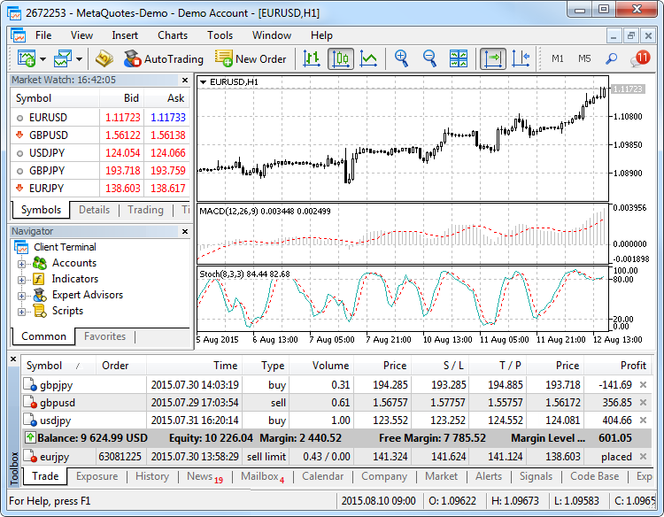
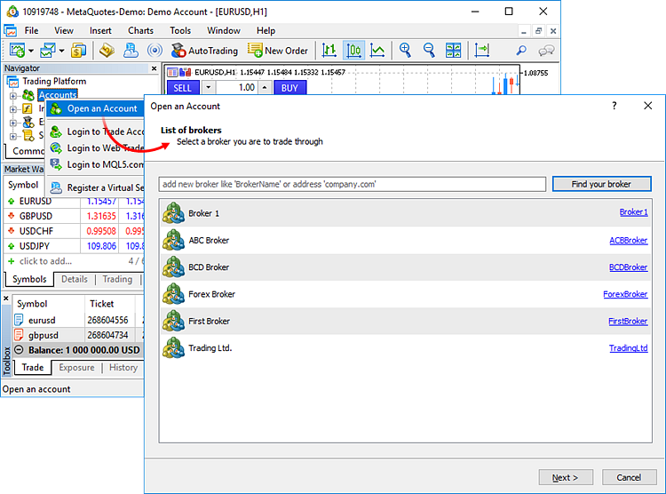
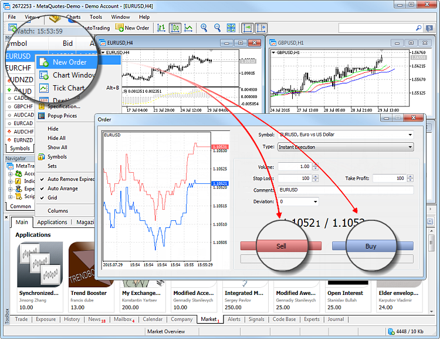
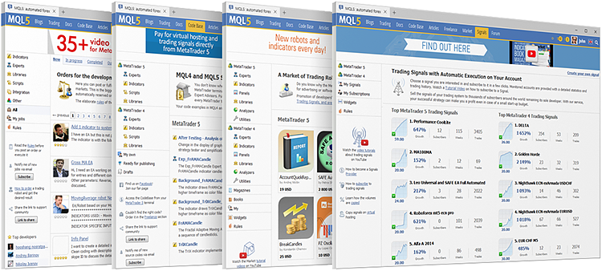

[🏠 Document Start](README.md) / Getting Started

[Previous](Trading-Platform.md) | [Next](Getting-Started/User-Interface.md)

# Getting Started (#getting-started)

This section contains basic information you need to know to get started with the platform.

## Key Elements of the Platform Interface (#interface)

The trading platform provides a simple and user friendly interface. All commands can be accessed from the main menu, and the most frequently used ones are available on the toolbar. Quotes are displayed in Market Watch, while from the Navigator you can manage technical analysis and algorithmic trading tools.

### Main Menu (#main-menu)

The main menu contains almost all the commands and functions that can be executed in the trading platform. It provides access to operations with charts, analytical tools, platform settings and other features. The main menu consists of the following items: File, View, Inset, Charts, Tools, Window, Help.File, View, Inset, Charts, Tools, Window, Help.

### Toolbars (#toolbars)

The platform has three built-in toolbars: Standard, Line Studies and Periodicity. The toolbars contain duplicated commands and functions of the main menu. However, the toolbars are customizable, and you can add the most frequently used controls there.

### Market Watch (#market-watch)

The [Market Watch](Trading-Operations/Market-Watch.md) window provides access to the price data of financial instruments: prices, statistics and tick charts. Contract specifications and one-click trading features can also be accessed from this window.

### Navigator (#navigator)

The Navigator allows switching between accounts and provides functions for running trading robots and indicators. It contains a list of applications purchased from the [Market](Market-App-Store/README.md) and downloaded from the [Code Base](Algorithmic-Trading-Trading-Robots/Where-to-Find-Trading-Robots-and-Indicators.md). From the navigator, users can [rent a virtual platform](Virtual-Hosting-for-247-Operation/README.md) to provide round-the-clock operation of Expert Advisors and trading Signals.

### Chart (#chart)

The essence of technical analysis is studying [price charts of financial instruments](Price-Charts-Technical-and-Fundamental-Analysis/README.md) using technical indicators and analytical objects. Charts in the platform have a variety of settings, so that traders can customize them and adapt to their personal needs. Every chart can be displayed with 21 timeframes from one minute (M1) to one month (MN1).

### Toolbox (#toolbox)

Toolbox is a multifunctional window that provides functions for working with [trade positions](Trading-Operations/Executing-Trades.md), [news (#news)](Price-Charts-Technical-and-Fundamental-Analysis/Fundamental-Analysis.md#news), [account history (#trade-history)](Trading-Operations/Executing-Trades.md#trade-history), alerts, internal mailbox, program logs and expert journals. Additionally, from the Toolbox you can open and modify various orders and manage trade positions.

[Find out more >>](Getting-Started/User-Interface.md)

## How to Open a Demo Account (#demo)

Demo accounts provide the opportunity to work in a training mode without real money, allowing to test a trading strategy. To open a demo account you need to select a trading server and specify registration data.

After you have opened an account, the platform [connects](Getting-Started/Connect-to-an-Account.md) to a server. You can now work in the platform.

[Find out more >>](Getting-Started/Open-an-Account.md)

## How to Make the First Trade (#trade)

On the demo account, you can practice you trading skills without risking real money. Try to make your first trade.

Select a financial instrument in the Market Watch window, open its context menu, and click "New Order."

To execute a Sell trade, click "Sell". For a Buy trade click "Buy".

[Find out more >>](Trading-Operations/README.md)

## Additional Trading Opportunities (#community)

The [MQL5.community](https://www.mql5.com "A community of traders and developers MQL5.community") features multiple useful services — from automated copy trading to the possibility of purchasing ready-made trading robots from the Market and running them 24/7 on a virtual platform.

MQL5.community provides access to the following services:

  * Market — [the store of applications](Market-App-Store/README.md) for the trading platform. Find here free and paid trading robots, technical indicators, and other useful tools that will help you work on the financial markets.
  * Signals — [copy trades](Trading-Signals-and-Copy-Trading/README.md) of professional traders directly to your account automatically. Choose from multiple providers and subscribe in just a few clicks.
  * Virtual Hosting — with a MQL5.community account, you can [rent a virtual hosting](Virtual-Hosting-for-247-Operation/README.md) straight from the platform to run your trading robot or to copy signals. Virtual platforms are located on special hosting servers to ensure uninterrupted operation 24 hours a day.
  * Freelance — if you cannot find the desired application in the Code Base or Market, order one from a professional developer in the [Freelance section](https://www.mql5.com/en/job "Freelance on MQL5.community") of MQL5.community website.

Register an account now. Go to the [registration page](https://www.mql5.com/en/auth_register "Registration of MQL5.community account") and specify the desired username and your email. A confirmation email will be sent to the specified address. Click on the link and access all the services of MQL5.community. Specify the account in the [trading platform settings (#community)](Getting-Started/Platform-Settings.md#community).
