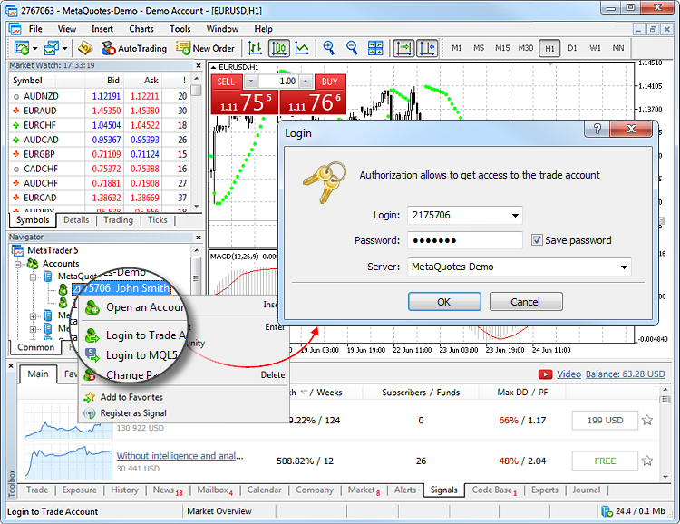
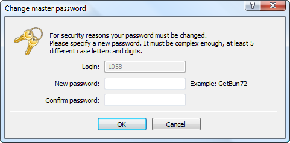

[🏠 Document Start](../README.md) / [Getting Started](../Getting-Started.md) / Connect to an Account

[Previous](Open-an-Account.md) | [Next](Deposits-and-withdrawals.md)

# Connect to an Account (#connect-to-an-account)

To start working with a trading account, you need to connect to it using a login (account number) and password. Two types of account access are available in the trading platform: master and investor. Logging in using the master password gives full rights for working with the account. Investor authorization allows you to see the account status, analyze prices, and work with your own Expert Advisors, but not trade. The Investor access is a convenient tool for demonstrating the trading process on the account.

> The trading platform provides the option of [extended authentication](For-Advanced-Users/Extended-Authentication.md) using SSL certificates.

Click " Login to Trade Account" in the [File](User-Interface.md) menu or in the [Navigator](User-Interface.md).

Specify the following data in this window:

  * Login — the number of the account used for connection.
  * Password — the master or investor password for the account.
  * Server — server to connect to. Also you can indicate a server manually. Enter its IP address and port number as [server number]:[port number], for example, 192.168.0.1:443.

> After specifying all the details, click "OK" to connect.

## Forced Change of Password (#change-password)

Upon authorization, you may be requested to change the master password of the account. Forced password change can be enabled by the trade server administrator. The mechanism of forced change of the master password, when you first connect or on a regular basis, increases safety.

Enter the new password, and then enter it again to confirm. The password must meet the following requirements:

  * It cannot be shorter than the length required in the password change dialog.

  * It must contain four character types: lowercase letters, uppercase letters, numbers, and [special characters](https://learn.microsoft.com/en-us/style-guide/a-z-word-list-term-collections/term-collections/special-characters) (#, @, ! etc.). For example, 1Ar#pqkj.

  * It must not be the same as the previous password.

> If the master password is changed forcedly, the investor password of the account is also reset. A new investor password can be set in the [platform settings (#password)](Platform-Settings.md#password).
