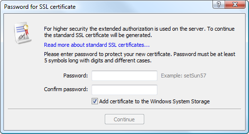
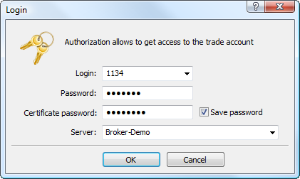
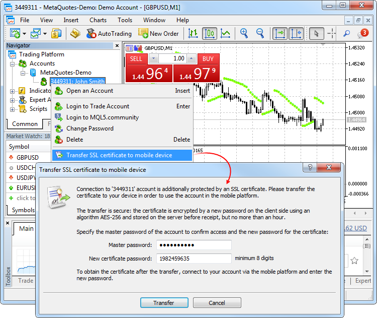
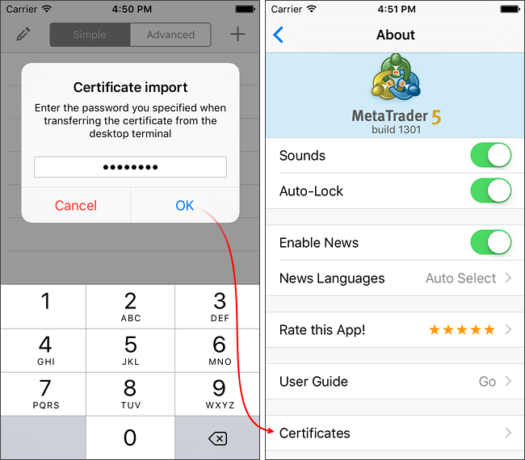
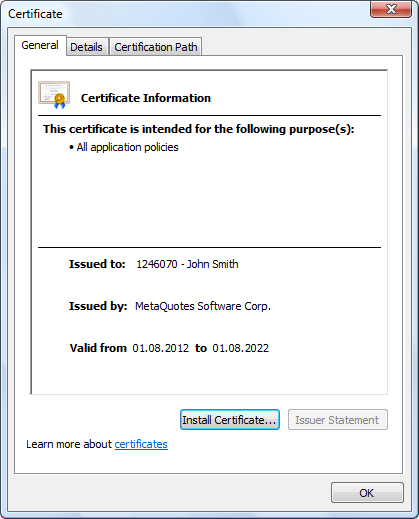
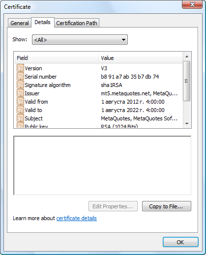
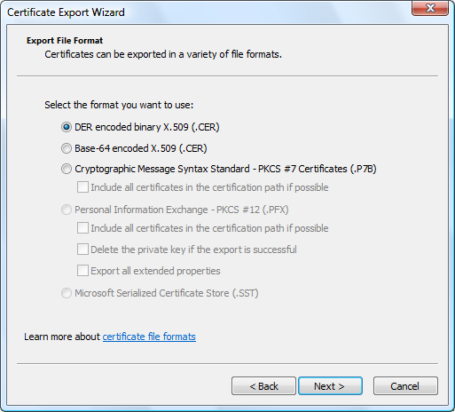

[🏠 Document Start](../../README.md) / [Getting Started](../../Getting-Started.md) / [For Advanced Users](../For-Advanced-Users.md) / Extended Authentication

[Previous](Platform-Start.md) | [Next](One-Time-Passwords-2FATOTP.md)

# Extended Authentication (#extended-authentication)

The trading platform provides an option of extended authentication using SSL certificates, which greatly increases the safety of the system. The extended authentication can be enabled on the server. When it is enabled, [the standard authentication](../Connect-to-an-Account.md) is still active. In any case, users need to enter their account details.

  * The authorization algorithm is generally accepted and secure. It is fully analogous to the SSL authentication.
  * Connection between the client and server is established over a custom protocol with the encryption of all data transmitted.
  * A public key can be freely distributed and used to verify the message signed using the secret key. It is guaranteed, that knowing a public key, it is impossible to compute the secret key within a reasonable time. The calculation of a secret key based on a public one, even on powerful modern computers, can take tens or even hundreds of years.

  
---  
  

## Order of Generating and Receiving a Certificate (#generation)

When trying to login using an account with the extended authentication, you will need to go through [standard authentication](../Connect-to-an-Account.md). After that, the trade server sends a request to the trading platform to generate two keys: private and public. The public key is sent to the trade server. 

Based on the account data, the server generates a certificate and signs it with its private key (the server's private key signature guarantees that the certificate cannot be falsified). After that a window appears in the trading platform, in which you need to enter the password to protect the certificate:

The following fields and settings are available in this window:

  * Password — a password for the certificate installation;
  * Confirm password — confirmation of the password to avoid mistyping;
  * Add the certificate to the Windows storage — if this option is enabled, the certificate is automatically installed to the operating system storage. If you install the certificate to the system storage, then you can choose not to keep the PFX file of the certificate on the hard disk in the folder /platform_folder/config/certificates. The platform checks the certificate in the system storage or in the specified folder on the hard disk.

> The password for the certificate must contain at least two types of symbols (lower case, upper case, digits), and be at least 5 characters long.

After the required data are specified, press "Continue". The certificate is packed and protected by the specified password. The resulting certificate file *.pfx is stored in [/platform_folder/config/certificates (#certificate)](Files-and-Folders.md#certificate), from which it can be relocated later. The certificate files are named according to the following rule: Login_ID_Name.pfx, where:

  * Login is the account number;
  * ID is a short name of the company the account was opened in;
  * Name is the name of a client specified when creating the account.

  * Even having access to the *.pfx file, the certificate cannot be used without the password.
  * Certificates are generated only during the first account connection or when a certificate is intentionally reset on the server.
  * The certificate is not required when connecting using an investor password.

  
---  
  

## Authentication (#authorization)

Further, each time you connect in the extended authentication mode, you will need to enter the certificate password together with the main account details:

## Confirmation of Certificates (#confirm)

An additional mode of certificate confirmation can be enabled on the server to significantly increase the safety of the platform. Until the certificate is confirmed, connection is only possible in the investor mode without the possibility to trade.

In this mode, after a certificate is received, a special email is sent to the platform, describing actions to be taken to confirm the certificate (for example, call the number specified and confirm user identity). The email can be viewed on the [Mailbox](Mailbox.md) tab of the Toolbox window.

Once the certificate is confirmed, a user can trade from this account.

  * For demo accounts, certificates are confirmed automatically straight after generation.
  * After the certificate has been confirmed, it's necessary to reconnect using the account details.

  
---  
  

## Move Certificates to Another PC (#move-certificates-to-another-pc)

To connect to an account with an extended authentication, a user requires a [certificate (#generation)](Extended-Authentication.md#generation). To work with the account on several computers or on a new computer, you need to move/copy the certificate.

To move the certificate, copy its PFX file from [/platform_folder/config/certificates (#certificate)](Files-and-Folders.md#certificate) of the source computer to the same folder on the target computer.

## Transferring the Certificates to a Mobile Device (#transfer-mobile)

If the certificate was requested and generated via the desktop platform, you should transfer it to your iPhone/iPad or Android device if you want to be able to enter your account via that device.

### Transfer (#transfer)

The certificate is transferred securely via a trading server:

  * First, the certificate is encrypted in the desktop platform: an account owner sets the password to encrypt the certificate using a reliable AES-256 algorithm. The password is not sent to the server ensuring that only the user knows it.
  * Next, the encrypted certificate is sent to the trade server where it is stored before receipt via a mobile platform (but no more than an hour).
  * In order to receive the certificate, the user should connect to the account via the mobile platform, After connecting, the user will be offered to import the certificate. To do this, they should enter the password that was used to encrypt the certificate in the desktop platform.

The certificate transfer is secure: the trading server is used solely as an intermediate storage, while encryption is performed at the user's side. The certificate password is not transferred or stored on the trade server.

### How to transfer the certificate (#how-to-transfer-the-certificate)

Connect to the account via the desktop platform and select "Transfer SSL certificate to mobile device" in its context menu:

Specify the master password of the account to confirm that it belongs to you. Next, set the password to be used to protect the certificate before sending it to the server or use an automatically generated random password. The password should consist of at least 8 digits.

After successfully sending the certificate to the server, open the mobile platform and connect to the account. You will be immediately offered to import the certificate. Agree and enter the password you have set during the transfer.

You can view the certificate in About – Certificates.

### Alternative transfer option (#alternative-transfer-option)

You can transfer the certificate manually:

  * iPhone/iPad — [via iTunes](https://www.metatrader5.com/en/mobile-trading/iphone/help/settings/settings_accounts/extended_authorization)
  * Android — [copying to a device](https://www.metatrader5.com/en/mobile-trading/android/help/settings_accounts/extended_authorization)

## View Certificates (#certificate-view)

To view a certificate used for the account in the [extended authentication](Extended-Authentication.md) mode click on "Certificate" on the [Server (#server)](../Platform-Settings.md#server) tab.

The following certificate details are displayed here:

  * Issued to — the account number and certificate holder name.
  * Issued by — the name of the company that issued the certificate.
  * Valid from — certificate validity period.

## Certificate Export (#export)

[The public part of the certificate (#generation)](Extended-Authentication.md#generation) (without the private key) can be exported to a file.

> Do not submit your certificate pfx file containing the private key to anyone. This file is generated during the first connection in the [extended authentication](Extended-Authentication.md) mode and is stored in /platform_folder/config/certificates.

To export the public part of your certificate, move to the Details tab and click "Copy to File":

Follow the instructions of Certificate Export Wizard. Select the file format for export after the greeting message:

Specify a file name and complete the export process.

## Extended Authentication Restrictions (#extended-authentication-restrictions)

The extended authentication option cannot be used in the [web platform](https://www.mql5.com/en/articles/3024) and in the [Signals service](../../Trading-Signals-and-Copy-Trading/README.md). If extended authentication is used on an account, you cannot connect to this account via the web platform or register it to provide trading signals. However, copying of signals to an account with extended authentication is possible.
