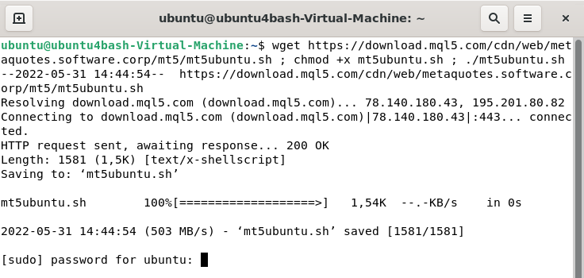
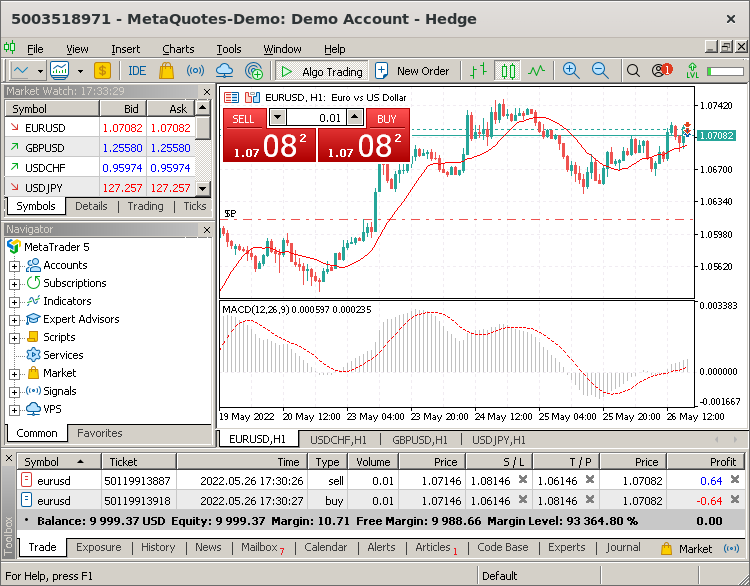

[🏠 Document Start](../../README.md) / [Getting Started](../../Getting-Started.md) / [For Advanced Users](../For-Advanced-Users.md) / Installation on Linux

[Previous](Installation-on-Mac-OS.md) | [Next](Platform-Start.md)

# How to Install the Platform on Linux

The platform runs on Linux using [Wine](https://www.winehq.org/). Wine is a free compatibility layer that allows application software developed for Microsoft Windows to run on Unix-like operating systems.

We have prepared a special script to make the installation process as simple as possible. The script will automatically detect your system version, based on which it will download and install the appropriate Wine package. After that, it will download and run the platform installer.

To start the installation, open the command line (Terminal) and specify the relevant command:

For Ubuntu:

wget https://download.mql5.com/cdn/web/metaquotes.software.corp/mt5/mt5ubuntu.sh ; chmod +x mt5ubuntu.sh ; ./mt5ubuntu.sh  
---  
  
For Debian:

wget https://download.mql5.com/cdn/web/metaquotes.software.corp/mt5/mt5debian.sh ; chmod +x mt5debian.sh ; ./mt5debian.sh  
---  
  
This command downloads the script, makes it executable and runs it. You only need to enter your account password to allow installation.

If you are prompted to install additional Wine packages (Mono, Gecko), please agree, as these packages are required for platform operation. The installer will launch after that. Once you complete the standard steps, the platform is ready to go.

## Install updates in a timely manner

It is highly recommended to always use the latest versions of the operating system and Wine. Timely updates increase platform operation stability and improve performance.

To update Wine, open a command prompt and type the following command:

sudo apt update ; sudo apt upgrade  
---  
  
For further information, please visit the [official Wine website](https://wiki.winehq.org/Download).

## Platform Data Directory

Wine creates a separate virtual logical drive with the necessary environment for every installed program. The default path of the installed platform data folder is as follows:

Home directory\\.mt5\drive_c\Program Files\MetaTrader 5  
---  
  
Use the platform on Linux: install with a single command and enjoy all the platform features.
