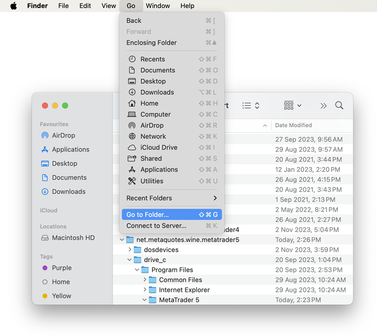
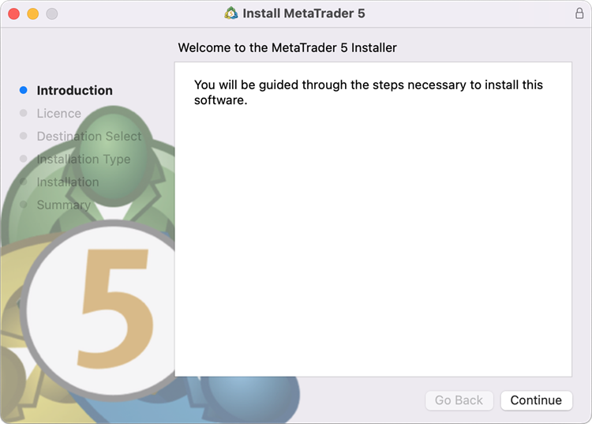

[🏠 Document Start](../../README.md) / [Getting Started](../../Getting-Started.md) / [For Advanced Users](../For-Advanced-Users.md) / Installation on Mac OS

[Previous](Platform-Installation.md) | [Next](Installation-on-Linux.md)

# How to Install the Platform on Mac OS

We provide a special installer for the platform on macOS. It is a full-fledged wizard that allows you to install the application natively. The installer performs all the required steps: it identifies your system, downloads and installs the latest [Wine](https://www.mql5.com/go?link=https://www.winehq.org/) version, configures it, and then installs MetaTrader within it. All steps are completed in the automated mode, and you can start using the platform immediately after installation.

You can download the installer via this [link](https://download.mql5.com/cdn/web/metaquotes.software.corp/mt5/MetaTrader5.pkg.zip?utm_campaign=metatrader5.help) or via the Help menu in the trading platform.

## System Requirements

The minimum macOS version required to install the platform is Catalina (10.15.7). The platform runs on all modern versions of macOS and supports all Apple processors, from M1 to the latest released versions.

## Preparation: Check the Wine version

If you are already using the platform on macOS, please check the current Wine version, which is displayed in the platform log upon startup:

LP 0 15:56:29.402 Terminal MetaTrader 5 x64 build 4050 started for MetaQuotes Software Corp.   
PF 0 15:56:29.403 Terminal Windows 10 build 18362 on Wine 8.0.1 Darwin 23.0.0, 12 x Intel Core i7-8750H @ 2.20GHz, AVX2, 11 / 15 Gb memory, 65 / 233 Gb disk, admin, GMT+2  
---  
  
If your Wine version is below 8.0.1, we strongly recommend uninstalling the old platform along with the Wine prefix in which it is installed. Be sure to save all necessary files in advance, including templates, downloaded Expert Advisors, indicators, and others. You can uninstall the platform as usual by moving it from the "Applications" section to the Trash. The Wine prefix can be deleted using Finder. Select the "Go > Go to Folder" menu and enter the directory name: ~/Library/Application Support/.

Delete the following folders from this directory:

~/Library/Application Support/Metatrader 5   
~/Library/Application Support/net.metaquotes.wine.metatrader5  
---  
  
## Installation

The platform is installed like a standard macOS application. Run the downloaded file and follow the instructions. During the process, you will be prompted to install additional Wine packages (Mono, Gecko). Please agree to this as they are necessary for the platform functioning.

## Platform Data Directory

A separate virtual logical drive with the necessary environment is created for the platform in Wine. The default path of the installed platform's data folder is as follows:

~/Library/Application Support/net.metaquotes.wine.metatrader5/drive_c/Program Files/MetaTrader 5   
---  
  
## Interface Language Settings

When installing the platform, Wine automatically adds support for the language (locale) currently set for macOS. In most cases, this is sufficient. If you wish to use a different language for the platform, switch the macOS language to the desired one before installation and restart your computer. Then, proceed with installing the platform. After the installation, you can set macOS to its original language.
