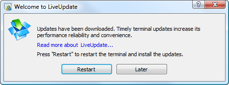
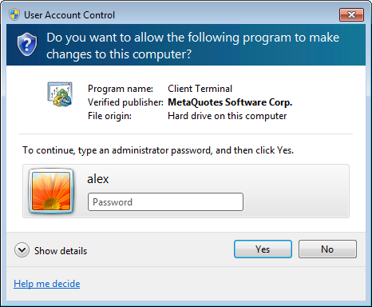
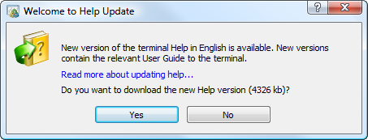

[🏠 Document Start](../../README.md) / [Getting Started](../../Getting-Started.md) / [For Advanced Users](../For-Advanced-Users.md) / Live Update

[Previous](Security-System.md) | [Next](Platform-Logs.md)

# Live Update (#live-update)

A system of automatic updates is built into the platform. It provides timely updates to new versions. This system can not be deactivated.

## Updating Procedure (#updating-procedure)

Upon connecting to a trade server, the system checks for the platform updates. If a new version of any of the platform components is found, it is automatically downloaded in the background mode.

The updates are downloaded to the following default folder C:\Users\username\AppData\Roaming\MetaQuotes\WebInstall. Here "C" is the letter of a logical disk, where the operating system is installed, "username" is the account in the operating system, under which the platform has been installed. Downloaded updates are available to all platforms, the updates are not re-downloaded for other instance of the platform.

After the update is downloaded, the following dialog appears prompting you to update the platform:

Click one of the buttons:

  * Restart — the windows of the platform and [MetaEditor (#metaeditor)](../../Algorithmic-Trading-Trading-Robots/How-to-Create-an-Expert-Advisor-or-an-Indicator.md#metaeditor) (if t is open) are closed, the components are updated, and the platform is then restarted.
  * Later — it hides the dialog, and the platform is updated automatically later with the next start.

  * All the update stages appear in the trading platform [Journal](Platform-Logs.md). "LiveUpdate" is specified in the Source column of such logs.
  * If the platform update fails (connection to server is lost), the next attempt will be made after one hour. Only missing data will be downloaded during this attempt.

  
---  
  

## Updating with UAC Enabled (#updating-with-uac-enabled)

If the UAC (User Account Control) system is enabled on the computer or the user does not have sufficient rights in the OS, a dialog requesting to confirm/increase the user's permissions appears at the attempt to update.

Depending on the user's permissions in MS Windows, it is necessary either to allow the operation (if a user is an administrator) or specify administrator account details.

## Updating Manuals (#help-update)

All user manuals (this User Guide, MetaEditor and MQL5 references) are updated separately. No more than once every two weeks, when a manual is opened, the system checks for its new version. If one is found, the following dialog appears, prompting to download it:

Click Yes to download the new version of the specified manual. To cancel the update, click No or close the window.
