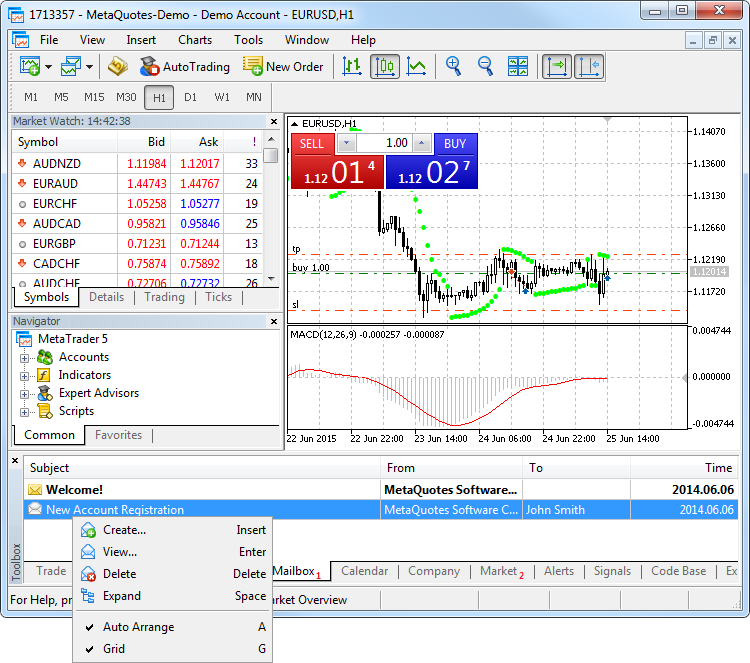
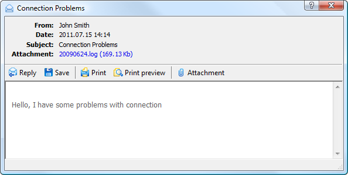
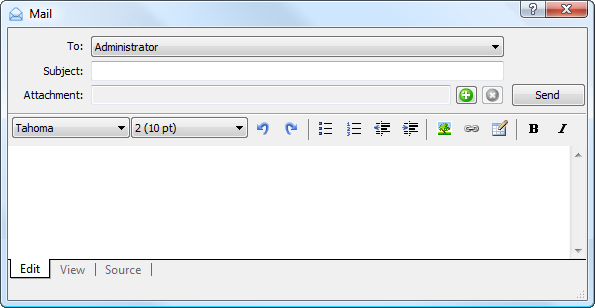

[🏠 Document Start](../../README.md) / [Getting Started](../../Getting-Started.md) / [For Advanced Users](../For-Advanced-Users.md) / Mailbox

[Previous](Manage-Trading-Accounts.md) | [Next](Security-System.md)

# Mailbox (#mailbox)

The trading platform contains an internal mail system. It allows you to receive important information from your broker: information about open accounts, useful information about the platform features, upcoming events, etc.

All the emails are displayed in the Mailbox tab of the Toolbox window.

Email subject

Email sender's name

Email recipient's name

Email sending or receiving time

[Write an email (#create)](Mailbox.md#create)

Unread messages are marked with icon , read ones - . Outgoing emails are marked with icon . When the function of response to an email is used, messages are joint into threads, which makes it easy to navigate in conversations with clients. Email threads are marked with icon . To expand a thread, click on this icon.

> Emails are stored on the trade server. When you delete an email from the platform interface, it will not be re-downloaded. However, if you delete the platform mail database (the file "/bases/server_name/mail/mail-account_number.dat") or connect from another platform, all the mails for the last 30 days will be downloaded again.

## Reading an Email (#view)

Double-click on an email to read it.

The top of the email contains the following data: a client's account and name, date of email, its subject and attachments (if any).

The toolbar of this window contains the following commands:

  *  Reply — open email creation window with the field "To" filled in and a quote of a received email;
  *  Save — save the email on a computer as a HTML file or a text file in Unicode standard;
  *  Print — print the email;
  *  Print Preview — open the preview window before printing the email;
  *  Attachment — save files attached to the email. Another way to save an attachment is to click on its name in the appropriate field of the email header.

## Writing an Email (#create)

To create an email, select the appropriate command in the context menu, or use the hot key "Insert" on the Mailbox tab.

Specify the following data in this window:

  * To — the account of a trade server administrators you want to send an email to;
  * Subject — subject of the email;
  * Attachments — files attached to the email. To attach a file click , and specify the desired file. To remove an attachment click . If several files are attached to an email, they are deleted starting from the last one;
  * Below is the window for working with am email text. It contains three tabs: Edit, View and Source. In the Edit tab you can write an email text and use commands for working with it. You can view the final email in the View tab. The Source tab allows working with the source HTML code of an email.

> Note the following limitations on attachments:
