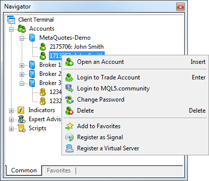
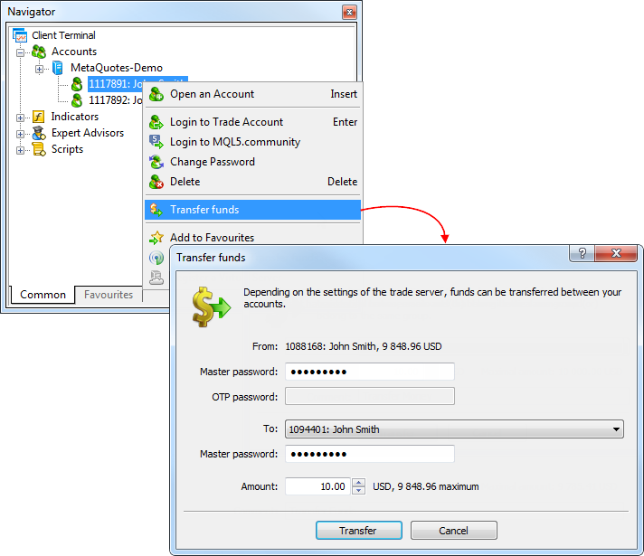

[🏠 Document Start](../../README.md) / [Getting Started](../../Getting-Started.md) / [For Advanced Users](../For-Advanced-Users.md) / Manage Trading Accounts

[Previous](Files-and-Folders.md) | [Next](Mailbox.md)

# Manage Trading Accounts (#manage-trading-accounts)

Traders can work with multiple accounts in one platform. These accounts can be opened with different brokers. Used accounts are stored and displayed in the Navigator window, they are grouped based on the name of the server they are open on.

## How to Switch between Accounts (#how-to-switch-between-accounts)

To switch to another account, double-click on it in the Navigator.

  * The trading platform can be configured to automatically disable trading after switching to another account. It helps protect against accidental deals performed by a trading robot working on that account. Enable the option ["Disable automated trading when switching accounts" (#enable-ea)](../Platform-Settings.md#enable-ea).
  * For greater security, you can disable the function of authorization data storage on the hard disk (encrypted). This can be done by disabling the option ["Keep personal settings and data at startup" (#keep-personal)](../Platform-Settings.md#keep-personal). You will need to manually enter the password every time you connect to the account.

  
---  
  
Demo accounts are marked by the icon , live accounts have icon . An unlimited number of demo accounts can be opened in the platform. However, live accounts cannot be opened here. They can only be opened by a brokerage company.

Account management functions are available in the context menu:

  *  Open an Account — [open  (#demo)](../Open-an-Account.md#demo) a demo account. The same action can be performed by pressing Insert.
  *  Login to Trade Account — [connect](../Connect-to-an-Account.md) to a trade server using the selected account. The same operation can be performed by double-clicking on an account, or by selecting it and pressing Enter.
  *  Login to MQL5.community — open trading platform [settings (#community)](../Platform-Settings.md#community) to login to [MQL5.community](https://www.mql5.com/ "MQL5.community") and access additional services.
  *  Change Password — open the [account password change (#password)](../Platform-Settings.md#password) window.
  *  Delete — delete a selected account. The same action can be performed by pressing the Delete key.
  *  Transfer Funds — [transfer funds (#transfer-funds)](Manage-Trading-Accounts.md#transfer-funds) between accounts. This commands is only available in the context menu of the current account, if the transfer of funds is allowed on the trade server.
  *  Add to Favorites — add the selected account to Favorites for quick access.
  *  Register as Signal — register the selected account in the [Signals service](https://www.mql5.com/en/signals "Trade Signals"). A click on this command opens a [signal creation page (#add)](../../Trading-Signals-and-Copy-Trading/How-to-Become-a-Signal-Provider.md#add) on MQL5.community. The selected account and the right broker server are automatically specified in the registration form.
  *  Register a virtual server — this is a command for [renting a virtual server](../../Virtual-Hosting-for-247-Operation/README.md) to provide round-the-clock operation of the platform. Unlike renting ordinary VDS or VPS from third-party companies, with Virtual Hosting you can choose a server that is the closest to your broker to minimize the network latency when sending orders from the platform to a trade server.

## Transferring Funds between Accounts (#transfer-funds)

The trading platform allows transferring money between accounts within the same trade server. Money can only be transferred from the currently [connected](../Connect-to-an-Account.md) account. Select it in the [Navigator](../User-Interface.md) window and choose "Transfer funds" from the context menu.

In the dialog box, select the account to which you want to transfer funds. The transfer amount is specified in the deposit currency of the current account. It cannot exceed the current balance and the current amount of free margin of the account.

To transfer funds, a master password must be specified for both accounts. If [OTP authentication](One-Time-Passwords-2FATOTP.md) is used for the account, from which funds are transferred, the one-time password should be additionally specified.

Funds are transferred in the form of [balance operations (#trade-history)](../../Trading-Operations/Executing-Trades.md#trade-history): a withdrawal operation on the current account and depositing operation on the recipient account.

  * The money transfer option must be enabled on the trade server. Depending on the settings, there are some restrictions on the accounts, between which transfer is allowed. In particular, money transfer can be allowed only for accounts with identical names and emails.
  * Funds can be transferred only within the same trading server and only between the accounts of the same type. From a real account funds can be transferred only to another real account, from a demo one - only to demo.
  * The accounts, between which funds are transferred, must use the same deposit currency.

  
---  
  

## Automatic creation of new demo accounts to replace inactive ones (#auto)

When a user tries to connect to an expired demo account (for which the server returns the "Invalid account" error), the platform automatically opens a new demo account. The account is created on the same trade server (provided that the broker still allows opening demo accounts from the platform).

An expired demo account is deleted from the Navigator window, since it becomes useless: it cannot be used for connecting to the trades server (the account has been deleted on the broker server), while its trading history cannot be viewed. When an expired demo account is deleted, the following message is added to the [platform journal](Platform-Logs.md): current demo account 'XXXX' was deleted on trade server, new demo will be allocated.

Thus, the platform helps traders to instantly start working with the account and eliminates the need to delete inactive and unnecessary data.
