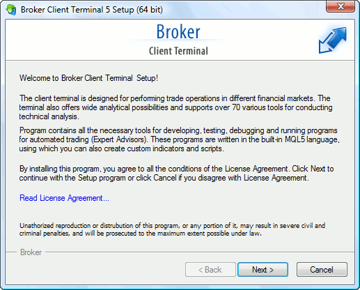

[🏠 Document Start](../../README.md) / [Getting Started](../../Getting-Started.md) / [For Advanced Users](../For-Advanced-Users.md) / Platform Installation

[Previous](../For-Advanced-Users.md) | [Next](Installation-on-Mac-OS.md)

# Platform Installation (#platform-installation)

To install the trading platform download the mt5setup.exe installer and run it.

  * This is a web installer. This means that most of the components will be downloaded from the Internet during installation.
  * The installer determines the bit characteristics of the operating system and installs the appropriate version of the platform;
  * The platform can run under Microsoft Windows 2008/7/8/10/11. A processor with SSE2 support (Pentium 4/Athlon 64 or higher) is also required. Other hardware requirements depend on specific platform use conditions — load from running MQL5 applications, number of active instruments and charts, etc. 

  
---  
  
Review the software description and the end-user license agreement. If you agree with all terms of the agreement, click on the "Next" button. If you do not agree with the Agreement, exit the installation program.

> A click on "Next" starts the background download of the platform distribution package from one of the developer's servers. A server that is closest to the user is chosen for downloading.

Click "Settings" to select installation options:

  * Installation folder — the directory you want to install the trading platform to. You can specify a different directory, by setting the path to it manually, or by clicking the "Browse" button.
  * Program group — the name of the program group that will be created in the Start menu.
  * Open MQL5.community — open the most popular traders' community website after installation. [MQL5.community](../../MQL5-Algotrading-community/README.md) features multiple useful services, from automated copy trading to the possibility of purchasing ready-made trading robots from the Market and running them 24/7 on a virtual platform.

  * The platform can be installed over an existing one. All the previous platform settings are preserved, except for the default [profiles (#profiles)](../../Price-Charts-Technical-and-Fundamental-Analysis/Additional-Features/Templates-and-Profiles.md#profiles) and [templates](../../Price-Charts-Technical-and-Fundamental-Analysis/Additional-Features/Templates-and-Profiles.md), and the standard set of [MQL5-programs](../../Algorithmic-Trading-Trading-Robots/How-to-Create-an-Expert-Advisor-or-an-Indicator.md).
  * If you need to work with multiple accounts simultaneously, install the appropriate number of platforms in different directories.

  
---  
  
Click "Next" to start the installation. When finished, click "Finish" and [run](Platform-Start.md) the platform.

## Beta Installation (#beta)

You can use the /beta key for the terminal installation file, which allows downloading the beta version. In normal mode, the release version should be installed first, which can then be updated till a beta version. By skipping this step, you can save time and traffic. Installation start example:

C:\mt5setup.exe /beta  
---  
  
To update an already installed platform up to beta build, navigate to Help — Check Desktop Updates — Latest Beta Version.

## Installation in automatic mode (#auto)

The platform can be installed in the automatic mode, without additional actions required from the user. When the installer is launched with the /auto key, installation settings will not be shown to the user, and the terminal will be installed at the standard path with the standard Start menu folder name for the program.

You can specify another directory for the platform installation in automatic mode using the additional key /path:

C:\mt5setup.exe /auto /path:"C:\Program Files\MyFolder"  
---
