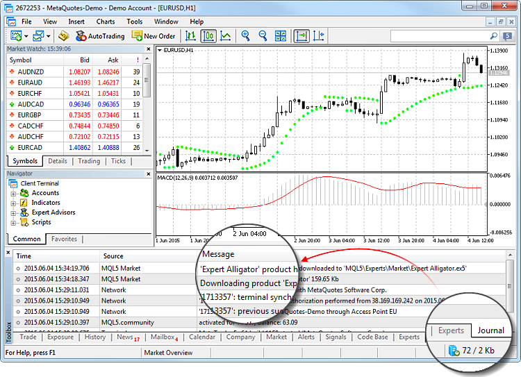
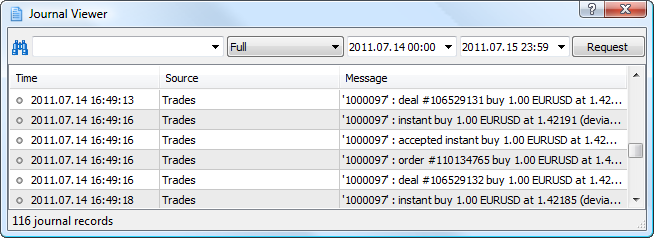
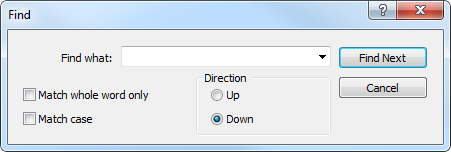
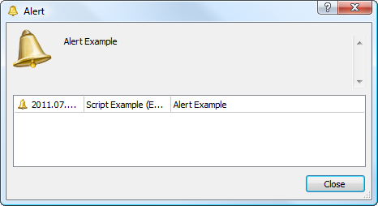

[🏠 Document Start](../../README.md) / [Getting Started](../../Getting-Started.md) / [For Advanced Users](../For-Advanced-Users.md) / Platform Logs

[Previous](Live-Update.md) | [Next](Task-Manager.md)

# Platform Logs (#platform-logs)

Almost all actions performed are logged in the platform journals. The logs reflect all important events: synchronization with the provider's account during copy trading, hosting migration results, details of purchases from the Market, and much more.

Two types of logs are available in the platform:

  * Experts Journal is displayed on the Experts tab of the Toolbox window. It contains information about the running indicators and Expert Advisor, including opening/closing of positions, modification of orders, Expert Advisor alerts and comments, etc.
  * Platform logs are shown on the Journal tab of the Toolbox window. It contains information about the recorded actions of the trader and platform for the current session. Information about the platform start and all events during its operation including execution of all trade operations are displayed here.

Journal logs are represented in a table with the following fields:

  * Time — the date and time of the event. Specified according to the time zone on the user's computer.
  * Source — event type: Network, Alert, HistoryBase, Experts, the name of a separate Expert Advisor or indicator, etc.;
  * Message — description of the event.

Events are divided into several types and marked by special icons:

  *  — informational message;
  *  — warning;
  *  — error message.

The following commands can be run from the context menu of this tab:

  *  Open — open the folder that contains the journal log files. Besides that, when this command is executed, all current journal entries are saved in log files. The platform log files are stored in the Logs directory, and Expert log files are saved in MQL5\Logs. File names correspond to the date of journal generation — YYYYMMDD.LOG. Previous logs on the platform operation can be reviewed from these files, while the "Journal" tab only contains the latest entries;
  *  Copy — copy a row with information to clipboard for use in other applications;
  *  Send — send the current log file to an administrator by the internal mailing system. Execution of this command opens a message creating window, to which the selected file is attached;
  *  Alerts (in the Experts journal only) — open the window of [Expert Advisor alerts (#expert-alerts)](Platform-Logs.md#expert-alerts);
  *  Viewer — open a special program to view log files;
  *  Clear — remove current logs from the tab. Logs are not physically removed from the computer, they are still available in log files;
  * Auto Scroll — if this option is enabled, the list of logs is scrolled to the last one every time a new entry appears in the journal;
  * Auto Arrange — if this option is enabled, the size of table columns is selected automatically in case the window size is changed;
  * Grid — enable/disable table field separators.

## Log Viewer (#viewer)

The platform includes a special program for viewing log files. It can be opened by selecting "Viewer" in the context menu of the Journal and Experts tabs.

A search bar (search is performed by exact words, case sensitive) and the filter of entries (Full, No connection, Errors only) are available at the top of the window. You can specify time range for search. After specifying all the necessary search condition, click "Request".

The following commands are available in the context menu of the log viewer:

  *  Open — open the folder that contains the journal log files. Besides that, when this command is executed, all current journal entries are saved in log files. The platform log files are stored in the Logs directory, and export log files are saved in MQL5\Logs. File names correspond to the date of journal generation — YYYYMMDD.LOG. Previous logs on the platform operation can be reviewed from thee files, while the "Journal" tab only contains the latest entries;
  *  Copy — copy a row with information to clipboard for use in other applications;
  *  Send — send the current log file to an administrator by the internal mailing system. Execution of this command opens a message creating window, to which the selected file is attached;
  *  Search — open the search window.
  *  Find next — find the next item matching the search query.
  *  Find Previous — find the previous item matching the search query.
  * Auto Scroll — if this option is enabled, the list of logs is scrolled to the last one every time a new entry appears in the journal;
  * Auto Arrange — if this option is enabled, the size of table columns is selected automatically in case the window size is changed;
  * Grid — enable/disable table field separators.

### Search in Logs (#search)

To find a word or phrase in the records displayed, click " Search" in the context menu or press "Ctrl+F".

It contains the following commands and parameters:

  * Find — field to enter the search word or phrase;
  * Match Whole Word Only — this option allows to search by a particular word form, only the word or phrase that exactly match the search query will be found;
  * Match Case — enable/disable case sensitivity when executing the search query;
  * Direction up/down — Enable search up or down from the current cursor position;
  * Find Next — move to the next found item. The same command can be executed by pressing F3;
  * Cancel — close the window.

## Alerts of Expert Advisors (#expert-alerts)

If the Expert Advisor code provides generation of alerts using the Alert(); function, a special dialog appears when the alerts trigger:

The message of the current alert appears at the top of the window. The current and the previous alerts of the Expert Advisor are shown in the table below:

  * Date and time;
  * Name of the MQL5 application, chart symbol and timeframe;
  * Alert message.

> Using alerts, an Expert Advisor can notify a trader about significant events. The window of alerts opens even if the window of the platform is minimized.
