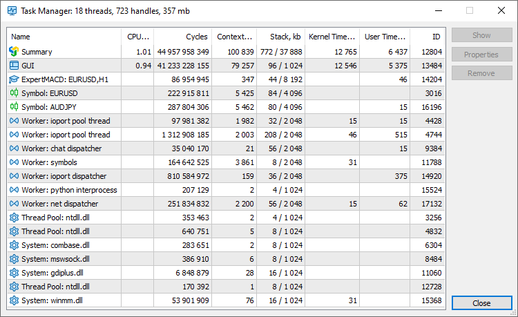

[🏠 Document Start](../../README.md) / [Getting Started](../../Getting-Started.md) / [For Advanced Users](../For-Advanced-Users.md) / Task Manager

[Previous](Platform-Logs.md) | [Next](Hot-Keys.md)

# Task manager

The Task Manager enables monitoring of resources consumed by the platform. You can view the amount of memory consumed by charts, CPU resources used by Expert Advisors and other performance metrics. If you platform performance slows down, you can easily detect and fix the issues.

Use the "Tools" menu or the F2 key to launch the Task Manager.

Different platform functions run on separate threads. The relevant thread statistics are presented in the Task Manager:

  * Summary — general statistics for all functions.
  * GUI — resources used by the main platform thread.
  * Experts/Scripts — resources used by each of the Expert Advisors running on the chart. If a program is running in the debug or profiling mode, the line will indicate 'debug' or 'profile', respectively.
  * Services — resources consumed by each active [service (#service)](../../Algorithmic-Trading-Trading-Robots/Expert-Advisors-and-Custom-Indicators.md#service).
  * Symbol — resources used for calculations related to the specified financial instrument: recalculation of prices and profits for open positions and orders, display of charts, calculation of relevant indicators, etc.
  * Worker — platform system threads. These threads are used for service purposes, background calculations and others.
  * Thread Pool — used by the system to efficiently manage the application's worker threads.
  * System — resources consumed by the system and third-party DLLs.

The following metrics are measured for platform threads:

  * CPU, % — processor load by the specified process. If the total CPU load is high, while the process load is low, the computer resources must be consumed by some third-party application.
  * Cycles — the total number of computational cycles spent by the processor to service the process, per second. The higher this metric, the more actively the processor is used.
  * Context Switches — the number of [context switches](https://en.wikipedia.org/wiki/Context_switch). High values (1000 or more) may indicate too many active threads in the system. They are trying to access the CPU time, and the system has to switch too often between them, thus wasting resources. For further details please read the [Microsoft Documentation](https://docs.microsoft.com/en-us/previous-versions/windows/it-pro/windows-2000-server/cc938613(v%3dtechnet.10)).
  * Stack — the amount of used and allocated memory stack in kilobytes.
  * Kernel Time — kernel mode operating time. An increase in this metric compared to the time spent in user mode can indicate system-level issues: drivers problems, hardware errors or slow hardware. For further details please read the [>Microsoft Documentation](https://docs.microsoft.com/en-us/windows-hardware/drivers/gettingstarted/user-mode-and-kernel-mode).
  * User Time — user mode operating time.
  * ID — thread identifier.

The window header displays summary statistics on resource usage by the platform:

  * The number of used threads.
  * The number of handles used by the platform. A handle is a pointer, which enables a program to access the allocated resource. The more handles a program uses, the more resources it consumes.
  * The amount of RAM consumed.

The task manager data is refreshed once a second. You may use the context menu to refresh the statistics manually.

The Task Manager enables the management of running MQL5 programs. Select a program in the list and use one of the commands on the right:

  * Show — go to the selected program in the Navigator. The same action can be performed by a double click on its line.
  * Properties — open the program [input parameters (#input)](../../Algorithmic-Trading-Trading-Robots/Expert-Advisors-and-Custom-Indicators.md#input).
  * Remove — remove the MQL5 program from the chart.

> To save resources and to optimize the platform working area, you can disable the MQL5 services which you do not use. For example, if you are not interested in [MQL5 programming languages (#articles)](../../Algorithmic-Trading-Trading-Robots/How-to-Create-an-Expert-Advisor-or-an-Indicator.md#articles) or in copy trading via the [Signals](../../Trading-Signals-and-Copy-Trading/README.md) service, uncheck the relevant options in the [settings (#community)](../Platform-Settings.md#community) to hide these sections.
