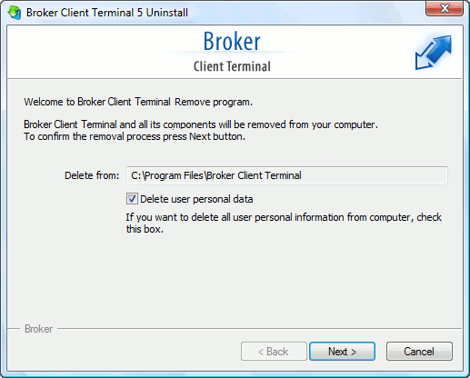

[🏠 Document Start](../../README.md) / [Getting Started](../../Getting-Started.md) / [For Advanced Users](../For-Advanced-Users.md) / Uninstalling the Platform

[Previous](Hot-Keys.md) | [Next](../../Trading-Operations/README.md)

# How to Uninstall the Platform

To remove the platform from a computer, run the "Uninstall.exe" file from the platform installation folder or select "Uninstall" in the appropriate program group in the Start menu.

Specify the folder from which you want to delete the trading platform. Option "Delete user personal data" can be additionally enabled to delete all user data (history of financial instruments, emails, MQL5 applications, platform settings, etc.) in addition to the [unchangeable files](Files-and-Folders.md) of the platform.

If you are sure you want to continue, click "Next" and wait for the completion of the uninstallation process.

  * You must be careful deleting the platform. After you delete user data, the platform recovery will be impossible.
  * If the option "Delete user personal data" is not enabled during platform deletion, the platform can later be restored with all its settings and information by installing it in the same directory.

  
---
