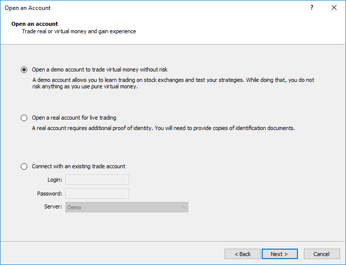
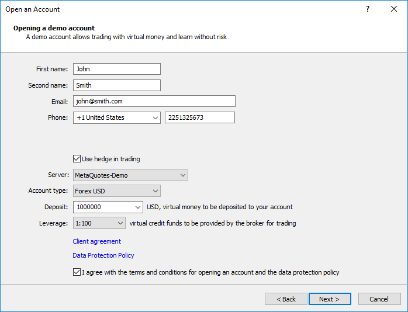
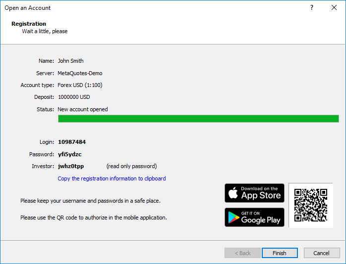
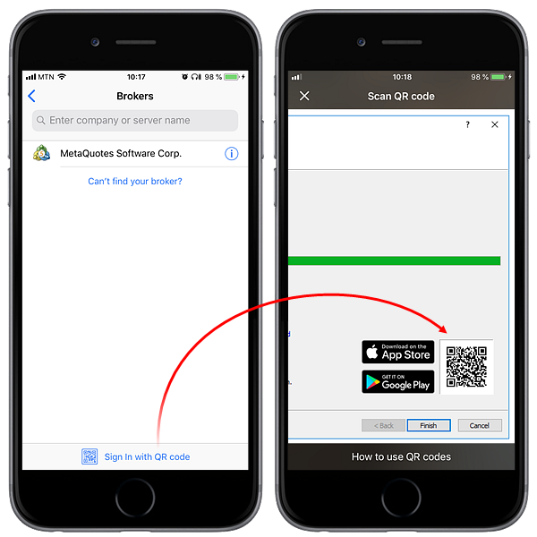
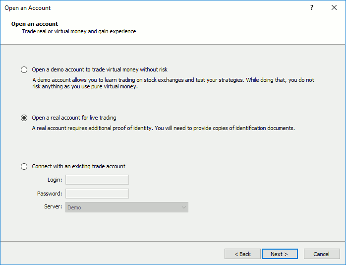
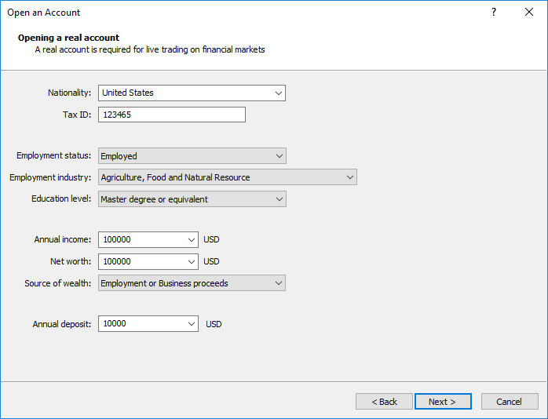

[🏠 Document Start](../README.md) / [Getting Started](../Getting-Started.md) / Open an Account

[Previous](User-Interface.md) | [Next](Connect-to-an-Account.md)

# Open an Account (#open-an-account)

Two types of accounts are available in the trading platform: demonstration (demo) and real. Demo accounts provide the opportunity to work in a training mode without real money, allowing to test a trading strategy. They feature all the same functionality as the live ones. The difference is that demo accounts can be opened without any investment and, therefore, one cannot expect to profit from them.

## Demo Account Opening (#demo)

Click " Open an Account" in the [File](User-Interface.md) menu or in the context menu of the Navigator window.

The account opening procedure consists of several steps:

### Select a Server (#select-a-server)

A broker is selected during the first step. If the desired company is not shown in the list, please type its name and click "Find your broker". Alternatively, you can type the address of the server instead of the company name. Once you find the desired company, select it and click "Next".

If the brokers list becomes too long, you can delete unnecessary companies by pressing the "Delete" key.

### Account Type (#type)

Enter the details of your existing account or create a new one.

Choose this option to [connect](Connect-to-an-Account.md) to an existing trading account. You will need to specify the account number, the password and the server name.

Select this option to open a demo account. Demo accounts help users learn trading and test trading strategies. All trading operations only involve virtual money.

Select this option to request opening of a [real account (#real)](Open-an-Account.md#real). Trading operations are performed using real money on such accounts, therefore you will need to provide broker detailed information about yourself, as well as ID and proof of address documents. The broker will check provided information and contact you to complete the account opening procedure.

### Personal Details (#personal-details)

Enter your personal details:

### Personal Details (#personal-details)

  * First name — the name of the user consisting of at least two characters.
  * Second name — the second name (surname) of the user consisting of at least two characters.
  * Email — email address, e.g. "smith@company.net".
  * Phone — contact phone number in international format. Example: +74951234567.

### Account Parameters (#account-parameters)

  * Use hedge in trading — enable the option if you want to open an account with the [hedging position accounting system (#hedging)](../Trading-Operations/Basic-Principles.md#hedging), which allows having multiple open positions of the same symbol, including opposite positions. Otherwise an account with the [netting system (#netting)](../Trading-Operations/Basic-Principles.md#netting) will be opened. The option affects account types available for selection.
  * Account Type — select a type from the drop down list.
  * Deposit — the initial deposit in the basic currency. Selected from a drop down list.
  * Currency — this field cannot be edited, the deposit currency is indicated here. This parameter depends on the account type specified. 
  * Leverage — ratio between borrowed and owned funds for trading; Select one of the available variants from the drop down list.

Links to broker's agreements are shown in this block. Read them carefully. The number of links and types of agreements available depend on the selected broker.

If you agree with account opening terms and the broker's data protection policy, tick the appropriate box and click "Next". After that, the account will be created.

### Account Registration (#account-registration)

Once an account is created on a selected server, details will be shown in the dialog window:

The upper part of the window contains brief information about the account; the lower part shows its details:

  * Login — the number of the opened account.
  * Password — a password to access the account. This is a master password, which allows trading from this account.
  * Investor — investor password. The password allows connecting to the account to view its state and analyze price dynamics, but it does not allow trading.

A QR code is shown below, using which you can instantly connect to this account from the [mobile platform](../Mobile-Trading/README.md). Open the mobile application, go to the "New account" section and click "Sign In with QR code". Point your camera at the QR code, and the trading account will be instantly connected, without the need to specify login, password and server values.

After clicking Finish, the newly created account is automatically connected to the trade server. It also appears in the Accounts section of the [Navigator](User-Interface.md) window. If you click Cancel in this window, connection to the trade server is not performed and the account is not added to the Navigator window, though it is already created. You can [connect](Connect-to-an-Account.md) to the server later using the account details.

> If you have any problems with registration, please contact your broker's technical support team.

## Live Account Opening (#real)

Directly from the trading platform, you can send a request to open a live account, on which you can trading using real money. You will need to fill out a few simple forms, and to additionally provide documents to confirm your identity and address.

Choose the option "Open a real account for live trading" and specify the required data:

Depending on broker's settings and applicable legislation, you can be requested to fill in information on employment, income and trading experience. In particular, such account opening requirements apply to MiFID regulated brokers (The Markets in Financial Instruments Directive).

Once you fill in all fields, a preliminary account with the zero balance will be opened for you on the broker's server. Although you cannot trade on a preliminary account, you can monitor price dynamics, perform technical analysis and test strategies.

Soon after opening the preliminary account, a representative of the brokerage company will contact you to finish the procedure of real account opening. After that the preliminary account is converted to the real one, and you can start trading from it.

An informational email is additionally sent to you via the internal mailing system when a preliminary account is opened.

> Accounts in the [Navigator](User-Interface.md) window are marked with appropriate icons depending on their type: — a demo account,— a preliminary account,— a live account.

## Contest Accounts (#contest)

The platform features a special account type, which can be used for various trading contests and competitions. They operate similarly to demo accounts and are marked with a blue icon in the [Navigator](User-Interface.md) window. Such accounts can only be opened by a brokerage company. When you are connected to such an account, the "Contest account" title is displayed in the platform window header.
