[🏠 Document Start](../README.md) / [Getting Started](../Getting-Started.md) / Platform Settings

[Previous](Deposits-and-withdrawals.md) | [Next](For-Advanced-Users.md)

# Platform Settings (#platform-settings)

The trading platform provides multiple settings to help you conveniently customize it. Click " Options" in the [Tools](User-Interface.md) menu or press "Ctrl+O".

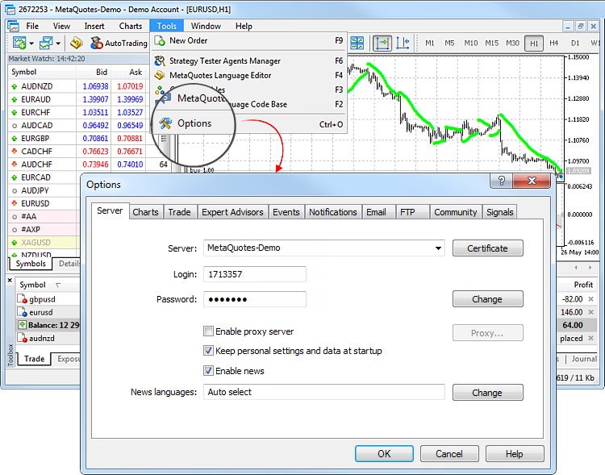

All settings are grouped in several tabs based on what they do:

  * [Server (#server)](Platform-Settings.md#server) — setup of server connection, configuration of a proxy server, and other important settings;
  * [Charts (#charts)](Platform-Settings.md#charts) — common settings of price charts and parameters of objects management: object selection straight after creation, immediate object configuration, and docking parameters;
  * [Trade (#trade)](Platform-Settings.md#trade) — default parameters applied to the opening of new orders. They include: financial instrument, number of lots, deviation, and placing of stop orders;
  * [Expert Advisors (#ea)](Platform-Settings.md#ea) — common settings for all Expert Advisors. They include: disabling operation of Expert Advisors, enabling importing functions from external DLL libraries and Expert Advisors, as well as a number of other features;
  * [OpenCL (#opencl)](Platform-Settings.md#opencl) — managing OpenCL devices used for calculations in trading robots.
  * [Events (#events)](Platform-Settings.md#events) — configuration of alerts of system events. You receive important alerts about connection loss, arrival of newsletters and other events;
  * [Notifications (#notifications)](Platform-Settings.md#notifications) — sending push notifications to mobile devices from the trading platform;
  * [Email (#mail)](Platform-Settings.md#mail) — email parameters for sending messages straight from the platform;
  * [FTP (#ftp)](Platform-Settings.md#ftp) — settings for publishing reports on the Internet. The trading platform allows saving and automatically publishing reports about the account state in real time. This is done over ftp based connection, which can be configured in this tab;
  * [Community (#community)](Platform-Settings.md#community) — details of your MQL5.community account;
  * [Signals (#signals)](Platform-Settings.md#signals) — settings for the [Signals service](https://www.mql5.com/en/signals "Signals Service") in the trading platform.

## Server (#server)

This tab contains the most important settings. The trading platform is initially configured to provide proper trouble-free operation. Thus, it is highly recommended not to change any parameters in this window unless there is a special necessity.

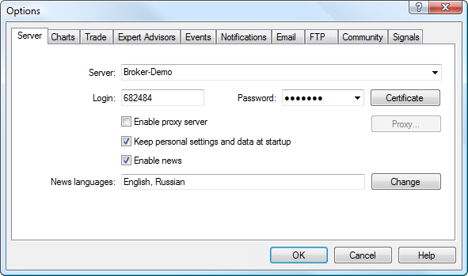

The window contains the following parameters:

  * Server — the name of the trade server the platform connects to. After the program installation, this field is already filled in. However, if you want to connect to another server, specify here the domain name (or IP address) of the server and connection port number separated by a colon. For example: 192.168.0.1:443. These data are saved on your computer and take effect only when you try to open a [new account](Open-an-Account.md). The new server address is added to the list of servers and can be selected during [account registration](Open-an-Account.md);
  * Certificate — click here to view the [details of the certificate (#certificate-view)](For-Advanced-Users/Extended-Authentication.md#certificate-view) that is used for authenticating on a trade server. The button only appears if the [extended authentication](For-Advanced-Users/Extended-Authentication.md) mode is used on the server;
  * Login — an account opened on the trade server and used to connect to it when you run the platform;
  * Password — account password for connecting to a trade server;
  * Change — [change the password (#password)](Platform-Settings.md#password) to the account;
  * Enable proxy server — allow the use of a proxy server when connecting to the trade server. If you enable this option, button "Proxy ..." becomes active;
  * Proxy — setup of connection through a [proxy server (#proxy)](Platform-Settings.md#proxy);
  * Keep personal settings and data at startup — save account details (number, main and investor passwords) on the hard disk after an account is created. During the next platform start, these data will be used for the automatic connection. If the option is disabled, you will need to enter the details manually each time you start the platform. This option only affects the current account specified in the "Login" field;
  * Enable news — this option allows to enable or disable [news (#news)](../Price-Charts-Technical-and-Fundamental-Analysis/Fundamental-Analysis.md#news). If this option is disabled, news will not be received in the platform;
  * News languages — this option allows filtering news by their language. When you click "Edit", the [news language (#news-language)](Platform-Settings.md#news-language) selection dialog appears. If it is set to "Auto Select", the news language is selected automatically in accordance with the trading platform UI language. News articles in English are displayed in case the platform language is not available for the news.

> It is strongly recommended that you do not change server connection settings unless there is a special necessity.

### Password Change (#password)

To change the account password, click "Edit". After that the following window opens:

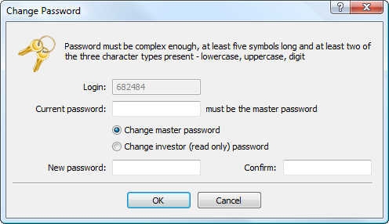

The following details are to be indicated in the password changing dialog:

  * Login — account number, this field cannot be changed;
  * Current password — the field to enter the [master password (#main-password)](Open-an-Account.md#main-password);
  * Change master password — select this option if you want to change the master password of your account;
  * Change investor password — select this option if you want to change the investor password of your account;
  * New password — field for entering a new password;
  * Confirm — field for confirming a new password.

The new password must meet the following requirements:

  * It must be no shorter than the length requirement displayed in the password change dialog.
  * It must contain four character types: lowercase letters, uppercase letters, numbers, and [special characters](https://learn.microsoft.com/en-us/style-guide/a-z-word-list-term-collections/term-collections/special-characters) (#, @, ! etc.). For example, 1Ar#pqkj.
  * It must not match the previous password.

After specifying all the data click "OK".

> A password cannot be changed if the current password is not specified.

### Proxy Server Setup (#proxy)

A proxy server is an intermediate between the trader's computer and the trade server. It is mostly used by internet providers or by local networks. If you have any connection problems, contact your system administrator or ISP. If you use a proxy server, configure the platform accordingly. Option "Enable proxy server" enables proxy server support and activates the "Proxy..." button.

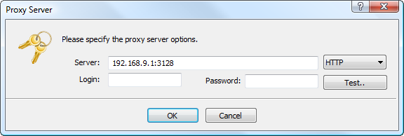

  * Server — enter here the IP address and port number of the server separated by a colon. To the right of this field, select the type of proxy server: HTTP, SOCKS4 or SOCKS5. In HTTP mode, NTLM authentication is also supported;
  * Login — a login to access the proxy server. If no login is required, leave it blank; 
  * Password — a password to access the proxy server. If no password is required, leave the field blank. 
  * Test — use this button to check whether all the proxy settings are correct. If the settings are incorrect, then after clicking on this button you will receive an appropriate message.

> Consult your system administrator or internet provider for proxy setup details.

### News Language Selection (#news-language)

To select language of incoming news, click "Edit" next to the appropriate field.

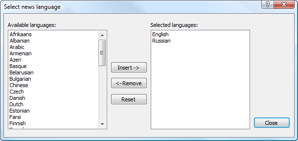

The left part of the window contains available languages, the right part — selected ones. To add a language, double-click on it in the left part, or select it and click "Add." To delete a language, use the "Remove" button. The "Reset" button sets the default values.

## Charts (#charts)

Charts show dynamics of security price changes. Chart settings and history data parameters are grouped in this tab. Changing the parameters in this tab does not cause any global changes in the platform operation.

This tab also contains settings for working with different objects applied to charts. They include [technical](../Price-Charts-Technical-and-Fundamental-Analysis/Technical-Indicators.md) and [custom](../Algorithmic-Trading-Trading-Robots/Expert-Advisors-and-Custom-Indicators.md) indicators, as well as various [graphical objects](../Price-Charts-Technical-and-Fundamental-Analysis/Analytical-Objects.md). Parameters collected in this tab facilitate work with graphical objects and cannot cause critical changes in the platform operation.

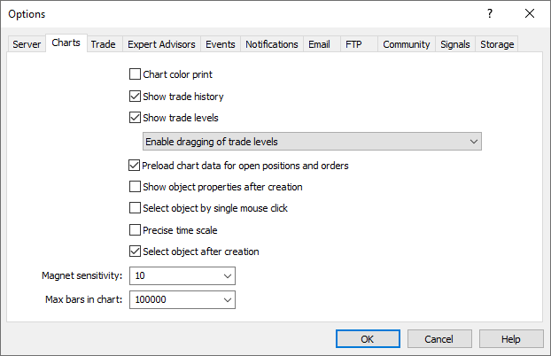

The following chart settings are available on this tab:

  * Color print — the platform allows printing not only black and white, but also colored charts. The latter ones are more appropriate for analysis than black-and-white ones. Enable this option to print color charts, if your printer supports colored printing.
  * Show trade history — show/hide on the chart entries and exits for the appropriate instrument. For more details, please visit section "[How to Analyze Your Entries on the Chart (#position-showonchart)](../Trading-Operations/Executing-Trades.md#position-showonchart)". The parameter is applied to all charts which the user opens in the platform. If the parameter is enabled, the display of trading history will be enabled on all charts by default. It can further be individually disabled [in appropriate chart settings (#trade-history)](../Price-Charts-Technical-and-Fundamental-Analysis/Additional-Features/Chart-Settings.md#trade-history).
  * Show trade levels — this option enables the display of price levels at which a position has been opened or a pending order has been placed, as well as Stop Loss and Take Profit levels. Display of trade levels can be enabled [separately (#trade-levels)](../Price-Charts-Technical-and-Fundamental-Analysis/Additional-Features/Chart-Settings.md#trade-levels) for each chart.

  * Disable dragging of trade levels — this option disables the possibility to modify [pending (#pending-modify-chart)](../Trading-Operations/Executing-Trades.md#pending-modify-chart) and [stop orders (#position-modify-chart)](../Trading-Operations/Executing-Trades.md#position-modify-chart) by dragging them on the chart.
  * Enable dragging of trade levels — this option allows modifying [pending (#pending-modify-chart)](../Trading-Operations/Executing-Trades.md#pending-modify-chart) and [stop orders (#position-modify-chart)](../Trading-Operations/Executing-Trades.md#position-modify-chart) by dragging them on the chart.
  * Enable dragging of trade levels with "Alt" key — this option allows to conveniently control [pending orders (#pending-modify-chart)](../Trading-Operations/Executing-Trades.md#pending-modify-chart) and [stop levels on a chart (#position-modify-chart)](../Trading-Operations/Executing-Trades.md#position-modify-chart). By default, without enabling this option, the orders and stop levels are moved using a mouse (drag'n'drop). If multiple [objects](../Price-Charts-Technical-and-Fundamental-Analysis/Analytical-Objects.md) are applied on a chart, you can accidentally move one of them instead of the level. In this case, enable this option. You still can drag trade levels using your mouse, but need to additionally hold the "Alt" key.
  * Preload chart data for open positions and orders — in order to save traffic, the trading platform downloads symbol price history only when the relevant data is requested, for example when the [price chart is opened](../Price-Charts-Technical-and-Fundamental-Analysis/View-and-Configure-Charts.md) or when [testing](../Algorithmic-Trading-Trading-Robots/Strategy-Testing.md) is launched. However, this may not always be convenient for actively used symbols. If you enable this option, the charts of the symbols for which you have open positions or pending orders, will always be updated in the background mode. Thus, you will not have to wait for data to be downloaded after chart opening, and the relevant data will be immediately available for analysis.
  * Show object properties after creation — all objects have certain [properties (#manage)](../Price-Charts-Technical-and-Fundamental-Analysis/Analytical-Objects.md#manage). For example, thickness and color of the trend line, period of the indicator's signal line, etc. Most traders use standard settings of all graphical objects, but in some cases you may need to set them up individually. Option "Show object properties after creation" allows to automatically open the window of properties of [graphical objects (#manage)](../Price-Charts-Technical-and-Fundamental-Analysis/Analytical-Objects.md#manage) and [indicators (#run)](../Price-Charts-Technical-and-Fundamental-Analysis/Technical-Indicators.md#run) after they are applied to a chart.
  * Select objects by single mouse click — graphical objects in the platform can be selected by a single or double click. This option allows switching between the object selection methods. If it is enabled, all objects are selected by a single click. If this option is disabled, all objects are selected by a double click.
  * Precise time scale — if this option is disabled, objects are bound to bars along the horizontal scale of a chart. If you enable it, then it is possible to position an object at any point between bars.
  * Select objects after creation — objects are positioned in charts manually. After creating an object you may need to move it, for example to accurately position a trendline. To do that, it is necessary to select the object first. This option allows to do that automatically right after placing an object on a chart.
  * Magnet sensitivity — the platform allows to "dock" anchor points (except for the central moving points) of [graphical objects](../Price-Charts-Technical-and-Fundamental-Analysis/Analytical-Objects.md) to different bar prices to locate them more precisely. In the "Magnet sensitivity" field, the sensitivity of this option in pixels can be defined. For example, if the value of 10 is specified, the object will automatically be docked to a bar if the object's anchor point is located within a distance of 10 pips from the nearest bar price (OHLC). That point should also be within the bar width. To disable this option, set the parameter to 0.

> When you apply an object on a chart with the [timeframe (#operations)](../Price-Charts-Technical-and-Fundamental-Analysis/View-and-Configure-Charts.md#operations) other than M1, the following magnet features appear:

  * Max. bars in chart — there is a difference between the bars stored in history and those shown in charts. This difference is determined by the fact that any amount of bars can be kept in the hard disk provided that it has enough space. But the amount of bars shown in the chart is limited by the computer resources.  
  
Bars displayed on the chart are used for drawing [technical](../Price-Charts-Technical-and-Fundamental-Analysis/Technical-Indicators.md) and [custom](../Algorithmic-Trading-Trading-Robots/Expert-Advisors-and-Custom-Indicators.md) indicators. When multiple indicators and large amount of data to be displayed are used simultaneously, computer free resources (CPU load and free RAM) can exhaust very soon.  
  
To avoid such problems, you can set the amount of data displayed on the charts. This can be done by selecting a corresponding value from the pop-up list or by entering a value manually in this field (minimum value is 5000). For the changes of this parameter to take effect, restart the platform.

> Indicators can access more bars than specified in "Max bars in chart" parameter for more efficient calculation. Older bars are not removed immediately from the data cache when the new ones appear. This allows not to recalculate an indicator at each new bar, but calculate its values for new bars instead.

Changes of the settings take effect after clicking the OK button except the "Max. bars in chart" option. Restart the platform after you change the parameter.

## Trading (#trade)

This tab features settings used for [opening orders (#position-open)](../Trading-Operations/Executing-Trades.md#position-open). Parameters specified here facilitate opening of orders and cannot cause critical changes in the platform operation.

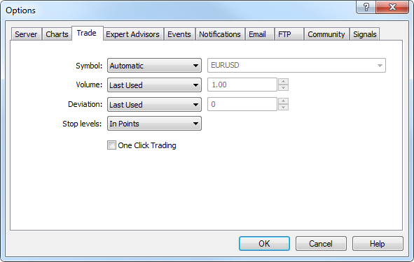

Use these options to set default parameters applied when [opening orders (#position-open)](../Trading-Operations/Executing-Trades.md#position-open):

  * Symbol — this option allows to define a symbol that will be automatically added to the position opening window. The "Automatic" parameter means that the active chart symbol will be set in this field, the "Last used" — the symbol of the latest trade operation. If "Default" parameter is selected, you can specify a certain financial instrument that will be automatically set for all positions.
  * Volume — this option adds a certain volume in the [position opening (#position-open)](../Trading-Operations/Executing-Trades.md#position-open) window, [quick trading panel on the chart (#chart-deal)](../Trading-Operations/One-Click-Trading.md#chart-deal) and [a trading panel in Market Watch (#trading)](../Trading-Operations/Market-Watch.md#trading). The "Last Used" parameter means that the volume of a previous operation will be selected. The "Default" parameter allows to specify a certain volume to be indicated automatically for all positions.
  * Deviation — symbol price may change during order creation. As a result, the price of a prepared order will differ from the market one, and the position will not be opened. The "Use Deviation" option helps to avoid this. When "Default" parameter is set, to the right of this field you can set the maximum acceptable price deviation from the value indicated in the order. If prices are not identical, the program modifies the order and a new position is opened. If "Last Used" is selected, the deviation value of the previous opened position will be automatically set in the order opening window.
  * Stop levels — settings for the Stop Loss and Take Profit [levels (#take-profit)](../Trading-Operations/Basic-Principles.md#take-profit) that will be added when [placing (#position-open)](../Trading-Operations/Executing-Trades.md#position-open) orders or [modifying positions (#position-modify)](../Trading-Operations/Executing-Trades.md#position-modify). If the "in points" variant is chosen, stop levels will be specified in the number of points from the price of order placing. If the "in prices" variant is chosen, it will be necessary to specify the certain price level for stop levels.
  * One click trading — to use this option, you need to accept [special terms and conditions (#agreement)](Platform-Settings.md#agreement). The one-click trading option allows performing trade operations in one click without additional confirmation by trader ([trade dialog (#position-open)](../Trading-Operations/Executing-Trades.md#position-open) is not displayed). The one-click trading feature is implemented in the following parts of the platform:

  * the [Trading (#trading)](../Trading-Operations/Market-Watch.md#trading) tab in Market Watch,
  * [the quick trading panel on the chart (#chart-deal)](../Trading-Operations/One-Click-Trading.md#chart-deal),
  * the [Trade (#position-list)](../Trading-Operations/Executing-Trades.md#position-list) tab in the Toolbox window,
  * [Depth of Market (#quick-trading)](../Trading-Operations/Depth-of-Market.md#quick-trading).
  * Show realtime history of deals on chart — when this option is enabled, all the deals performed by a trader are automatically displayed on the chart of the corresponding symbols with the icons  (a Buy deal) and  (a Sell deal). When you point the mouse cursor to an icon, a tooltip appears containing information about the deal: ticket, deal type, volume, symbol, open price and current price coordinate of the cursor.

### Terms and Conditions for Using One-Click Trading (#agreement)

When "One click trading" option is used for the first time, Terms and Conditions for using this function are displayed to users.

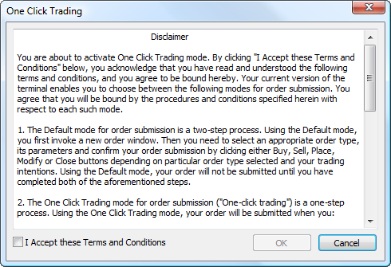

If you accept the conditions, tick "I Accept these Terms and Conditions" option and click "OK". If you do not accept the conditions, click "Cancel" and do not use the "One Click Trading" function.

## Expert Advisors (#ea)

Settings of working with Expert Advisors are grouped in this tab. Expert Advisors in the platform are applications developed in the [MetaQuotes Language 5 (#mql5)](../Algorithmic-Trading-Trading-Robots/How-to-Create-an-Expert-Advisor-or-an-Indicator.md#mql5) used for the automation of analytical and trading processes. The description of how to create and use experts is given in section [How can I create and Expert Advisor or an Indicator](../Algorithmic-Trading-Trading-Robots/How-to-Create-an-Expert-Advisor-or-an-Indicator.md).

This section contains description of settings common for all Expert Advisors only:

  * Allow Auto Trading — this option allows or prohibits trading using [Expert Advisors](../Algorithmic-Trading-Trading-Robots/Expert-Advisors-and-Custom-Indicators.md) and [scripts (#type)](../Algorithmic-Trading-Trading-Robots/How-to-Create-an-Expert-Advisor-or-an-Indicator.md#type). If it is disabled, scripts and Expert Advisors can work, but are not able to trade. This limitation can be useful for testing the analytical capabilities of an Expert Advisor in the real-time mode (not to be confused with testing on history data).  
The option enables/disables automated trading for the entire platform. If you disable it, no Expert Advisor will be allowed to trade, even if you enable automated trading individually in the [Expert Advisor settings (#run)](../Algorithmic-Trading-Trading-Robots/Expert-Advisors-and-Custom-Indicators.md#run). If you enable it, the Expert Advisors will be allowed to trade, unless automated trading is individually disabled in the Expert Advisor parameters.

  * Disable automated trading when switching accounts — this option represents a protective mechanism disabling trading by Expert Advisors and scripts when the account is changed. It is useful, for example, when switching from a demo account to a real one.
  * Disable automated trading when switching profiles — a large amount of information about the current settings of all charts in the workspace is stored in [profiles (#profiles)](../Price-Charts-Technical-and-Fundamental-Analysis/Additional-Features/Templates-and-Profiles.md#profiles). Particularly, profiles contain information about Expert Advisors attached. [Expert Advisors](../Algorithmic-Trading-Trading-Robots/Expert-Advisors-and-Custom-Indicators.md) included into the profile will start working with the arrival of a new tick. Enable this option to prevent trading by Expert Advisors when changing the profile.
  * Disable automated trading when switching chart symbols or period — if this option is enabled, then when the period or symbol of a chart is changed, the Expert Advisor attached to it will be automatically prohibited from trading.

  * Disable automatic trading through the external Python API — [Python scripts (#python)](../Algorithmic-Trading-Trading-Robots/Expert-Advisors-and-Custom-Indicators.md#python) which use the module for integration with the trading platform, can perform trading operations. However, this possibility is disabled by default for security reasons. You should explicitly enable auto trading by ticking off this option.
  * Allow DLL imports (potentially dangerous, enable only for trusted applications) — to extend functionality, [mql5 applications](../Algorithmic-Trading-Trading-Robots/How-to-Create-an-Expert-Advisor-or-an-Indicator.md) can use DLLs. This option allows determining a default value for the "Allow DLL imports" parameter used during [start of applications (#run)](../Algorithmic-Trading-Trading-Robots/Expert-Advisors-and-Custom-Indicators.md#run). It is recommended to disable import when working with unknown Expert Advisors.
  * Allow WebRequest for listed URL — the WebRequest() function in MQL5 is used for receiving and sending information to websites using GET and POST requests. To allow an MQL5 application to send such requests, enable this option and manually explicitly specify the URLs of trusted websites. For security reasons, the option is disabled by default.  
To delete an address from the trusted list, select it and press "Delete".

## OpenCL (#opencl)

Modern video cards contain hundreds of small specialized processors which can simultaneously perform simple mathematical operations on incoming data threads. The [OpenCL](https://www.mql5.com/en/docs/opencl) language organizes parallel computations and thus enables much faster operations for certain tasks when creating trading robots. In particular, such acceleration can be useful when developing applications based on neural networks. [MQL5 (#mql5)](../Algorithmic-Trading-Trading-Robots/How-to-Create-an-Expert-Advisor-or-an-Indicator.md#mql5) provides native functions for accessing the OpenCL API and thus you can easily utilize API capabilities in your trading applications.

In platform settings, you can explicitly specify which devices will be used for calculations. Using the settings, you can also enable/disable the use of OpenCL when working in the local platform, in the strategy tester or when executing computational tasks received from the [MQL5 Cloud Network](../MQL5-Cloud-Network/README.md).

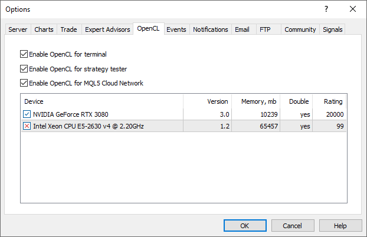

The following information is displayed for each device:

  * Supported OpenCL version
  * Available memory
  * Support for the double type in calculations
  * Performance rating

## Events (#events)

Alerts of system events (like server connection, disconnection, email notification, etc.) can be set up here. It is a very convenient tool informing about changes in the platform status. To start setting up alerts, check the "Allow" option.

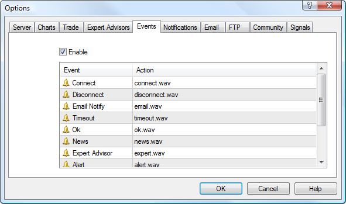

All events are represented in the form of a table containing their names and default audio files that are executed when the event occurs. The following types of events are available:

  * Connect — alert of a successful connection to a server;
  * Disconnect — alert of server connection loss;
  * Email Notify — email received;
  * Timeout — a certain time range is given for performing trade operations. If this range has been exceeded for some reason, the operation will not be performed, and the alert will trigger;
  * Ok — alert of a successful execution of a trade operation;
  * News — alert of a received [newsletter (#news)](../Price-Charts-Technical-and-Fundamental-Analysis/Fundamental-Analysis.md#news);
  * Expert Advisor — alert of a trade operation performed by an [Expert Advisor](../Algorithmic-Trading-Trading-Robots/Expert-Advisors-and-Custom-Indicators.md);
  * Alert — Alert() function executed by an Expert Advisor;
  * Requote — alert of a price changed (requote) at the attempt to perform a trade operation;
  * Trailing Stop — alert of [trailing stop order (#trailing-stop)](../Trading-Operations/Basic-Principles.md#trailing-stop) triggering.
  * Testing Finished — alert of the end of [testing or optimization](../Algorithmic-Trading-Trading-Robots/Strategy-Testing.md).

To disable any of the alerts, click once on its icon  or double-click on its name. After that the icon will look like this — . To activate an alert, repeat the same operation.

To change a file played when the event occurs, double-click on its name or select it and press "Enter". Then select "Choose other" from the drop-down list and specify the necessary file.

> By default a file with *.wav extension is offered as a sound. However, another file can also be selected. If a *.wav file is selected, it will be played when the alert triggers. If another file is selected, it will be opened using application it is associated with in the operating system.

## Notifications (#notifications)

The trading platform supports push notifications. Push notifications are short text messages which can be sent to mobile devices from the desktop platform and from various MQL5.community services.

Unlike SMS, push notifications are sent over the Internet and thus they do not depend on mobile carriers. They can be delivered to different regions without any fees. The trader only needs to install a mobile platform for [iOS](https://download.mql5.com/cdn/mobile/mt5/ios?hl=en&utm_campaign=metaquotes.download&utm_source=www.metatrader5.com "iOS") or [Android](https://download.mql5.com/cdn/mobile/mt5/android?hl=en&utm_campaign=metaquotes.download&utm_source=www.metatrader5.com "Android"). Notifications are delivered via the mobile platform.

### Configuring Notifications in the Mobile Platform (#configuring-notifications-in-the-mobile-platform)

The identifier of the push notification recipient is MetaQuotes ID. Each device has a unique ID. Open the mobile platform and go to the "Messages" section:

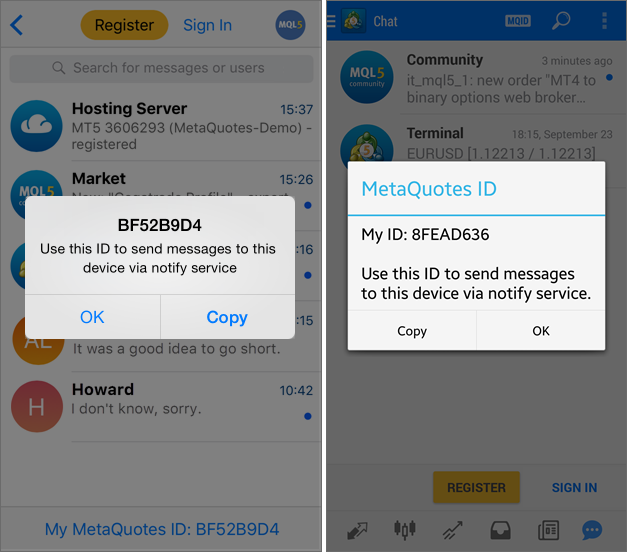

For further details please view the documentation for mobile platforms: [iPhone/iPad](https://www.metatrader5.com/en/mobile-trading/iphone/help/settings_messages), [Android](https://www.metatrader5.com/en/mobile-trading/android/help/messages).

> To install a mobile platform, please use the following links:

### Configuring Notifications in the Desktop Platform (#configuring-notifications-in-the-desktop-platform)

Check the "Enable Push Notifications" box and specify the MetaQuotes ID from your mobile platform.

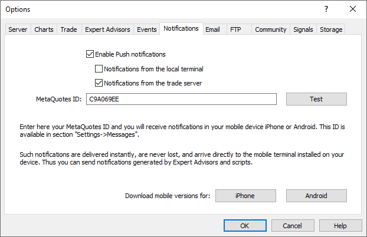

You can specify up to 4 MetaQuotes IDs separated by commas. Push notifications will be sent to all devices simultaneously.

Next, select the type of notifications about trading activity on your account:

  * Notifications from the local terminal — the platform will automatically send notifications about all successful trade operations to the specified MetaQuotes ID. The platform will also send notifications about any balance operations performed on the account as well as about the Margin Call state (in this case notifications are sent periodically, as long as the account is in the Margin Call state). The platform will not send notification about unsuccessful operations (for example, if the order was rejected due to incorrect parameters).
  * Notifications from the trade server — the advantage of this option over the previous one is that the trader does not need to keep the platform constantly running. Notifications are sent from the broker's server. For example, if a Take Profit triggers on the server while your computer is turned off, you will receive a relevant position closing notification on your mobile device.  
  
When you enable this option, the platform subscribes the current account to notifications. If you want to enable notifications for a different account, connect using the relevant account and enable this option in setting.  
  
The availability and details of notifications depend on the broker. Three notification types are supported: orders, deals and balance operations. When you enable the option, the available notification types will be displayed in the platform log: 

'1222': subscribed to deals, orders, balance notifications from trade server  
---  
  
Click on the "Test" button to test the delivery of push notifications. Upon successful sending, you will see a corresponding message, and a test notification will be delivered to your mobile device.

### Configuring Notifications from MQL5.community (#configuring-notifications-from-mql5community)

In order to keep abreast of the latest MQL5.community events, you can set up notifications about the latest site events via the Settings — Notifications section of your profile.

  * private message notifications
  * notifications about comments on your blogs, forum posts, etc.
  * notifications about step confirmations in the "Freelance" service
  * notifications about completed product publication steps in the Market, notifications about article and Code Base publications
  * notifications about new Market products, articles, free codes and Freelance orders
  * and much more

Next, go to Settings — Security, and enter your MetaQuotes ID.

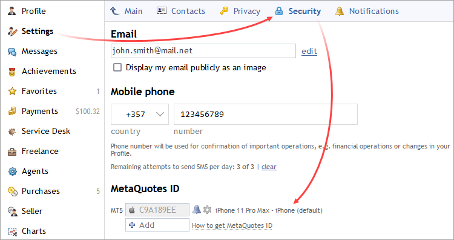

### Sending Notifications via an MQL5 Application (#sending-notifications-via-an-mql5-application)

The MQL5 language provides a special function [SendNotification](https://www.mql5.com/en/docs/network/sendnotification) which enables MQL5 applications to send push notifications to MetaQuotes ID specified in the platform settings. You can include notifications about any events in your code. If you do not have the required skills, you can order a program from a professional developer via the [Freelance](https://www.mql5.com/en/job) service.

### Sending Messages via the Alert Function (#sending-messages-via-the-alert-function)

The trading platform allows creating [alerts (#alert)](../Trading-Operations/Executing-Trades.md#alert) to notify the user about market events. This feature is available in the Alerts tab of the Toolbox window. One of the event notification types is push notifications.

> There is a limitation on the number of messages sent: no more than 1 message per 0.5 second and no more that 10 messages per minute.

## Email (#mail)

Mailbox is configured on this tab. These settings will be then used to send message by the [Expert Advisor](../Algorithmic-Trading-Trading-Robots/Expert-Advisors-and-Custom-Indicators.md) command or by a triggered [alert (#alert)](../Trading-Operations/Executing-Trades.md#alert).

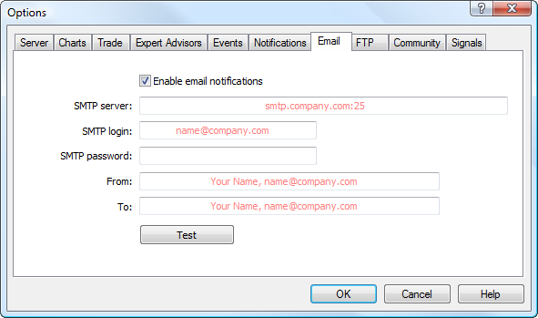

Configure the following parameters on this tab:

  * Enable — enable/disable the mailbox. If this option is disabled, all other settings are not available;
  * SMTP server — address of the SMTP server and port used. This server is used to send emails. The record must be made in the following format "[server web address] : [port number]". For example, "smtp.mail.ru:25", "smtp.gmail.com:465" etc.
  * SMTP login — a login for authentication on the mail server, usually it is an email address, for example, "your_name@mail.net";
  * SMTP password — a password for authentication on the mail server (your mailbox password);
  * From — the email address, from which the message will be sent. Enter the name and address of the email account on the same mail server, the SMTP-protocol of which will be used. The name may also be missing. Example of this field: "your_name, your_name@mail.ru";
  * To — the email address, to which the messages will be sent. Name and address are also specified here, but the name may be omitted, for example: "any_name, any_mail@mail.net".

  * Only one email address may be specified for either of fields "From" and "To". Several emails given with or without separators will not be accepted.
  * The email password is stored in encrypted form.

  
---  
  
Click "Test" to send a test message using the settings specified. If the test is successful, click "OK" to apply these settings. If the test fails, it is recommended to check all settings again, restart the platform and resend a test message.

## FTP (#ftp)

The trading platform allows you to automatically publish [reports (#trade-history)](../Trading-Operations/Executing-Trades.md#trade-history) on the account state and its history. To do this, configure internet connection parameters through FTP.

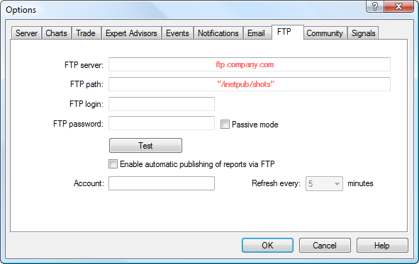

The following parameters are available in this window:

  * FTP server — address of the FTP server the report will be sent to. For example, ftp.company.com;
  * FTP path — path to a directory on the FTP server where the reports will be placed. Specify the path relative to the root directory, for example: /inetpub/statements;
  * FTP login — login for authorizing on the FTP server;
  * FTP password — password for authorizing on the FTP server;
  * Passive mode — switching between active and passive mode. In the active mode, the trading platform accepts connection from the FTP server, in the passive mode the server accepts connection from the platform;
  * Test — use it to send a test report on the active account using the specified parameters. The test result is shown in a separate window;
  * Enable automatic publishing of reports via FTP — enable/disable publishing of reports. If you do not select this option, the remaining fields are not available;
  * Account — the account number you want to publish reports for. To publish reports, you need to be connected with this account;
  * Refresh every — periodicity of sending reports to the web server (in minutes).

  * Reports are published for the currently active account only. If the account number specified in this tab does not correspond to the current one, reports will not be published.
  * In the active mode, a free port (from dynamic range of 1024 to 65535) is allocated on the platform. The server connects to this port in order to set connection for data transmission. The FTP server connects to the client's port with the given number using TCP port 20 from its part to transfer data. In the passive mode, the server informs the client about the TCP port number (from the dynamic range of 1024 to 65535) to which the client can connect to set up data transfer.
  * Report templates are located in the [/Templates (#templates)](For-Advanced-Users/Files-and-Folders.md#templates) folder of the platform.

  
---  
  

## Community (#community)

The trading platform is tightly integrated with [MQL5.community](https://www.mql5.com/en "MQL5.community") — a community of MQL5 developers. The MQL5.community provides unique services for traders and developers:

  * The Market — the platform allows [purchasing](../Market-App-Store/How-to-Purchase-an-App.md "Purchase the product at the Market tab") any ready-made application from the [MQL5 application store](https://www.mql5.com/en/market "Market on MQL5.community website") website. Before purchasing, you can download a trial version and test it in the [strategy tester](../Algorithmic-Trading-Trading-Robots/Strategy-Testing.md).
  * Signals — subscribe to the [trading signals](../Trading-Signals-and-Copy-Trading/README.md) of professional traders and receive them straight in your platform.
  * VPS — rent a [virtual platform](../Virtual-Hosting-for-247-Operation/README.md) for 24/7 operation of copied signals and trading robots. A VPS can be rented directly from the platform and it does not require any additional setup on your side. Furthermore, the location of virtual servers ensures minimum delays in the execution of trading operations on the broker's server.
  * MQL5 Cloud Network [is a powerful distributed computing network](https://cloud.mql5.com/ "MQL5 Distributed Cloud Network") available for testing and optimization of Expert Advisors in the [Strategy Tester](../Algorithmic-Trading-Trading-Robots/Strategy-Testing.md). Thousands of optimization sessions can now be performed in minutes. In addition to using the network, you can provide your own computing capacities and [earn](../MQL5-Cloud-Network/How-to-Participate.md "Take part in MQL5 Cloud Network") profit.
  * MQL5 Storage — personal storage of source codes integrated into the MetaEditor. Keep your code safe and access it from anywhere in the world. The MQL5 Storage features will be expanded soon to allow multiple users to remotely work on one project.
  * Freelance — if you cannot find the desired application in the Code Base or Market, order one from a professional developer in the [Freelance section](https://www.mql5.com/en/job "Freelance on MQL5.community") of MQL5.community website.
  * Code Base — [download (#codebase "download an application at the code base tab")](../Algorithmic-Trading-Trading-Robots/Where-to-Find-Trading-Robots-and-Indicators.md#codebase "download an application at the code base tab") any code published in the [Code Base](https://www.mql5.com/en/code "Code Base on MQL5.Community") of MQL5.community website. The code is automatically placed in the correct directory and compiled. You only need to run the application from the [Navigator](User-Interface.md) window.
  * Articles — the extensive library of [MQL4/MQL5 programming articles (#articles)](../Algorithmic-Trading-Trading-Robots/How-to-Create-an-Expert-Advisor-or-an-Indicator.md#articles) will help you learn how to create trading robots and technical indicators.
  * MQL5 Charts — a special service allowing to [post screenshots from the trading platform online](../Price-Charts-Technical-and-Fundamental-Analysis/Publish-Online.md) and share them in popular social networks.

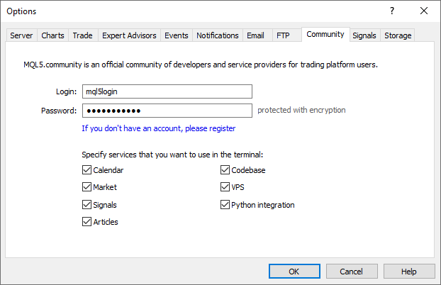

Enter your account details and get access to all the unique services of the MQL5.community:

  * Login — MQL5.community account.
  * Password — a password to the specified account.

  * The password is stored on the hard drive in an encrypted form.
  * If you do not have an MQL5.community account, please [register](https://www.mql5.com/en/auth_register "Register at MQL5.community") and get access to unique opportunities.

  
---  
  
Link "register" opens the window of quick registration on MQL5.community.

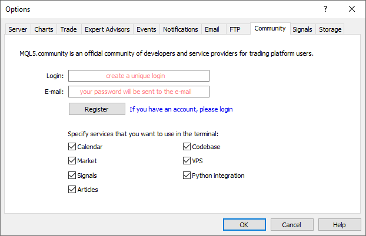

Here, specify the desired username for your account, and e-mail. Once you click "Register", an account is created for you and an email with the account password is sent to the specified address.

To save resources and to optimize the platform working area, you can disable the MQL5 services which you do not use. For example, if you are not interested in [MQL5 programming languages (#articles)](../Algorithmic-Trading-Trading-Robots/How-to-Create-an-Expert-Advisor-or-an-Indicator.md#articles) or in copy trading via the [Signals](../Trading-Signals-and-Copy-Trading/README.md) service, uncheck the relevant options in the settings to hide these sections. If you disable [Python integration (#python)](../Algorithmic-Trading-Trading-Robots/Expert-Advisors-and-Custom-Indicators.md#python) the relevant scripts will not be launched on charts.

## Signals (#signals)

Use this tab to configure the [Signals service](https://www.mql5.com/en/signals "Signals Service") in the trading platform.

The Signals service allows anyone to become a provider and sell trading signals or subscribe to them and follow the strategy of an experienced trader. Any traders can subscribe to the signals of another experienced trader ([Provider](../Trading-Signals-and-Copy-Trading/How-to-Become-a-Signal-Provider.md)) to copy his or her trade operations.

Find more about the service in the [Signals](../Trading-Signals-and-Copy-Trading/README.md) section.

The name of the signal you are currently [subscribed](../Trading-Signals-and-Copy-Trading/How-to-Subscribe-to-a-Signal.md) to is displayed at the top of the tab. If there is no subscription, the settings below are uneditable.

  * Agree to the terms of use of the Signals service — to start using the Signals service, agree to its [rules of use](https://www.mql5.com/en/signals/rules "Rules of Using the Signals Service"). Read the rules carefully. If you agree, check the box next to the option. If you do not agree with the rules, do not use the Signals service.
  * Enable realtime signal subscription — trading operations can be copied to your account only if this option is enabled. No operations will be copied to the account in case the option is disabled. The settings below will become editable only after enabling this option.
  * Copy Stop Loss and Take Profit levels — [Stop Loss (#stop-loss)](../Trading-Operations/Basic-Principles.md#stop-loss) and [Take Profit (#take-profit)](../Trading-Operations/Basic-Principles.md#take-profit) placed at the provider's account will be also placed on your trading account if this option is enabled. These orders are executed at the broker's side. It means that they are executed regardless of whether the platform is running or not. Also, execution can be different for different brokers (if subscriber and provider have different brokers).  
Therefore, copying of stop orders guarantees that a position will be closed upon reaching the specified profit and loss levels.
  * Synchronize positions without confirmations — automatic synchronization without additional confirmation. When subscribing to a signal, trading state of the Subscriber's and Provider's accounts are [synchronized (#sync)](../Trading-Signals-and-Copy-Trading/How-to-Subscribe-to-a-Signal.md#sync). This can be a primary synchronization when activating the subscription or [a re-synchronization (#resync)](../Trading-Signals-and-Copy-Trading/How-to-Subscribe-to-a-Signal.md#resync) during copying.  
If pending orders or non-signal positions (opened manually or by an Expert Advisor) are detected at the Subscriber's account during synchronization, the dialog offering to close the positions and remove the orders is displayed. If during the [initial synchronization (#sync)](../Trading-Signals-and-Copy-Trading/How-to-Subscribe-to-a-Signal.md#sync), a provider account has floating (unfixed) profit, a user will see a dialog window offering to wait for better conditions to start copying. In both cases, synchronization is not performed and copying of signals is stopped until the user makes the decision by clicking the appropriate dialog button.  
If the platform is working around the clock without constant external control (for example, runs on VPS), confirmation requests to perform synchronization are left unanswered and thus can prevent signals from being copied. When this option is enabled, synchronization is always performed automatically without the need for Subscriber's confirmation.

  * If there are custom positions/orders, they are left on the account, while the system starts/proceeds copying the Provider's trades.
  * If the Provider has a floating profit, the platform does not wait for better entry conditions and starts copying immediately.
  * Use no more than [A] % — percentage value of your deposit that can be used for following provider's signals. For example, if your balance is 10,000 USD and 90% is specified here, then 9,000 USD will be used for following the signals. This affects the calculation of volumes of the deals performed when following the signals. The volume is calculated proportionally. See ["Signal Subscribers" (#trade)](../Trading-Signals-and-Copy-Trading/How-to-Subscribe-to-a-Signal.md#trade) section for more information. It is strongly not recommended to change the deposit load if you already have positions opened according to a signal. This will lead to correction of volume of the open positions (volume increase or partial close at the current market price).
  * Stop if equity is less than [B] — this parameter allows you to limit losses when using trading signals. If equity drops below a specified level, copying of trade signals is automatically terminated, and all positions are closed. 0 means no limitations.
  * Deviation/Slippage [C] spreads — this setting is similar to deviation set when [orders are placed (#position-open)](../Trading-Operations/Executing-Trades.md#position-open) from the platform. This is the value of the permissible deviation of the executed order price from the price initially requested by the platform when copying a trading operation. This value is displayed as a part of the current spread on the symbol used in trading operation.  
The order is executed if the deviation is less or equal to the specified parameter. If the price deviation is greater than the specified value, operation is canceled. The next attempt to perform a trading operation will be carried out after a while.

