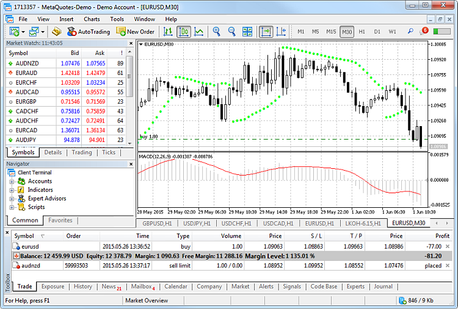
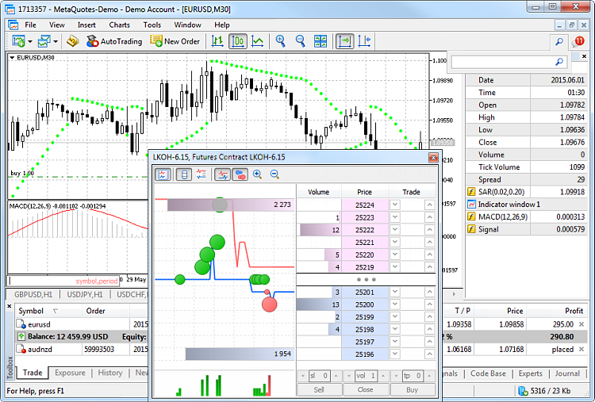
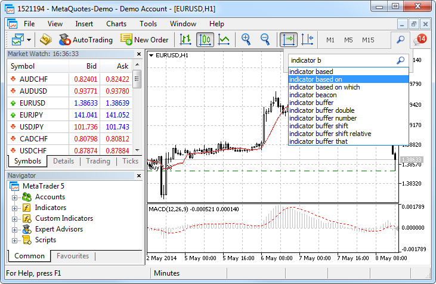
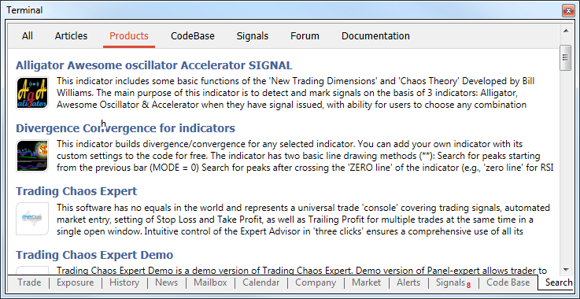

[🏠 Document Start](../README.md) / [Getting Started](../Getting-Started.md) / User Interface

[Previous](../Getting-Started.md) | [Next](Open-an-Account.md)

# User Interface (#user-interface)

The platform interface provides access to all the necessary tools for trading in the financial markets. It includes various menus, toolbars, and service windows.

### Main Menu (#main-menu)

The main menu contains almost all commands and functions that can be executed in the trading platform. It provides access to operations with charts, analytical tools, platform settings and other features. The main menu consists of the following items: File, View, Inset, Charts, Tools, Window, Help.

### Toolbars (#toolbars)

The platform has three built-in toolbars: Standard, Line Studies and Periodicity. The toolbars contain duplicated commands and functions of the main menu. However, these commands are customizable, so one can collect only mostly used widgets in them.

### Learning system (#learning-system)

The platform includes a built-in learning system featuring over 100 interactive tips concerning its main functions.

  * Tips are seamlessly displayed as a progress bar on the toolbar and thus they do not distract the user.
  * Tips only appear for the actions which you have never performed in the platform.
  * All tips include interactive links, by which you can navigate to the relevant interface elements. For example, a trading dialog or a menu with the desired program can be launched straight from the tip.

The progress bar will increase whenever you perform the actions described in the tips.

### Market Watch (#market-watch)

The [Market Watch](../Trading-Operations/Market-Watch.md) window provides access to the price data of financial instruments: prices, statistics and tick charts. It also provides details of contract specifications and One Click Trading options

### Navigator (#navigator)

The Navigator allows switching between accounts and provides functions for running trading robots and indicators. It contains a list of applications purchased from the [Market](../Market-App-Store/README.md) and downloaded from the [Code Base](../Algorithmic-Trading-Trading-Robots/Where-to-Find-Trading-Robots-and-Indicators.md). From the navigator, users can [rent a virtual platform](../Virtual-Hosting-for-247-Operation/README.md) to provide round-the-clock operation of Expert Advisors and trading Signals.

### Chart (#chart)

The essence of technical analysis is studying [price charts of financial instruments](../Price-Charts-Technical-and-Fundamental-Analysis/README.md) using technical indicators and analytical objects. Charts in the platform have a variety of settings, so that traders can customize them and adapt to their personal needs. Every chart can display 21 timeframes from one minute (M1) to one month (MN1).

### Chart Switch Bar (#chart-switch-bar)

The chart selection bar provides quick access to open chart windows.

### Status Bar (#status-bar)

The status bar contains additional details: server connection indication, the name of an active template and profile, as well as command prompts and price data.

### Toolbox (#toolbox)

Toolbox is a multifunctional window that provides functions for working with [trade positions](../Trading-Operations/Executing-Trades.md), [news (#news)](../Price-Charts-Technical-and-Fundamental-Analysis/Fundamental-Analysis.md#news), [account history (#trade-history)](../Trading-Operations/Executing-Trades.md#trade-history), alerts, internal mailbox, program logs, and expert journals. Additionally, from the Toolbox you can open and modify various orders and manage trade positions.

### Company (#company)

A broker may choose to show a useful web resource here, for example a support website. Any link added here opens in a separate web browser window.

This tab is hidden if the web page is disabled by the broker.

The trading platform interface is highly customizable. You can choose to display only the tools that you currently need. For example, you can hide Market Watch and Navigator, and show the Depth of Market and Data Window.

### Search (#search)

The trading platform provides the smart high-performance [Search system (#search)](User-Interface.md#search) to help you find required information in the MQL5.community — a community of traders and MQL5 developers. The [MQL5.community](https://www.mql5.com) resource contains [documentation](https://www.mql5.com/en/docs), [trading forum](https://www.mql5.com/en/forum), [blogs](https://www.mql5.com/en/blogs) of traders and analysts, as well as [articles](https://www.mql5.com/en/articles) about programming and terminal use.

The community provides access to the huge [Code Base (#codebase)](../Algorithmic-Trading-Trading-Robots/Where-to-Find-Trading-Robots-and-Indicators.md#codebase) and the [store of applications](../Market-App-Store/README.md) for the platform. Trading operations of professional traders can be copied through the online [Signals](../Trading-Signals-and-Copy-Trading/README.md) service.

### MQL5.community Chat (#mql5community-chat)

Chat with you friends and fellow traders on [MQL5.community](https://www.mql5.com/) straight from the trading platform. The chat maintains the history of messages, as well as it features the number of unread messages. To start a chat, log in to your MQL5 account directly from the chat window or via the platform settings: 'Tools' -> 'Options' -> 'Community'.

### Data Window (#data-window)

The [data window (#datawindow)](../Price-Charts-Technical-and-Fundamental-Analysis/View-and-Configure-Charts.md#datawindow) features accurate price information, as well as currently used [indicators](../Price-Charts-Technical-and-Fundamental-Analysis/Technical-Indicators.md) and [Expert Advisors](../Algorithmic-Trading-Trading-Robots/Expert-Advisors-and-Custom-Indicators.md) at the selected point of the chart.

### Depth of Market (#depth-of-market)

The [Depth of Market](../Trading-Operations/Depth-of-Market.md) displays information about buy and sell orders for a security at the best prices (closest to the market price). The Depth of Market also includes a tick chart, on which the Time&Sales data of deals is displayed. Deals appear as colored circles. The color shows the direction, the size means the volume of a deal.

### Fast Navigation Bar (#fast-navigation-bar)

This bar provides functions for quick chart operations. It allows moving a chart along the time axis, as well as changing its timeframe or the symbol. Double-click and type the required symbol, timeframe, and date.

### Account and Chart Details (#account-and-chart-details)

The platform header contains information about the current account number, application name, as well as the active chart name and its timeframe.

## Search (#search)

The trading platform provides the smart and high-performance Searching through the [MQL5.community](https://www.mql5.com "MQL5.community") — a community of traders and [MQL5 (#mql5)](../Algorithmic-Trading-Trading-Robots/How-to-Create-an-Expert-Advisor-or-an-Indicator.md#mql5) developers. The site contains all kinds of useful information: [documentation](https://www.mql5.com/en/docs "MQL5.community Documentation"), [forum](https://www.mql5.com/en/forum "MQL5.community Forum"), [blogs](https://www.mql5.com/en/blogs "Traders' and analysts' blogs at MQL5.community") of traders and analysts, [articles](https://www.mql5.com/en/articles "MQL5.community Articles") related to programming and platform use. The community provides access to the huge [source code database (#codebase "mql5.community code base")](../Algorithmic-Trading-Trading-Robots/Where-to-Find-Trading-Robots-and-Indicators.md#codebase "mql5.community code base") and [the application store](../Market-App-Store/README.md "Trading platform application store at MQL5.community") for the platform. You can also copy deals of professional traders through the [Signals service](../Trading-Signals-and-Copy-Trading/README.md "Copying deals through the Signals service at MQL5.community"). 

As you type in your search query, the search engine instantly offers matching options. Select the desired phrase from the list and press Enter or  button. In order to search by one of the previous queries, place the cursor to the box and press the Down Arrow key to open the search history.

Search results are displayed in a separate Search tab of the Toolbox window. The system selects the most relevant results and conveniently arranges them by categories:

To open the found item, left-click on its title. Use the top panel to view the search results found in Market products, Code Base, Signals, MQL5.community Forum and Documentation.
