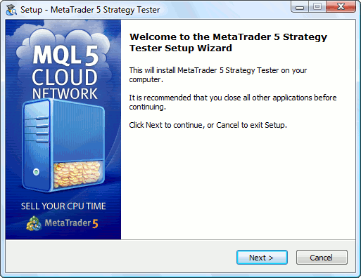
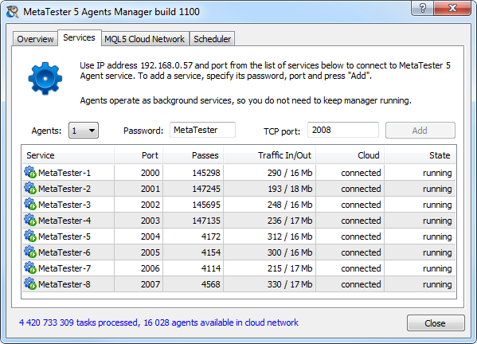
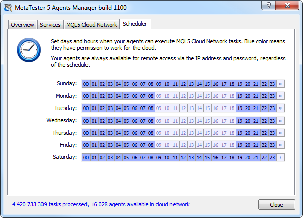
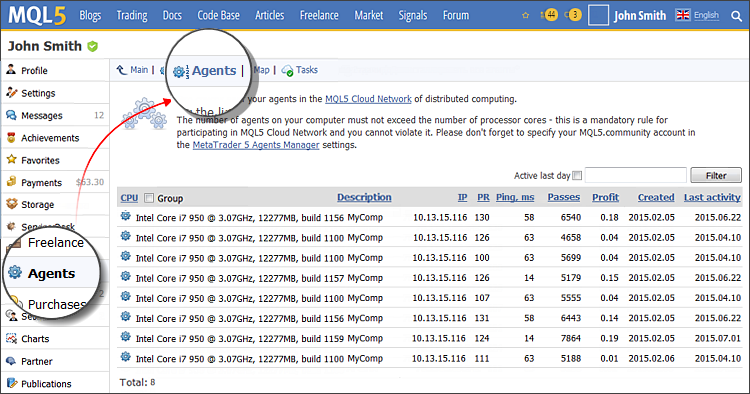

[🏠 Document Start](../README.md) / [MQL5 Cloud Network](README.md) / How to Participate

[Previous](How-to-Use.md) | [Next](Price-Calculation.md)

# How to Participate (#how-to-participate)

By participating in the MQL5 Cloud Network you can earn providing the processing power of your computer. Install testing agents using a manager and specify your [MQL5.community (#community)](../Getting-Started/Platform-Settings.md#community) account, to which the payment will be transferred. Agents automatically receive computation tasks, no further user action is required. You can control the amount of work done and payments in your MQL5.community profile.

## How to Install the Agent Manager (#install)

To join the MQL5 Cloud Network, you do not need to install the entire trading platform. [Download](https://download.mql5.com/cdn/web/metaquotes.software.corp/mt5/mt5tester.setup.exe) the special installer that lets you quickly and easily install the [MetaTester](../Algorithmic-Trading-Trading-Robots/MetaTester-and-Remote-Agents.md) application for managing remote agents on a computer.

> To connect your agents to the MQL5 Cloud Network, the computer where the agents are installed must have at least 2048MB of RAM. Agents can be installed in 64 bit systems only.

The installation is a multi-step process:

  * Read the welcome message.
  * Read the license agreement. If you agree with the terms of the agreement, select "I accept the agreement terms" and click "Next." If you do not agree with the agreement, you should exit the installation program.
  * Specify the folder in which you want to install the application, and the folder to create the shortcuts in the Start menu. If you check the option "Don't create a Start Menu folder", program shortcuts will not be created.
  * Complete the installation. You can directly move to [agents setup (#setup)](How-to-Participate.md#setup) and open the [MQL5 Cloud Network](https://cloud.mql5.com/en "MQL5 Cloud Network") website.

## How to Install and Configure Agents (#setup)

To start providing your computing power in the MQL5 Cloud Network, [install](How-to-Participate.md) and run the [MetaTester](../Algorithmic-Trading-Trading-Robots/MetaTester-and-Remote-Agents.md).

To install agents, click the "Add" button on tab "Services". The MetaTrader 5 Agents Manager automatically determines the number of logical cores and installs the appropriate number of testing agents. By default, single password "MetaTester" is set for all agents. All agents are available in the local network at the same IP address, but each is assigned a separate port. If necessary, you can specify different port numbers or a password. These settings do not influence the use of the agents in the MQL5 Cloud Network.

  * To participate in MQL5 Cloud Network, the number of agents should not exceed the number of logical processor cores.
  * To connect your agents to the MQL5 Cloud Network, the computer where the agents are installed must have at least 2048MB of RAM.
  * If you access the Internet via a proxy server, specify its settings in the [trading platform (#proxy)](../Getting-Started/Platform-Settings.md#proxy) or in Internet Explorer.

  
---  
  

On the "MQL5 Cloud Network" tab, check the box "Sell computing resources through a MQL5.community account", so that agents are available to all users of our network of distributed computing. To sell the processing resources of your agents to other users, you need to indicate a valid account at [MQL5.community](https://www.mql5.com/ "MQL5.community"). Payments for the used resources will be transfered to this account.

> If the MQL5.community account is invalid or not specified at all, the computational power of agents will be provided for free.

The last setting on the "Scheduler" tab allows you to set a schedule, specifying the time when your agents will be available on the MQL5 Cloud Network. For example, you can disable execution of tasks during working hours, if you need the computer power at this time.

Configuration of agents is over. Now you can close the window of the MetaTrader 5 Agents Manager. Your agents run as services and do not require your attention. If necessary, you can anytime change their settings by running the MetaTrader 5 Strategy Tester from the Start menu or the desktop shortcut.

## Managing Agents on MQL5.community (#manage)

You can also manage your agents from your profile on the [MQL5.community](https://www.mql5.com/ "MQL5.community"). All the required information is available in the "Agents" section: computer configuration, IP address, rating, number of completed tasks and the amount of earnings.

## Restrictions of Participation on MQL5 Cloud Network (#limits)

There are several limitations of participation on MQL5 Cloud Network:

  * An agent should have at least 768 MB of available physical memory to perform calculations.
  * To connect your agents to the MQL5 Cloud Network, the computer where the agents are installed must have at least 2048MB of RAM.
  * The agent's [productivity index (PR)](Price-Calculation.md) should not be less than 50.
  * Agents installed on a virtual machine cannot participate in MQL5 Cloud Network.
  * Agents having [PR](Price-Calculation.md) below 100 are not used in [genetic optimization](../Algorithmic-Trading-Trading-Robots/Optimization-Types.md) in order not to slow down the calculation process. The reason is that the calculation is performed by generations (256 passes). While one generation is not calculated, calculation of the next one cannot start. Even if a single pass out of 256 ones is calculated by a low PR agent, the total calculation speed is reduced.
  * An agent will not be able to receive new tasks from the MQL5 Cloud Network if the free disk space on the computer where the agent is installed falls below 500MB.
  * Agents do not receive tasks from the cloud network in case the PC they are installed at is powered by a battery (it refers to laptops).

## Command Line Configuration of Agents (#console)

MetaTester can be launched from the command line.

> The command line does not allow to adjust the parameters of the agents connection to MQL5 Cloud Network including such parameter as MQL5.community account, to which the funds for the agents submission will be transferred. Such a possibility has not been provided to ensure safe operation with the computing network.

The following keys can be used for working with the agents in the command line mode:

  * /install /address:address:port /password:password — install the tester agent on a specified IP address and a port with a specified password. Example:

c:\>metatester.exe /install address:192.168.0.1:2000 /password:akq1skdj  
---  
  
  * /uninstall /address:address:port — delete the tester agent that has been previously installed on a specified IP address and a port. Example:

c:\>metatester.exe /uninstall address:192.168.0.1:2000  
---  
  
  * /start /address:address:port — launch the agent that has been previously installed on a specified IP address and a port.

c:\>metatester.exe /start address:192.168.0.1:2000  
---  
  
  * /stop /address:address:port — stop the agent running at a specified IP address and a port.

c:\>metatester.exe /stop address:192.168.0.1:2000  
---  
  
  * /restart /address:address:port — restart the agent running at a specified IP address and a port.

c:\>metatester.exe /restart address:192.168.0.1:2000  
---  
  
  * /shutdown — stop all running agents.

c:\>metatester.exe /shutdwon  
---  
  
  * /autouninstall — remove all previously installed agents.

c:\>metatester.exe /autouninstall  
---  
  
  * /help or /? — call the help on command line launch.

c:\>metatester.exe /?  
---
