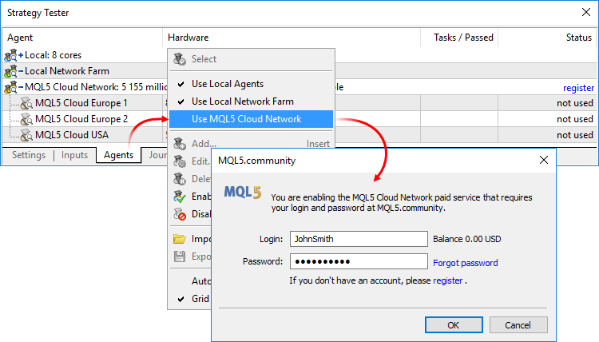
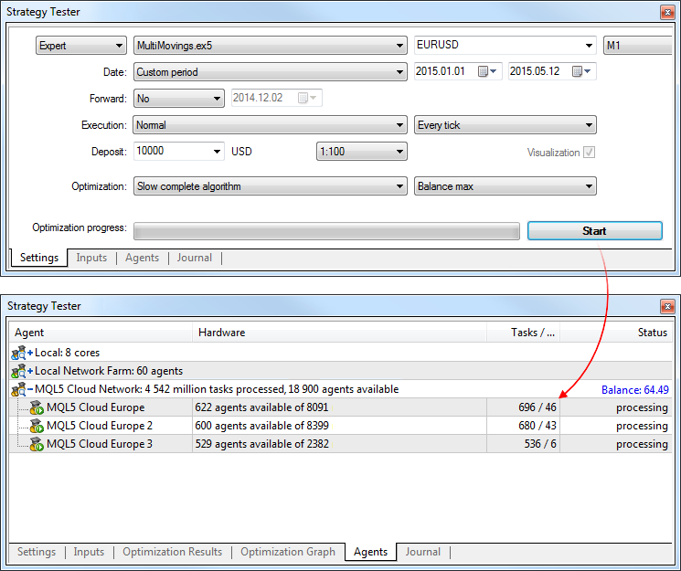
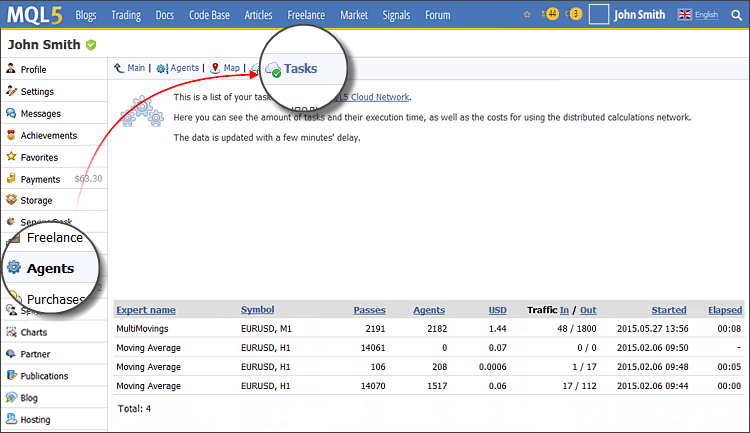

[🏠 Document Start](../README.md) / [MQL5 Cloud Network](README.md) / How to Use

[Previous](README.md) | [Next](How-to-Participate.md)

# How to Use (#how-to-use)

[The MQL5 Cloud Network](https://cloud.mql5.com/en "Official site of the MQL5 Cloud Network") allows you to quickly optimize your Expert Advisors using the power of thousands of computers. The network combines remote agents and distributes optimization tasks among them. The Strategy Tester connects to the cloud network through multiple access points, which are distributed on a territorial basis (e.g., MQL5 Cloud Europe).

## Features of the MQL5 Cloud Network (#cloud-features)

  * The entire power of the MQL5 Cloud Network is used only for [complete slow optimization](../Algorithmic-Trading-Trading-Robots/Optimization-Types.md).
  * During [genetic optimization](../Algorithmic-Trading-Trading-Robots/Optimization-Types.md), only agents of one access point are used. It is connected with the specific features of the genetic algorithm.
  * The genetic optimization mode is automatically enabled when the total number of optimization steps exceeds 100 million.
  * MQL5 Cloud Network can be used in 64 bit systems only.
  * In addition to using the MQL5 Cloud Network, you can provide your CPU computing power in the network. To install the remote agents and include them into the network, use a special utility [MetaTester](../Algorithmic-Trading-Trading-Robots/MetaTester-and-Remote-Agents.md).
  * Read more about the MQL5 Cloud Network on [the official site](https://cloud.mql5.com/en "MQL5 Cloud Network").

## Payments for the Use of the MQL5 Cloud Network (#cloud-pay)

Using agents of the MQL5 Cloud Network is paid. The formula for calculating the cost is described in [a separate section](Price-Calculation.md). The current MQL5.community account balance is displayed above the list of cloud agents. To use MQL5 Cloud Network a user need to have at least 1 US dollar on the MQL5.community account.

It is not possible to calculate the final cost of testing/optimization through the MQL5 Cloud Network.

There is no physical possibility to calculate the time and CPU resources required to conduct a test. The system cannot know which calculations your program uses. The exact amount of resources consumed by the testing or optimization process can only be evaluated after process completion. Also, please note that computational tasks are submitted into the network in batches (hundreds or thousands of tasks in a batch), and not one at a time.

Therefore, even when the system detects that your budget has been totally spent, it can still have calculations running on a number of tasks. The tasks cannot be stopped in the middle and thus the system has to complete them. Once the calculation is complete, the system will deduct the final cost from your balance.

All the details about your tasks performed using the Cloud Network are available on the [Agents \ Tasks (#report)](How-to-Use.md#report) page of your profile.

## Enabling MQL5 Cloud Network (#cloud-enable)

To use the network agents, enable them using command " Enable" in the context menu of the Agents tab of your Strategy Tester. Since the MQL5 Cloud Network is a paid service, a user must have an account at the [MQL5.community](https://www.mql5.com/ "MQL5.community") website, through which all the accounting operations are performed. Account details are specified on the [MQL5.community (#community)](../Getting-Started/Platform-Settings.md#community) tab of the platform settings.

If you do not specify the details of your MQL5.community account before enabling the MQL5 Cloud Network agents, you will be offered to do this.

If you have not registered on the website, use the [new account creation](https://www.mql5.com/en/auth_register) link.

## Starting Calculations Using the MQL5 Cloud Network (#cloud-start)

Like with a conventional optimization, you need to set all the testing options and Expert Advisor input parameters. On the Agents tab, you can monitor how the Strategy Tester distributes tasks to available agents. The number of available and currently used agents is displayed for each access point.

Traders may need to run hundreds of thousands of optimization passes in a reasonable time. With the multi-threaded Strategy Tester and the MQL5 Cloud Network, in one hour you can complete the calculations that would require a few days without the network. The computing power of thousands of cores is available straight on the trading platform.

> There are limitations for each optimization pass. During optimization, the Expert Advisor cannot write more than 4GB of information to disk and use more than 4GB of RAM. If the limit is exceeded, the network agent will not be able to complete the calculation correctly, and you will not receive the result. However, you will be charged for all the time spent on the calculations.

## Task Execution Reports (#report)

The details of the calculations performed using the MQL5 Cloud Network are available in your MQL5.community profile.

The report displays information about the tested Expert Advisors, the number of test runs and the amount of money spent.
