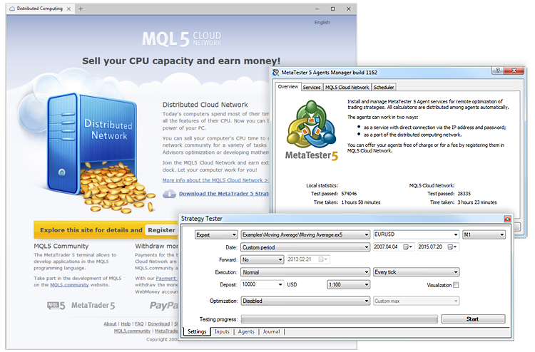

[🏠 Document Start](../README.md) / MQL5 Cloud Network

[Previous](../Market-App-Store/How-to-Become-a-Seller.md) | [Next](How-to-Use.md)

# MQL5 Cloud Network

[The MQL5 Cloud Network](https://cloud.mql5.com/en "Official site of the MQL5 Cloud Network") allows organizing the exchange of computing resources between those who need them, and those who can provide idle CPU time of their computers.

## Using the Network

If you need the processing power of the MQL5 Cloud Network, you can [access](How-to-Use.md) it from the trading platform. Open the [Strategy Tester (#cloud)](../Algorithmic-Trading-Trading-Robots/Strategy-Optimization.md#cloud) window, which displays both local agents and the MQL5 Cloud Network agents divided into segments on a territorial basis. For quick access and better load balancing, all agents are registered at the nearest MQL5 Cloud Network access point.

The MQL5 Cloud Network provides traders with the opportunity to quickly optimize automated trading systems written in the MQL5 programming language, while enabling the owners of free resources to make money.

## Participation in the Network

In addition to the use of the MQL5 Cloud Network computing power, you can [provide your resources](How-to-Participate.md) and earn money.

To join the MQL5 Cloud Network, you do not need to install the entire trading platform. [Download](https://download.mql5.com/cdn/web/metaquotes.software.corp/mt5/mt5tester.setup.exe) the specially created installer that allows you to quickly and easily [install](How-to-Participate.md) the MetaTester, an application for managing remote agents on the computer. If you have already installed the trading platform, you only need to run the [MetaTester](../Algorithmic-Trading-Trading-Robots/MetaTester-and-Remote-Agents.md).

After a simple setup you join the MQL5 Cloud Network and start earning. Statistics on the use of the network and your earnings for the CPU power provided is conveniently collected in your profile on the [MQL5.community](https://www.mql5.com/ "MQL5.community"). Information about agents appears in your profile immediately after they fulfill their first task.

  * Participation in MQL5 Cloud Network is absolutely safe. Agents cannot be remotely connected to MQL5 Cloud Network. A user decides whether to participate on the network and enters the MQL5.community account, to which the funds will be transferred, via the [MetaTester (#setup)](How-to-Participate.md#setup) application interface.
  * Read more about the MQL5 Cloud Network on [the official site](https://cloud.mql5.com/en "MQL5 Cloud Network").

  
---
