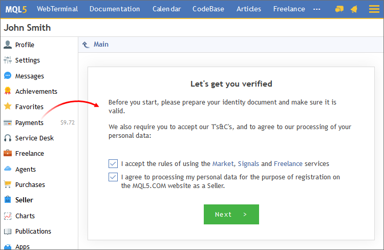
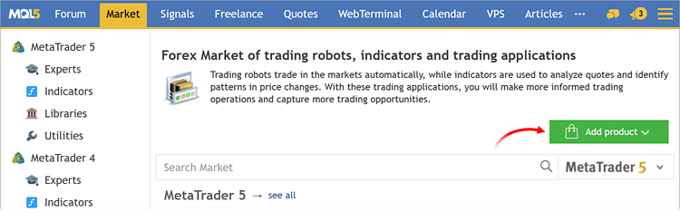
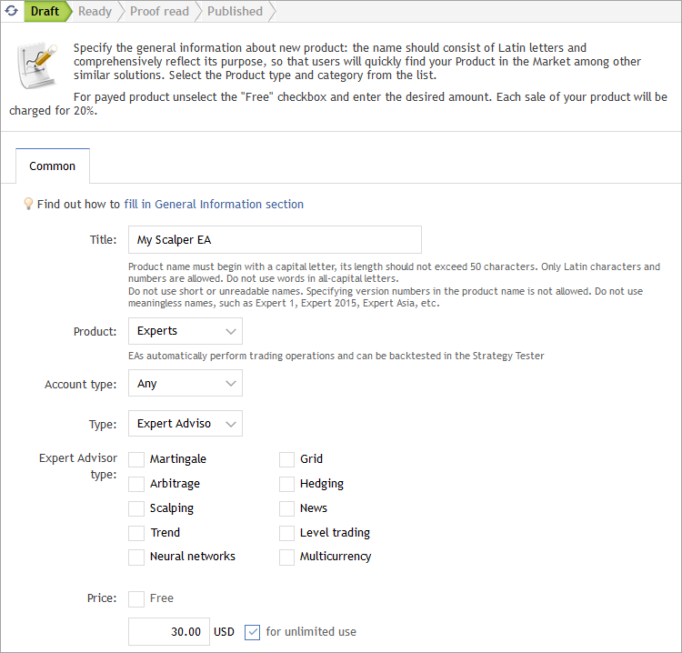
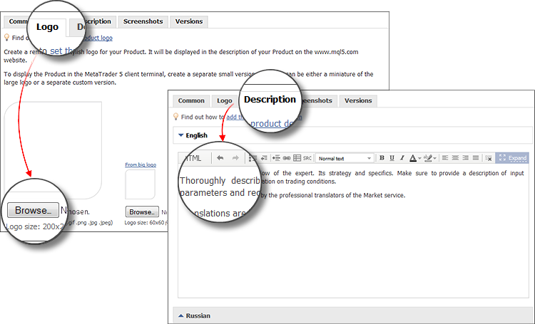
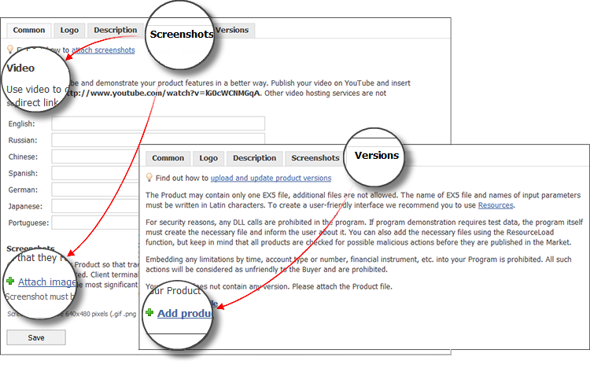
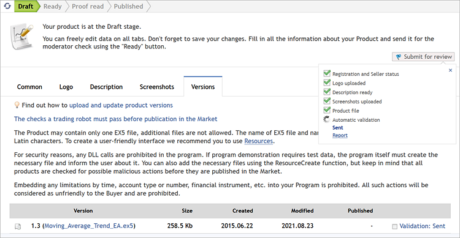
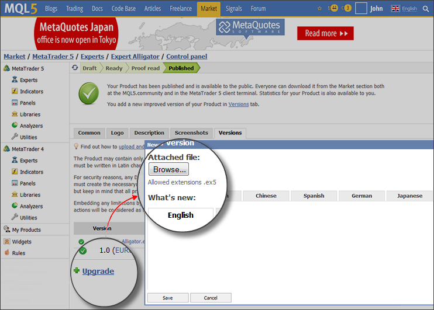

[🏠 Document Start](../README.md) / [Market App Store](README.md) / How to Become a Seller

[Previous](How-to-Rent-a-Product.md) | [Next](../MQL5-Cloud-Network/README.md)

# How to Become a Seller (#how-to-become-a-seller)

The trading platform has an audience of millions traders. Become a Seller in the [Market](README.md) to access this audience through your products that are featured straight in the trading platform. In addition, all products are available online in the Market section of [MQL5.community](https://www.mql5.com/en/market "Signals section on MQL5.community").

You need a valid MQL5.community account in order to sell products through the Market. If you do not have an account yet, please [register](https://www.mql5.com/en/auth_register "Register on MQL5.community").

## How to Register as a Signal Provider (#seller)

If you want to offer your products in the Market, you need to register as a Seller. Move to the "Seller" section of your profile at [MQL5.community](https://www.mql5.com/en/market "Signals section on MQL5.community").

Prior to registration, you should confirm your consent to the processing of your personal data and agree to Service Rules. During the registration process, you will need to provide your personal data as well as to attach photographs of your ID documents. Every registration step is provided with detailed instructions. Please read them carefully and strictly follow the requirements.

Information about the approval or refusal of your registration will appear on the same page in due course.

## How to Publish a Product (#publish)

Products are published on the MQL5.community website. Open the [Market](https://www.mql5.com/en/market) and click "Add product".

For convenience, product details are added in a few stages. In the first step specify the basic information.

### Name (#name)

A product name should start with a capital letter and be clear for non-professionals. Only Latin characters and numbers are allowed. The length should not exceed 50 characters. Please do not use unreadable or short names. Also, do not insert the version number into the name and do not overuse abbreviations and acronyms.

### Product (#product)

Product category that defines its purpose:

  * Trading robot
  * Technical indicator
  * Library for expanding program functionality during development
  * Auxiliary utility 

### Account type (#account-type)

If your robot or indicator only works with a certain type of account, [hedging or netting (#position-type)](../Trading-Operations/Basic-Principles.md#position-type), specify it in this parameter. This will prevent potential customers from purchasing an obviously inappropriate product.

### Type (#type)

Select the program type: Expert Advisor, Indicator or Script. This is the physical type of the software. Purchased products are arranged in platform folders according to their type: Experts\Market, Indicators\Market or Scripts\Market.

### Expert Advisor/Indicator/Utility type (#expert-advisorindicatorutility-type)

The market enables the detailed categorization of programs: by strategies used, type of analysis, purpose, etc. Be sure to fill in this field so that potential customers can easily find your product. The specified types can be used to [filter the products (#additional-filters)](How-to-Purchase-an-App.md#additional-filters).

### Price (#price)

If you want to offer your product for free, enable the corresponding option. Otherwise, specify at least one price:

  * For unlimited use — the price for the full product version with an unlimited validity period
  * 1, 3, 6 or 12 months rent price — rented products have no limitations except for validity period

The minimum price for all the Market products is 30 USD.

The Market service commission of 20% is charged on purchases. If the sold product price is 100 USD, the Seller receives 100 USD - 20% = 80 USD.

Then specify the number of available activations. All programs downloaded from the Market are securely encrypted. This is to protect them from unauthorized use. Encryption is performed so that the product can be run only on the computer from which it is downloaded. The process of product binding to a computer is called activation. Every product on the Market is provided with at least 5 activations: one is used during purchase, the other four activations are additional. A seller may choose to increase the number of available activations. Find out more about the activations in the service [rules](https://www.mql5.com/en/market/rules).

Once you specify all the required data, you will be able to move to the next steps.

> Each tab contains recommendations for product description design and links to useful articles. Be sure to review these materials.

### Logo and Description (#logo-and-description)

Upload an image that will be the logo of your product. You will need images with three different sizes: 200x200, 140x140 and 60x60. This requirement provides proper logo display in all showcases.

If you only have one image sized 200x200, you can select the automated generation of other sizes.

A logo is the face of your product. Prepare an attractive, high-quality image, which reflects the essence of your product and symbolizes your brand. The article [Tips for an effective product presentation on the Market](https://www.mql5.com/en/articles/999) contains recommendations on how to prepare products.

Give the details about your product and operation features on the Description tab. Start with general information to immediately give an idea about the product, and then specify the particular operation and configuration features, add recommendations on trading conditions and describe the input parameters. If you cannot prepare a description in Russian, the Market service employees will add a translation for your product.

### Screenshots and Product File (#screenshots-and-product-file)

Add high-quality screenshots of your product that best demonstrate its operation. Please follow the requirements:

  * Text in the screenshots should be in English.
  * The required screenshot size is 640 * 480 pixels
  * You can upload up to 12 images

Try not to scale the screenshots to preserve the readability of text.

A perfect complement to the product description is a video tutorial. Upload it to YouTube and add a link to it on the Screenshots tab.

On the "Version" tab, upload the file of the product. You can upload only one compiled EX5 file. If a product requires custom indicators, sounds or images, add them to [resources](https://www.mql5.com/en/docs/runtime/resources "Article on the use of resources in the MQL5 Reference").

  * For reasons of security, use of DLLs in products is prohibited.
  * Products may not contain any operation restrictions depending on the account type, account number, financial instrument and so on.

  
---  
  

## Automatic Validation (#automatic-validation)

The uploaded file is instantly sent for automatic validation. This implies the basic quality control:

  * Detection of programming errors, such as missing trading condition checks, zero divide errors, excessive resource consumption, etc.
  * For trading robots, the system checks if it performs any trading operations.

During the check, the program is run multiple times in the strategy tester with different trading conditions, on different symbols and timeframes.

It usually takes no more than 10 minutes. The check status is shown in the publication progress window:

Check results are displayed in the report.

After passing the automatic checks, your product is ready for publishing. Before publishing, you will need to read and accept the service rules again. In particular, these rules prohibit products containing profit promises.

After publication, your product will become available to users via the MQL5.com website showcase and in MetaTrader trading terminals.

## How to Release a New Version of the Product (#update)

All your products are available under the [Market \ My Products](https://www.mql5.com/en/market) section at MQL5.com.

To publish an updated version of the product containing functionality enhancements and fixes, open the "Version" tab and click "New Version".

Upload the product file and describe what has changed in the new version. The history of all changes is available to users in a separate product tab "What's New".

At any time, you can change product information: logo, description and screenshots. The price can be changed no more than once a day.

> For additional information, please see the article "[How to publish your product in the Market](https://www.mql5.com/en/articles/385)".
