[🏠 Document Start](../README.md) / [Market App Store](README.md) / How to Purchase an App

[Previous](README.md) | [Next](How-to-Rent-a-Product.md)

# How to Purchase an Application (#buy)

The [Market](https://www.mql5.com/en/market "Market") features thousands of products for the trading platform: trading robots, technical indicators and useful utilities. This section will help you choose and buy the needed application from the wide variety of available products.

To use the Market, you need a valid MQL5.community account. Using the account, you will be able to access the history of payments and purchases, as well as to update applications and to install them on other platforms. Specify the account in the platform settings, in the "[Community (#community)](../Getting-Started/Platform-Settings.md#community)" tab. If you do not have an account, please [register](https://www.mql5.com/en/auth_register).

Before you start, please read the [service rules](https://www.mql5.com/en/market/rules "MQL5.community Market service rules").

## How to Choose a Product on the Market (#choose)

[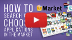](https://www.metatrader5.com/video/1/bO2_Ya9cZMY/video.mp4 "Watch video: How to search and choose applications") | Watch video: How to search and choose applications The Market features a well-developed product filtration and sorting systems. Each product has a detailed description and screenshots. Trading robots and indicators have demo versions. Watch our video to know how to use all these options and make the right choice.  
---|---  
  
Select Market in the Navigator. The default option sorts apps in the showcase by popularity.

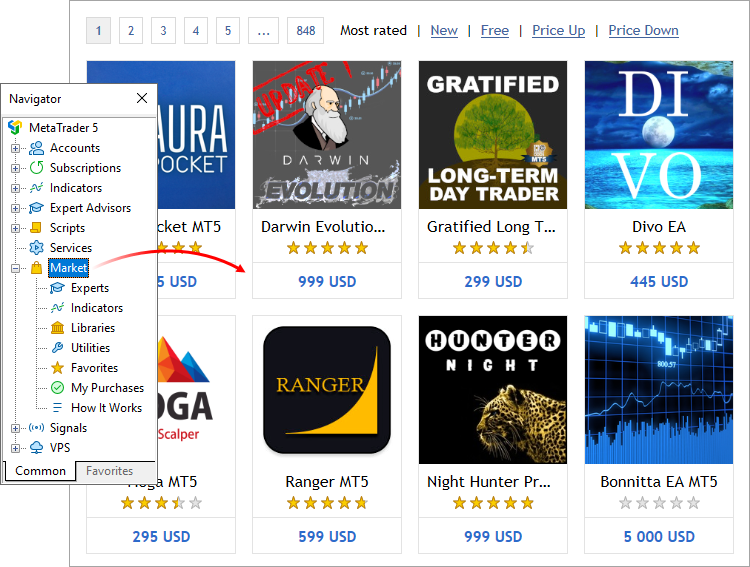

Use the Navigator to filter products by category:

  * Expert Advisors: automated trading robots.
  * Indicators: indicators for technical analysis.
  * Libraries: ready-made sets of functions expanding the capabilities of the applications you develop.
  * Utilities: graphical panels to automate various actions, analyzers to search for market patterns and others.

Use the top bar to sort products by price and newest.

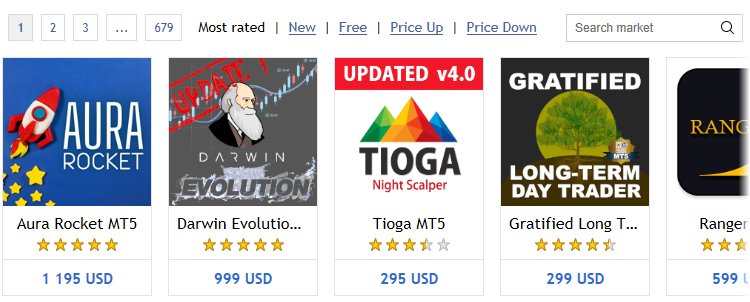

Apps can be searched by name or description. For example, you can type "trend" in the search bar to view the products which contain the specified word.

Additional search tools are available in the [MQL5.com Market](https://www.mql5.com/ru/market) web version. Select the product category to access advanced filters by program type, price, reviews, and rental options.

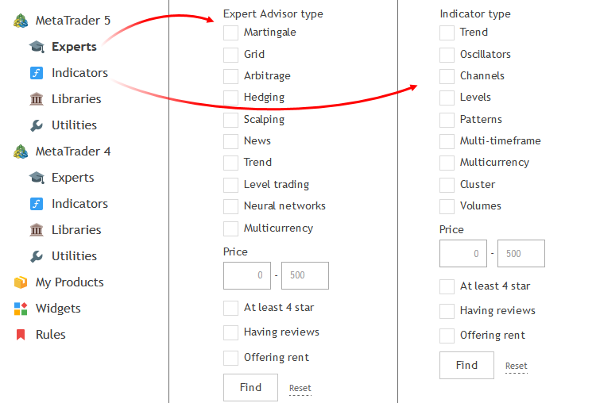

Select a product to view detailed information. General information about the product is shown at the top of the page. A detailed description and screenshots from the author appear below.

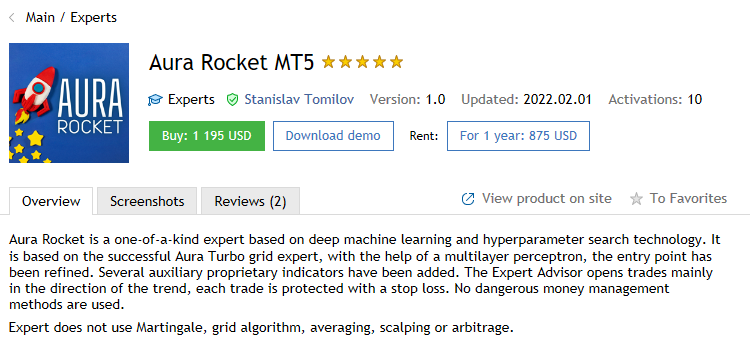

Read the product description to learn about its features.

View product screenshots to see how it appears in the platform.

It is important to read the feedback and comments of other traders who have purchased and tested the application. 

Check out the product page on the [MQL5.community](https://www.mql5.com/) website for more information: 

  * Product video (if provided by the author)
  * Discussion tab, where you can communicate with the author and other buyers of the product
  * List of changes in product updates

If you like the product but are not sure about purchasing it, add it to your favorites. So you can easily get back to it at any time. All favorite products are displayed in a separate section in the Navigator.

Every customer can rate a product and give it 1 to 5 stars. When choosing a product, check out the ratings given by other users.

Price for a time-unlimited product license.

By renting a product for a certain period, you can evaluate its capabilities in real conditions, without paying its full cost.

The availability and possible rental periods are determined by the author of the product.

Download the free product [demo version (#test)](How-to-Purchase-an-App.md#test) to test it in the strategy tester.

Product category

  * Trading robot
  * Technical indicator
  * Trade automation panel
  * Library to add advanced functionality when developing applications
  * Analyzer for data analysis
  * Auxiliary utility 

You can view other products of the same category by clicking on its name.

Product author's name. Click on the name to go to the author's profile on the [MQL5.community](https://www.mql5.com/) website. The profile features other products by the same author and the rating. If you have any questions about the product, you can write a message to the author via the profile.

The current version of the product. If you have already purchased the product, compare your version with the current one. There may be an update available for you. Updates become available in the platform within 24 hours after they are released by the author.

Last update release date. If a product has been updated recently, it means the author continues to improve it.

All programs downloaded from the Market are securely encrypted. This is to protect them from unauthorized use.

Encryption is performed so that the product can be run only on the computer from which it is downloaded. The process of product binding to a computer is called [activation (#activation)](How-to-Purchase-an-App.md#activation).

Every product in the Market is provided with at least 5 activations: one is used during purchase, the other four are additional.

## How to Add a Product to Favorites (#favorites)

A huge number of products is available for purchasing. When searching for products, you can add any of them to Favorites in order to select the best one. Add/remove a product from Favorites by clicking  on the list and overview page.

All Favorite products are displayed in a separate subsection of the Navigator.

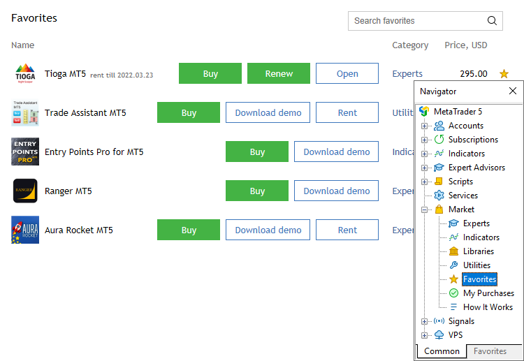

## How to Test a Product before Purchasing (#test)

[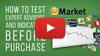](https://www.metatrader5.com/video/1/ouEh29q3QJ4/video.mp4 "Watch the video: How to test Expert Advisors and Indicators before purchase") | Watch the video: How to test Expert Advisors and Indicators before purchase Before making a purchase it is recommended to test desired trading robots and indicators. It is an easy and free-of-charge operation that gives you more confidence in a product. Please watch the video for further details.  
---|---  
  
Before purchasing an application you can download its demo version. To do this, click on the product and then click "Free Download".

Demo versions have some limitations:

  * A demo version of an [Expert Advisor](../Algorithmic-Trading-Trading-Robots/Expert-Advisors-and-Custom-Indicators.md) cannot be launched on an online chart of the trading platform. Its trading part can be tested only in the [Strategy Tester](../Algorithmic-Trading-Trading-Robots/Strategy-Testing.md);
  * A demo version of an [indicator](../Price-Charts-Technical-and-Fundamental-Analysis/Technical-Indicators.md) cannot be launched and viewed on an online chart. Its behavior can only be seen in the [Visual testing mode in the Strategy Tester (#indicator)](../Algorithmic-Trading-Trading-Robots/Strategy-Testing.md#indicator).

To quickly start testing an application in the [Strategy Tester](../Algorithmic-Trading-Trading-Robots/Strategy-Testing.md), run it from the [Navigator](../Getting-Started/User-Interface.md) window.

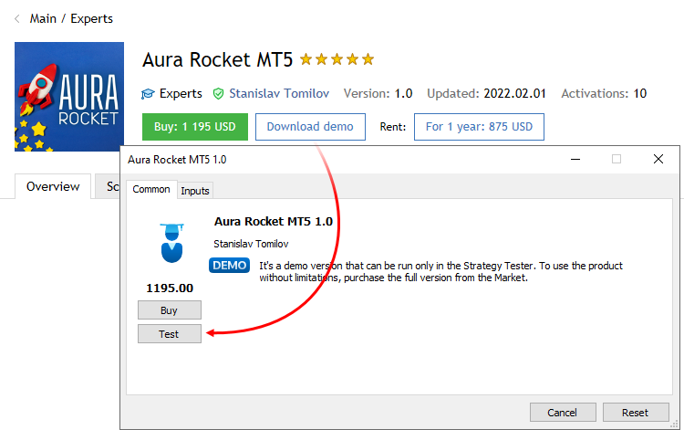

Next click "Test". The application will be selected in the Strategy Tester. You only need to set parameters and start testing.

Once the testing process is over, review the detailed report in the [Results (#result)](../Algorithmic-Trading-Trading-Robots/Strategy-Testing.md#result) tab to evaluate the trading strategy based on various trading figures and charts. The details of trading operations performed by the Expert Advisor can be viewed in the tester logs.

Indicators are tested in the [visual mode (#indicator)](../Algorithmic-Trading-Trading-Robots/Strategy-Testing.md#indicator). You can view their behavior on a chart, which is plotted based on a sequences of ticks simulated in the tester.

## How to Purchase an Application (#buy)

[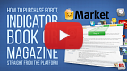](https://www.metatrader5.com/video/1/M1lD90g9Rjg/video.mp4 "Watch video: How to purchase a trading robot or an indicator from the Market?") | Watch video: How to purchase a trading robot or an indicator from the Market? Any trader can find thousands of trading robots and indicators in the Market. You can purchase them straight from the platform. Watch the video to find out the details.  
---|---  
  
To purchase a product, go to its page. The price of the time-unlimited license is displayed next to the "Buy" button. If a rental option is available for a product, the relevant rental fee is displayed next to the corresponding term.

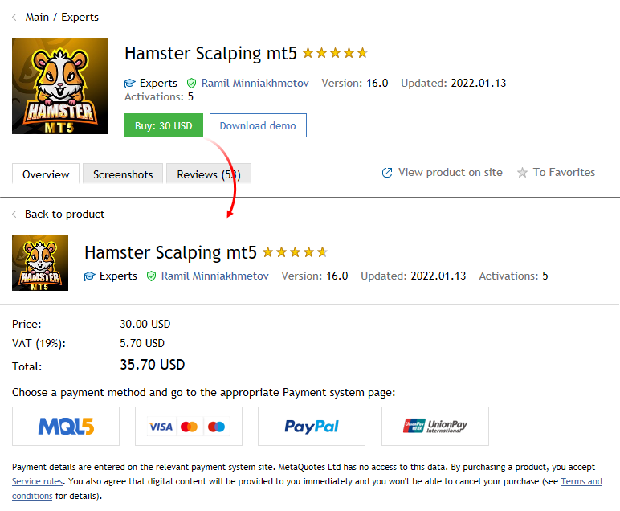

Read the [Market service terms of use](https://www.mql5.com/ru/market/rules). By purchasing a product you confirm that you agree with the terms.

To pay for the purchase from your MQL5.community account balance, select the MQL5 option. If you do not have enough money on your account, you do not necessarily need to go to the site and top it up. A payment can be transferred directly through one of the payment systems. Select any of the available options and follow the system instructions to complete the payment. To maintain a clear and unified history of purchases, the required amount is first transferred to your MQL5.community account, from which an appropriate payment is made.

As soon as you complete the payment, the product will be immediately downloaded into the platform. Click "Start" to open it in the Navigator. From the navigator, you can run the application by dragging it onto the chart.

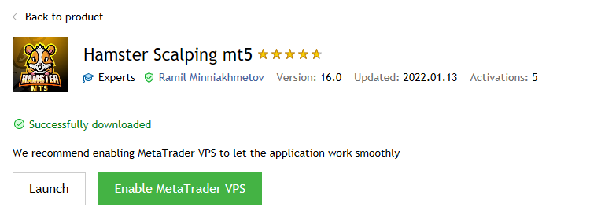

  * All the user's products and downloads are displayed under the [Market \ My Purchase (#purchases)](How-to-Purchase-an-App.md#purchases) section in the Navigator.

  * Products are downloaded to the \MQL5\program_type\Market\ platform folder, where program_type is an application type. For example, Expert Advisors are downloaded to \MQL5\Experts\Market\\.

  
---  
  

## What is product activation (#activation)

A purchased or downloaded application is bound to the user's computer, which means that it can only be run on the same hardware and operating system. The process during which an application is bound to a computer is called activation.

Each product has at least 5 activations, while the seller may increase this number at their discretion. If you change your PC or reinstall the system, you can use the activation to reinstall the product.

Available activations are displayed on each product page.

Note:

  * Activation does not link a product to a specific trading account. The buyer can use the product with any accounts and brokers within the computer on which the activation was performed.
  * Activation does not bind the product to a specific trading platform instance. The buyer can use the product in several platforms simultaneously, provided they are installed within one PC, on which the product has been activated.
  * The number of available activations is fixed at the time of purchase. For example, if you bought a product with 10 activations, and later the seller reduces them to 5, your activations will not change. The same happens if the seller increases the number of activations. Any changes only affect new purchases, but they do not change previous purchases.
  * Activations are not reset or restored when the product is removed from the device.

In order to run the product, the user must be authorized in the platform with the same MQL5 account via which the product was purchased. The account must be specified under the [Tools \ Options \ Community (#community)](../Getting-Started/Platform-Settings.md#community) section. If no account or an invalid account is specified, the product will not start, and the following message will be printed in the platform journal:

'ProductName' requires active MQL5 account in Tools->Options->Community   
---  
  

## Where can I see my purchases? (#purchases)

All your purchases and downloads are displayed under the Market \ My Purchases section of the Navigator. For convenience, they are divided into categories:

  * Updates — products for which new versions are available
  * Applications — a general list of purchased/downloaded products
  * Demo — a list of products for which you have downloaded demos

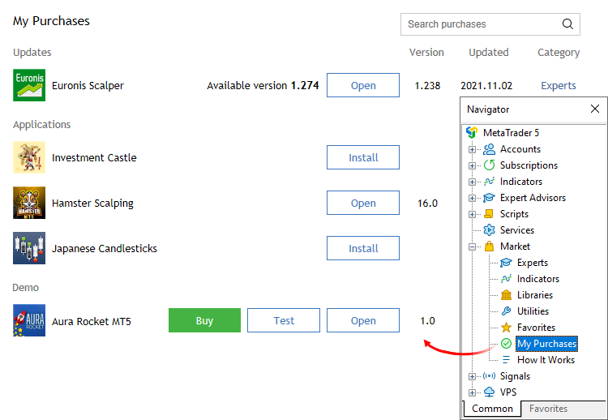

Each product appears with the name, currently installed version, update date, category, and purchase price.

Click "Open" to navigate to the application in the Navigator. From the Navigator, you can run the application by dragging it onto the chart.

> Make sure you have specified your MQL5 account in the [platform settings (#community)](../Getting-Started/Platform-Settings.md#community). Otherwise, the list of purchases may not be complete: it will only show products downloaded in the current platform instance.

## How to Install an Earlier Purchased Application (#redownload)

[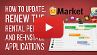](https://www.metatrader5.com/video/1/0RuNdX7CW3U/video.mp4 "Watch video: How to update, renew the rental period and reinstall products") | Watch video: How to update, renew the rental period and reinstall products All your products are tied to your MQL5.community account or to your computer and are always at hand. You will always know about updates, will be able to renew the rent or download a previously purchased product. Watch the video to find out how easy that is.  
---|---  
  
You may need to move a previously purchased application to another platform. For example, you may use several trading platforms on one or several computers.

If you use several platforms on the same computer, copy the ex5 file of the application to a similar folder of the target platform. For example, you should copy a file from [source trading platform]\MQL5\Indicators\Market to [target trading platform]\MQL5\Indicators\Market.

If you need to move a previously purchased product to another computer:

  * Specify your MQL5.community account data on the [Community (#community)](../Getting-Started/Platform-Settings.md#community) tab of the target platform.
  * Open the "Market" tab and move to the [Purchased (#purchases)](How-to-Purchase-an-App.md#purchases) section. Click "Install" near the purchased product:

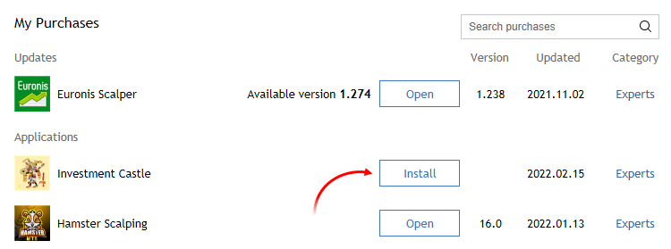

> Each product is tied to the configuration of the computer it is purchased from. According to ["Market" service Rules,](https://www.mql5.com/en/market/rules ""Market" service Rules") the number of free product activations available to the buyer on another computer after purchasing the product is defined by the seller. The minimum number of such Activations is 4. Further on, a user will have to purchase them again.

## How to Update an Application to the Latest Version (#update)

From time to time sellers may release updated versions of their products to increase reliability and extend functionality.

To check whether new versions of your previously purchased or downloaded products are available, go to the Market \ My Purchases tab in the Navigator.

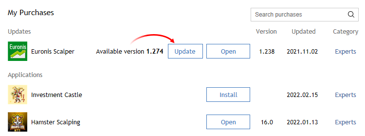

If a new version of a product is available, you will see the corresponding message against it as well as the "Update" button (or the "Update demo" button for demo version of paid products).

Once this button is pressed, the new version will be downloaded. The new file replaces the previous one. Thus if need, save the old version of the file under a different name or outside of the directory [platform data folder]\MQL5\Market\\.

  * All updates of previously purchased products are free of charge.

  * Product updates become available in the trading platform within 24 hours of being published in the [Market on MQL5.community](https://www.mql5.com/en/market "MQL5.community Market").

  
---
