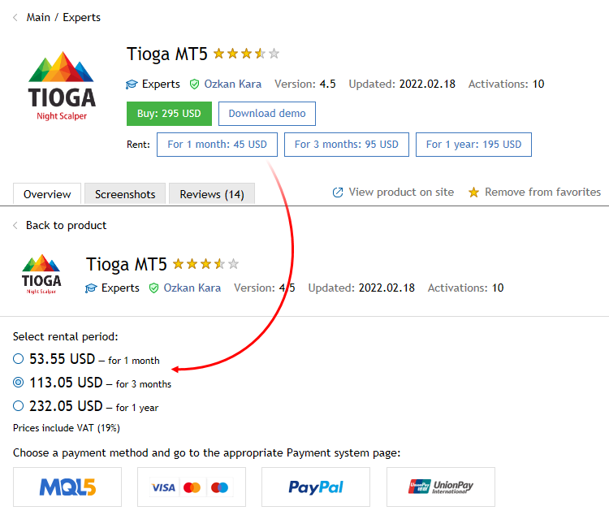
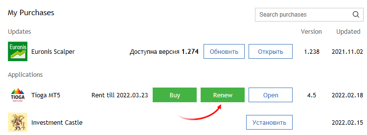

[🏠 Document Start](../README.md) / [Market App Store](README.md) / How to Rent a Product

[Previous](How-to-Purchase-an-App.md) | [Next](How-to-Become-a-Seller.md)

# How to Rent a Product

The Market products can be rented for 1, 3, 6 or 12 months. For buyers, the rent is another opportunity to assess a product before buying a full license. Unlike demo versions that can be launched only in the strategy tester, rented products have no limitations except for validity period.

Rental period and fee, as well as the possibility to rent are determined by product developers. Therefore, some products may be unavailable for rent. If a product can be rented, you will see the corresponding buttons on the product page:

Select a rental period and proceed to payment. As with [full version purchases (#purchases)](How-to-Purchase-an-App.md#purchases), the rental fee can be paid from an MQL5.community account or through one of the available payment systems.

## Rental expiration

After the period expires, rented products stop their operation automatically. For example, a rented trading robot is automatically removed from a chart. So, be careful not to leave your positions unattended if they have been managed by a rented Expert Advisor.

The following entry is periodically displayed in the platform [Journal](../Getting-Started/For-Advanced-Users/Platform-Logs.md) one day before the end of the rental period:

Licence of 'product.ex5' expires on 02.03.2015. Please renew the license, otherwise the program will be stopped  
---  
  
In order to renew a rental period or buy a full version, go to Purchased section.

Rental period expiration date is shown to the right of a product name. The current period expiration time is considered to be the beginning of the renewed rental period. Thus, you can renew the rent in advance without losing the time remaining till the current period expires.

If you want to purchase a full version, click Buy. In this case, you pay the full cost of a product. Previously paid rental fees are not considered.
