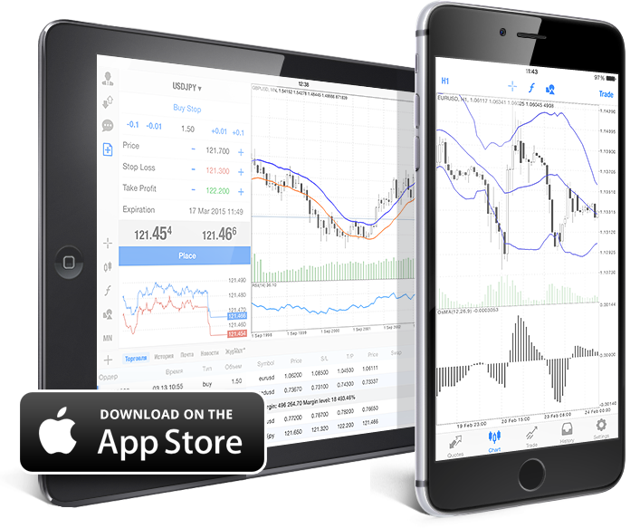
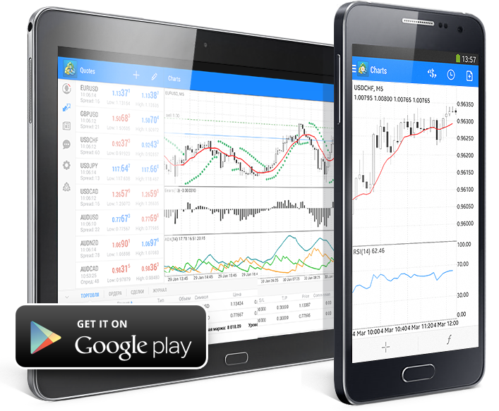
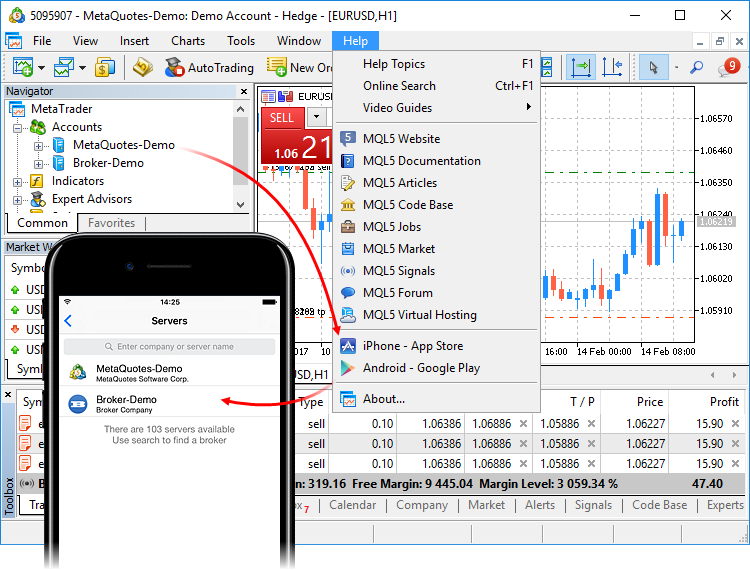

[🏠 Document Start](../README.md) / Mobile Trading

[Previous](../Virtual-Hosting-for-24-7-Operation/Working-with-the-Virtual-Platform.md) | [Next](../MQL5-Algotrading-community/README.md)

# Mobile Trading (#mobile-trading)

The trading platform provides opportunities for financial trading and market analysis with the most popular mobile devices based on iOS and Android. On mobile platforms, you can manage your trading account, view price charts, use technical indicators and analytical objects. Furthermore, you can read financial news, be notified of important events in the account, and send messages through your MQL5.community account.

## Mobile Platform for iPhone/iPad (#mobile-platform-for-iphoneipad)

 

Features of the Mobile Platform for iPhone/iPad:

  * [Realtime charts](https://www.metatrader5.com/en/mobile-trading/iphone/help/quotes) of financial instruments
  * A complete set of market and pending orders
  * [Trading](https://www.metatrader5.com/en/mobile-trading/iphone/help/trade) on chart
  * Access to the account's history of trades
  * Technical analysis using 30 major [technical indicators](https://www.metatrader5.com/en/mobile-trading/iphone/help/chart/indicators) and 23 [analytical objects](https://www.metatrader5.com/en/mobile-trading/iphone/help/chart/objects)
  * Customizable [charts](https://www.metatrader5.com/en/mobile-trading/iphone/help/chart) and 9 timeframes: M1, M5, M15, M30, H1, H4, D1, W1 and MN1
  * [Financial news](https://www.metatrader5.com/en/mobile-trading/iphone/help/settings_news) and internal mail
  * Instant messaging with MQL5.community members

## Mobile Platform for Android (#mobile-platform-for-android)

 

Features of the Mobile Platform for Android:

  * [Realtime charts](https://www.metatrader5.com/en/mobile-trading/android/help/quotes) of financial instruments
  * A complete set of market and pending [orders](https://www.metatrader5.com/en/mobile-trading/android/help/trade)
  * Access to the account's history of trades
  * Technical analysis using 30 major [technical indicators](https://www.metatrader5.com/en/mobile-trading/android/help/chart/indicators) and 23 [analytical objects](https://www.metatrader5.com/en/mobile-trading/android/help/chart/objects)
  * Customizable [charts](https://www.metatrader5.com/en/mobile-trading/android/help/chart) and 9 timeframes: M1, M5, M15, M30, H1, H4, D1, W1 and MN1
  * [Financial news](https://www.metatrader5.com/en/mobile-trading/android/help/settings_news) and internal mail
  * Instant messaging with MQL5.community members

## Moving accounts to the mobile platform (#transfer)

The platform allows you to quickly move the trading accounts from the desktop version to the mobile one. When you switch to download the mobile terminal from the Help menu, the list of your trade servers is remembered. Then, when you install the mobile platform on your iPhone or Android device, a ready list of servers will be shown to you. You can quickly connect to your existing trading accounts. The server of the currently connected account will be displayed first in the mobile platform.

> In order to successfully move the list of servers, your desktop and mobile devices should be in the same network (use the same Wi-Fi hotspot for Internet connection).
