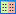
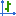
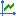
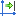
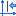
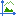
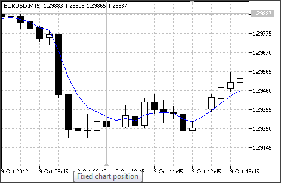

[🏠 Document Start](../../README.md) / [Price Charts, Technical and Fundamental Analysis](../README.md) / [Additional Features](../Additional-Features.md) / Chart Management

[Previous](Chart-Print.md) | [Next](Lists-of-Objects-Applied.md)

# Chart Management (#chart-management)

This section provides information about how to manage charts in the trading platform.

  * [Chart managing using the context menu and the "Charts" menu (#context)](Chart-Management.md#context)
  * [Chart managing using a mouse (#mouse)](Chart-Management.md#mouse)
  * [Chart managing from keyboard (#keyboard)](Chart-Management.md#keyboard)
  * [Fixed chart position (#fixed)](Chart-Management.md#fixed)

## Chart Managing Using the Context Menu and the ["Chart"](../../Getting-Started/User-Interface.md) Menu (#chart-managing-using-the-context-menu-and-the-chartgetting-starteduser-interfacemd-menu)

Commands in these menus are identical (except for "Save As Picture" and "Delete Indicators Window" that are available only in the context menu) and allow to manage chart settings:

  * Trading — open the menu of trading operations for the symbol of the chart: [placing stop levels (#chart-deal)](../../Trading-Operations/One-Click-Trading.md#chart-deal) or [pending orders (#pending-chart)](../../Trading-Operations/Executing-Trades.md#pending-chart).
  *  Depth Of Market — open the Depth of Market of the current chart's symbol.
  *  Indicator List — open the ["Indicator List" (#indicators)](Lists-of-Objects-Applied.md#indicators) window for managing indicators running on the chart. 
  * Objects — open the objects control submenu:

  *  Object List — open the ["Object List" (#objects)](Lists-of-Objects-Applied.md#objects) to manage objects on the chart.

  * Delete Last — delete the last added object.
  *  Delete All Selected — delete all selected objects.
  *  Delete All Arrows — delete all arrows belonging to the [Arrows](../Analytical-Objects/Arrows.md) group.
  * Delete All — delete all [objects](../Analytical-Objects.md) from the current chart;
  * Unselect All — unselect all objects on the chart.
  * Unselect — unselect the selected object.
  *  Undo Delete — restore the last deleted object.
  *  Expert List— open the ["Expert List" (#ea)](Lists-of-Objects-Applied.md#ea) window to manage Expert Advisors running on the chart.
  *  Bar chart — show the chart as a sequence of bars.
  *  Candlestick — show the chart as a sequence of Japanese candlesticks.
  *  Line — show the chart as a broken line that connects close prices of bars.
  * Timeframes — select the chart timeframe. A click on this item opens a sub menu, where you can select one of the available timeframes.
  * Templates — managing [chart templates](Templates-and-Profiles.md).
  *  Refresh — refresh the chart window. When you refresh the chart, the price data displayed on it are also recalculated based on one-minute data stored on the computer.
  *  Docked — [dock/undock the chart window (#docked)](../View-and-Configure-Charts.md#docked) from the main platform window.
  * Toolbar — show/hide the toolbar in the chart window. The command is only available for the charts, which were detached from the main platform window.
  *  Grid — show/hide grid on the chart.
  *  Auto Scroll — enable/disable automatic chart scrolling to its beginning when new ticks are received.
  *  Chart Shift — enable/disable chart shift from the right side of the window.
  *  One Click Trading — show/hide the [one click trading panel  (#chart-deal)](../../Trading-Operations/One-Click-Trading.md#chart-deal) on the chart.
  *  Volumes — show/hide real trade volumes for the charts of exchange instruments.
  *  Tick Volumes — show/hide tick volumes for the charts of Forex instruments.
  *  Zoom In — zoom in the chart.
  *  Zoom Out — zoom out the chart.
  *  Delete Indicator Window — delete the indicator subwindow. This command is only available in the context menu when called from the subwindow, in which the indicator is opened.
  *  Step by Step — move the chart bar by bar from right to left. This function is only available when the autoscroll feature is disabled.
  *  Save As Picture — save the chart as a picture in a *.png file. This command also allows to immediately publish a screenshot of the chart online using a special service of the [MQL5.community](https://www.mql5.com/ "MQL5.community") site and share it with other traders. See "[Publishing Charts Online](../Publish-Online.md)" for details.
  *  Properties — open the [chart properties](Chart-Settings.md) managing window.

## Chart Managing Using a Mouse (#mouse)

A chart can be managed using a mouse:

  * click-and-hold anywhere in the chart window and then move the cursor horizontally to scroll the chart;
  * click-and-hold on the vertical scale of the chart and move the cursor vertically to change the vertical scale of the chart; double-click on the vertical scale of the chart to restore the chart scale;
  * click-and-hold on the horizontal chart scale (anywhere outside the [fast navigation bar](../../Getting-Started/User-Interface.md)) and move the cursor horizontally to change the chart scale; 
  * right-click anywhere in the chart window to open the context menu of the chart (see below);
  * double-click on the elements of technical indicators (lines, signs, histogram bars, etc.) to call the indicator setup window;
  * right-click on elements of a technical indicator to call the context menu of the indicator;
  * depending on the [platform settings (#charts)](../../Getting-Started/Platform-Settings.md#charts), a single or a double click on an [object](../Analytical-Objects.md) (line studies, text or arrow) selects the object;
  * click-and-hold the selected object and drag to move it;
  * Ctrl + left-clicking on a selected trend line and then moving the cursor allows to draw a parallel trend line (create a channel);
  * hold down Ctrl and scroll the mouse wheel to scale the chart;
  * click with the mouse wheel on a chart tab in the switch panel closes the chart;
  * middle-click on the chart window to switch the cursor to the "crosshair" mode;
  * right-click on a selected object to open its context menu;
  * point your mouse to the Close price of a bar or to an element of an object or indicator to call a prompt.

## Chart Managing from Keyboard (#keyboard)

Various chart manipulations can be performed using certain keys and key combinations:

  * Home — move the chart to the last bar;
  * End — move the chart to the first bar;
  * Page Up — move the chart at a one-window distance back;
  * Page Down — move the chart at a one-window distance forward;
  * Ctrl+I — open the window containing the list of indicators;
  * Ctrl+B — open the window containing the list of objects;
  * Alt+1 — show the chart as a sequence of bars;
  * Alt+2 — show the chart as a sequence of Japanese candlesticks;
  * Alt+3 — show the chart as a broken line that connects the Close prices of bars;
  * Ctrl+G — show/hide grid in the chart window;
  * "+" — zoom in the chart;
  * "-" — zoom out the chart;
  * F12 — scroll the chart step by step (bar by bar);
  * F8 — open the properties window;
  * Backspace — delete the last added object from the chart;
  * Delete — delete all selected objects;
  * Ctrl+Z — cancel deletion of the last object.

## Fixed Chart Position (#fixed)

Every chart has an icon — a gray triangle located in the bottom left corner of the window by default. Move the triangle on any bar to lock its position on the chart:

The selected bar stays in this position when you zoom the chart. The position stays fixed until you change the [chart timeframe (#operations)](../View-and-Configure-Charts.md#operations).
