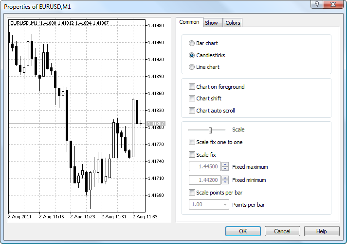
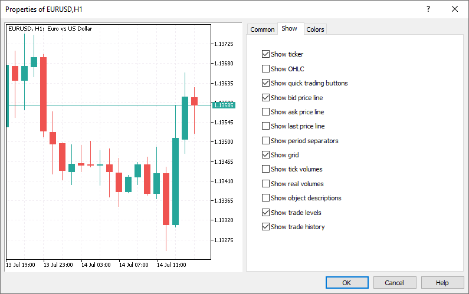
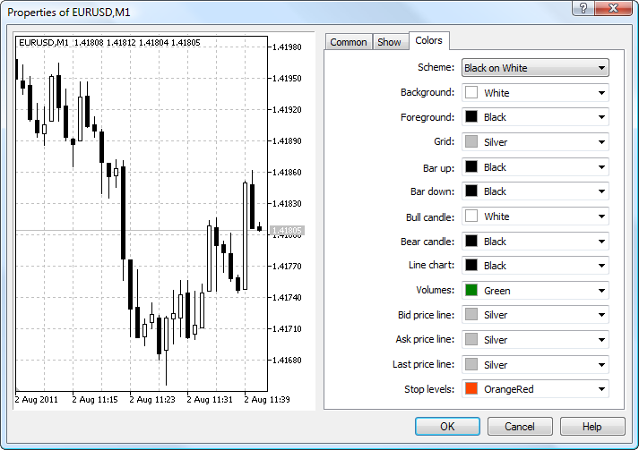

[🏠 Document Start](../../README.md) / [Price Charts, Technical and Fundamental Analysis](../README.md) / [Additional Features](../Additional-Features.md) / Chart Settings

[Previous](../Additional-Features.md) | [Next](Chart-Print.md)

# Chart Settings (#chart-settings)

Appearance and properties of each chart in the trading platform can be configured individually. Click " Properties" in the [Charts](../../Getting-Started/User-Interface.md) menu or in the chart context menu.

  * [General Settings (#common)](Chart-Settings.md#common)
  * [Setup of Displayed Information (#show)](Chart-Settings.md#show)
  * [Color Settings (#colors)](Chart-Settings.md#colors)

## Common (#common)

The common properties of a chart can be set up from this tab:

  * Bar chart — show the chart as a sequence of bars.
  * Candlestick — show the chart as a sequence of Japanese candlesticks.
  * Line — show the chart as a broken line that connects close prices of bars.
  * Chart in foreground — place the chart in the foreground. If the function is enabled, all [analytical objects](../Analytical-Objects.md) appear in the background.
  * Chart shift — shift the chart from the right edge of the window to the shift mark. The chart shift mark (a gray triangle at the top of the window) can be dragged horizontally using a mouse within 10% to 50% of the window size.
  * Chart autoscroll — enable/disable automatic chart shift to the left with the beginning of new bar formation. If the option is enabled, the chart always shows the last bar.
  * Scale — use a scaler to adjust the chart scale. This also changes the chart scale in the preview window located in the left part of the properties window.
  * Scale fix one to one — fix the chart scale as "one to one" (the size of one pip of the vertical axis in pixels is equal to the distance between the bar axes in pixels). In this case the "Scale fix" option is enabled automatically, and a scroll bar appears at the right side of the window that allows to move the chart vertically. This mode allows drawing precise geometrical constructions.
  * Scale fix — fix the chart scale vertically. When this option is selected, additional scaling parameters "Fixed maximum" and "Fixed minimum" for setting the minimum and maximum value of the price scale become active.
  * Scale points per bar — fix the chart scale by the ratio of points on the vertical axis to one bar. Specify the number of bars in the "Points per bar" field.

## Show (#show)

The tab contains options of information display on the chart:

  * Show ticker — show/hide the line containing the trading symbol name, the timeframe and a custom comment.
  * Show OHLC — show/hide the OHLC line. An additional data line appears at the top left of the window. The last bar prices are displayed in addition to the symbol name and chart timeframe. Price are shown in the following format: OPEN, HIGH, LOW and CLOSE (OHLC) — bar open price, the highest bar price, the lowest bar price, and bar close price, respectively. Thus, the exact value of the latest bar is always shown on the screen. This option is also effective for the data line in the indicator sub-windows.
  * Show quick trading buttons — show/hide buttons that open the [quick trade panel (#chart-deal)](../../Trading-Operations/One-Click-Trading.md#chart-deal) and the [depth of market](../../Trading-Operations/Depth-of-Market.md) on the chart.
  * Show Bid price line — show/hide the Bid price level of the latest quote. A horizontal line corresponding to the Bid price of the latest quote appears on the chart.
  * Show Ask price line — show/hide the Ask price level of the latest quote. Bars in the platform are formed based on Bid prices (or Last prices if the [depth of market](../../Trading-Operations/Depth-of-Market.md) is available for the instrument). However, the Ask price is always used to open long positions and close short ones. The Ask price is not displayed on the chart, so it cannot be seen. To have a more precise control over trading, enable the "Show Ask price line" parameter. An additional horizontal line corresponding to the Ask price of the latest quote appears on the chart.
  * Show Last price line — show/hide the level of the price at which the latest trade was executed. This line can only be displayed if the appropriate symbol price is provided by the server.
  * Show period separators — show/hide period separators. Date and time of each bar are displayed on the horizontal axis of the chart. The scale interval of the horizontal axis is equal to the selected timeframe. The "Show period separators" option draws additional vertical lines corresponding to the larger period (timeframe) borders. Daily separators are drawn for M1 to H1 charts, weekly separators are shown for H4, monthly appear for D1 and year separators are used for W1 and MN1 charts.
  * Show grid — show/hide grid in the chart window.
  * Show tick volumes — show/hide the volume chart calculated based on the number of ticks at the bottom of the window. The option is unavailable with scale fix enabled.
  * Show real volumes — show/hide the volume chart calculated based on the actual number of executed trades. The option is only available for exchange-traded instruments.
  * Show object descriptions — show/hide object descriptions on the chart. If the option is enabled and [objects](../Analytical-Objects.md) on the chart are provided with descriptions, these descriptions appear straight on the chart.
  * Show trade levels — show/hide the price levels where a position was opened or a pending order was placed, as well as the levels of Stop Loss and Take Profit. The option is only valid if the same option is enabled in the [platform settings (#trade-levels)](../../Getting-Started/Platform-Settings.md#trade-levels).
  * Show trade history — show/hide on the chart entries and exits for the appropriate instrument. For more details, please visit section "[How to Analyze Your Entries on the Chart (#position-showonchart)](../../Trading-Operations/Executing-Trades.md#position-showonchart)". The option affects the specific selected chart. To set a default property value for all charts, use [platform settings (#trade-history)](../../Getting-Started/Platform-Settings.md#trade-history).

## Colors (#colors)

From this tab, you can set up the color display of the chart and its elements:

  * Scheme — select a predefined chart color scheme. Four color schemes are available: "Yellow on Black", "Green on Black", "Black on White" and "Color on White". Custom color schemes can be saved using [templates (#template)](../View-and-Configure-Charts.md#template).
  * Background — the chart background color;
  * Text — the color of axes, scale and OHLC line;
  * Grid — grid color;
  * Bar up — the color of an up bar, tails and edges of a bullish candlestick's body;
  * Bar down — the color of a down bar, tails and edges of a bearish candlestick's body;
  * Bull candle — the color of the bullish candlestick body;
  * Bear candle — the color of the bearish candlestick body;
  * Line chart — the color of the chart line and Doji candlesticks;
  * Volumes — the color of volumes and position opening levels;
  * Bid price line — the color of the Bid price line;
  * Ask price line — the color of the Ask price line;
  * Last price line — the color of the price line of the latest executed trade;
  * Stop levels — the color of [stop order (#stop-loss)](../../Trading-Operations/Basic-Principles.md#stop-loss) (Stop Loss and Take Profit) levels.

