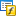
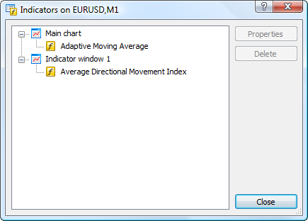
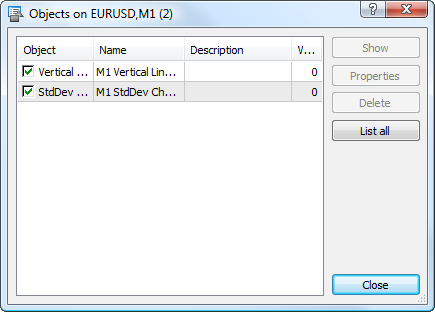
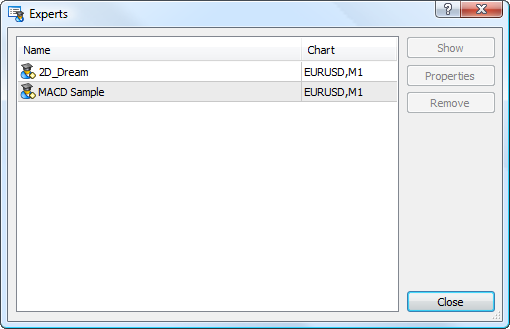

[🏠 Document Start](../../README.md) / [Price Charts, Technical and Fundamental Analysis](../README.md) / [Additional Features](../Additional-Features.md) / Lists of Objects Applied

[Previous](Chart-Management.md) | [Next](Deleted-Charts.md)

# Lists of Objects Applied (#lists-of-objects-applied)

For each chart you can open a list of all applied objects: indicators, analytical objects and Expert Advisors. From the list you can modify the properties of objects or delete them from the chart.

  * [List of indicators (#indicators)](Lists-of-Objects-Applied.md#indicators)
  * [List of objects (#objects)](Lists-of-Objects-Applied.md#objects)
  * [List of Expert Advisors (#ea)](Lists-of-Objects-Applied.md#ea)

## List of Indicators (#indicators)

To manage [indicators](../../Algorithmic-Trading-Trading-Robots/Expert-Advisors-and-Custom-Indicators.md) applied on the chart click " Indicator List" in the context menu or press "Ctrl+I".

Indicators are divided into two groups: those plotted in the main chart window and indicators drawn in separate windows. Select an indicator and click "Properties" to open [indicator settings (#appearance)](../Technical-Indicators.md#appearance). To remove an indicator from the chart, click "Delete".

## List of Objects (#objects)

To manage [analytical objects](../Analytical-Objects.md) applied on the chart click " Object List" in its context menu or press "Ctrl+B".

The following information is available in the list of objects:

  * Object — object type. Tick the "Object" field to select the object on the chart;
  * Name — object name. This name is formed of the period of the chart the object is attached to, the object type and the unique ID that is automatically assigned to each object. The name can be changed in the [object properties (#name)](../Analytical-Objects.md#name);
  * Description — object description. It can also be changed from the [object properties (#description)](../Analytical-Objects.md#description);
  * Window — the number of the window the object is added on. 0 is the main chart window, further numbers mean serial numbers of indicator sub-windows from the top down.

The "Objects" window contains the following commands:

  * Show — move the chart to the selected object;
  * Properties — [edit the properties (#parameters)](../Analytical-Objects.md#parameters) of the selected object;
  * Delete — delete the selected object;
  * List all — any object can be marked as hidden (property OBJPROP_HIDDEN) from a [MQL5 (#mql5)](../../Algorithmic-Trading-Trading-Robots/How-to-Create-an-Expert-Advisor-or-an-Indicator.md#mql5) application. Such objects are displayed on a chart, but they are not displayed in the object list by default. Click "List all" to show the hidden objects in the list.

Press Ctrl+A to select all objects.

## List of Expert Advisors (#ea)

To manage [Expert Advisors](../../Algorithmic-Trading-Trading-Robots/Expert-Advisors-and-Custom-Indicators.md) and [scripts (#type)](../../Algorithmic-Trading-Trading-Robots/How-to-Create-an-Expert-Advisor-or-an-Indicator.md#type) running on a chart click " List of Expert Advisors" in its [context menu (#experts-list)](Chart-Management.md#experts-list).

The list includes Expert Advisors and scripts running on all currently open charts. The Charts column contains the name and timeframe of the chart, on which the Expert Advisor or the script is running.

Select an Expert Advisor or a script and click "Show" to move to the chart, on which the MQL5 application is running. To open [settings (#run)](../../Algorithmic-Trading-Trading-Robots/Expert-Advisors-and-Custom-Indicators.md#run) of the selected Expert Advisor or script click "Properties". The "Delete" button stops the program and removes it from the chart.
