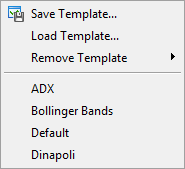
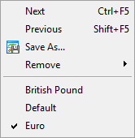

[🏠 Document Start](../../README.md) / [Price Charts, Technical and Fundamental Analysis](../README.md) / [Additional Features](../Additional-Features.md) / Templates and Profiles

[Previous](Deleted-Charts.md) | [Next](../../Algorithmic-Trading-Trading-Robots/README.md)

# Templates and Profiles (#templates-and-profiles)

A template is a set of chart window parameters that can be applied to other charts. The following data can be stored in a template:

  * chart type and color;
  * color scheme;
  * chart scale;
  * OHLC line shown or hidden;
  * running Expert Advisor and its parameters;
  * applied custom and technical indicators and their settings;
  * graphical objects;
  * separators of days.

When you apply a template to a chart, settings stored in it are applied to the instrument and timeframe. For example, you can create a template that includes indicators MACD, RSI, and Moving Average, and then use it for other charts. In this case, the chart windows look the same for different symbols and periods.

Templates are saved as TPL-files in folder [\MQL5\Profiles\Templates (#templates)](../../Getting-Started/For-Advanced-Users/Files-and-Folders.md#templates). The platform provides several predefined names of templates:

  * default.tpl — the basic template that us automatically applied when you create a new chart;
  * tester.tpl — the template of the chart on which [testing](../../Algorithmic-Trading-Trading-Robots/Strategy-Testing.md) results are displayed;
  * debug.tpl — the template of the chart created when you start MQL5 application debugging from [MetaEditor (#metaeditor)](../../Algorithmic-Trading-Trading-Robots/How-to-Create-an-Expert-Advisor-or-an-Indicator.md#metaeditor).

To create a template with the desired parameters (or modify an existing one), configure the chart and click " Save Template..." in its context menu.

> To share and synchronize templates and profiles between your platforms, use the [MQL5 Storage](https://www.metatrader5.com/en/metaeditor/help/mql5storage), which is integrated into MetaEditor. You will be able to access them from any computer using your [MQL5.community](../../MQL5-Algotrading-community/README.md) account.

## Actions with Templates (#actions-with-templates)

Click "Templates" in the [Chart](../../Getting-Started/User-Interface.md) menu or in the context menu of a chart or click on  on the toolbar.

Templates menu | Actions with templates  
---|---  
 | 

  * Creation  
To create a new template click " Save Template...". A new template is created based on the information of the active chart window.
  * Modification  
To edit a template, follow the same steps, but instead of a new file name select an existing template.
  * Applying  
To apply a template to a chart, select the required file at the bottom of the menu or click "Load Template" to open a template from any other folder.
  * Deletion  
To remove a template, click "Remove Template" in the [Charts menu](../../Getting-Started/User-Interface.md) or the context menu of the chart.

  
  

## Profiles (#profiles)

Profiles provide a convenient way of working with groups of charts. The following data can be stored in a profile:

  * charts that are open at the moment when you save the profile
  * the location and size of these charts;
  * [templates](Templates-and-Profiles.md) applied to the charts.

When a profile is opened, each chart with all its settings is located exactly in the same position where it was during profile saving. All changes in open chart windows are automatically saved in the current profile. The list of all charts of the current profile is available in the [Window](../../Getting-Started/User-Interface.md) menu. The name of the current profile is displayed in the [status bar](../../Getting-Started/User-Interface.md) and is marked with a tick in the profile control menu.

A default profile is created during platform installation. Initially, it stores four chart windows of basic currency pairs: EURUSD, USDCHF, GBPUSD and USDJPY. All profiles are stored in a folder [\MQL5\Profiles\Charts (#profiles)](../../Getting-Started/For-Advanced-Users/Files-and-Folders.md#profiles).

> Chart templates with running Expert Advisors are also saved in profiles, therefore the [platform settings (#profile)](../../Getting-Started/Platform-Settings.md#profile) provide an option for automatic disabling of Expert Advisors when changing the profile.

## Managing Profiles (#profiles-manage)

Click "Profiles" in the [File menu](../../Getting-Started/User-Interface.md), button  on the toolbar or click on the name of the current profile in the [status bar](../../Getting-Started/User-Interface.md).

Profiles menu | Commands  
---|---  
 | 

  * Next — switch to the next profile in the list. The same action can be performed using hotkeys "Ctrl+F5";
  * Previous — switch to the previous profile in the list. The same action can be performed using "Shift+F5";
  *  Save as — save the current profile with a new name. The new profile is a copy of the current one and becomes active after saving;
  * Remove — delete a profile. Clicking on this command opens the menu of existing profiles. Select one of them to delete it.

  
The lower part of this menu contains the list of existing profiles. To apply one of them click on it.  
  
A predefined profile can be assigned to a trade account. Create a profile with the same name as the account number. The predefined profile is applied automatically when you switch to this account. If there is no predefined profile, the current profile remains active.

> The current profile and the default profile (marked as DEFAULT) cannot be deleted.
