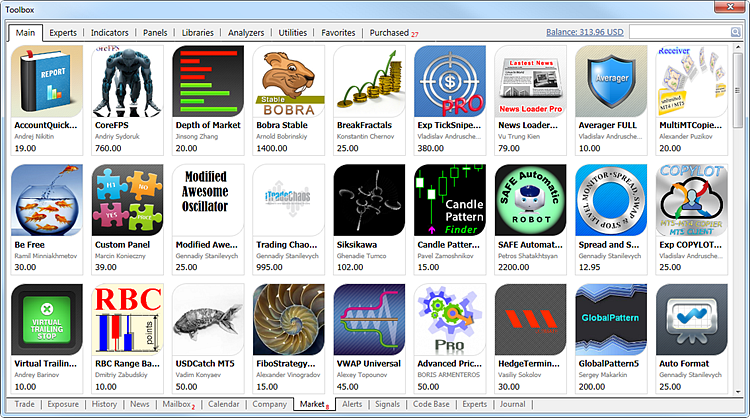

[🏠 Document Start](../README.md) / [Price Charts, Technical and Fundamental Analysis](README.md) / Additional Technical Indicators

[Previous](Fundamental-Analysis/New-Zealand/Unemployment-Rate.md) | [Next](Additional-Features.md)

# Additional Technical Indicators (#additional-technical-indicators)

The trading platform contains a plethora of popular technical indicators used for analysis. However, you can receive even more tools for your trading. A large number of additional custom indicators can be accessed straight from the trading platform.

  * [Market — the store of applications for the trading platform (#market)](Additional-Technical-Indicators.md#market)
  * [Code Base — a free source code library of Expert Advisors and indicators (#codebase)](Additional-Technical-Indicators.md#codebase)
  * [Freelance — an online service for ordering trading applications from professional developers (#freelance)](Additional-Technical-Indicators.md#freelance)
  * [MQL5 — a programming language used for the development of Expert Advisors and indicators (#mql5)](Additional-Technical-Indicators.md#mql5)

## Market — the store of applications for the trading platform (#market)

The [Market](../Market-App-Store/README.md) is a secure service for purchasing trading robots, indicators, scripts and other trading programs. It is a store of ready-made applications for working on financial markets. The service is available for all the trading platform users. You can open the Market anytime to purchase or rent a program and run it straight in your platform.

To purchase a selected product, go to its page and click "Buy". After operation confirmation, the application is activated and downloaded to the appropriate folder depending on whether it is an Expert Advisor, an indicator or a script. The software name is added to the [Navigator](../Getting-Started/User-Interface.md), from which it can be run on a chart.

## Code Base — a free source code library of Expert Advisors and indicators (#codebase)

Straight from the platform you can access a huge code base of free applications for automated trading. All the applications are available in the form of a source code. However, you can easily use them even if you are unfamiliar with programming.

When you download the code, it is automatically compiled, after which a ready-to use application is created and saved in the appropriate directory depending on whether it is an Expert Advisor, an Indicator or a Script. The software name is added to the [Navigator](../Getting-Started/User-Interface.md), from which it can be run on a chart.

## Freelance — an online service for ordering trading applications from professional developers (#freelance)

If you cannot find the desired application in the Code Base or Market, order one from a professional developer in the [Freelance service](https://www.mql5.com/en/job "Freelance on MQL5.community") of the MQL5.community website.

The order procedure is secure: the payment is frozen during the development and is only transferred to the developer when the customer accepts the resulting application. Any dispute can be resolved through arbitration.

## MQL5 — a programming language used for the development of Expert Advisors and indicators (#mql5)

You can develop your own trading robots or indicators using the [MQL5 (#mql5)](../Algorithmic-Trading-Trading-Robots/How-to-Create-an-Expert-Advisor-or-an-Indicator.md#mql5) programming language. This language is based on the concept of the popular C++ programming language. MQL5 is also a high-level object oriented programming language. However, due to its narrow specialization, MQL5 thrives in financial markets challenges.

The specialized MetaEditor is available for program development. It can recognize language structures: suggests tips on how to use functions and highlights various elements of the program source code. Thus, the editor enhances navigation in the source code of trading programs and speeds up the development process.
