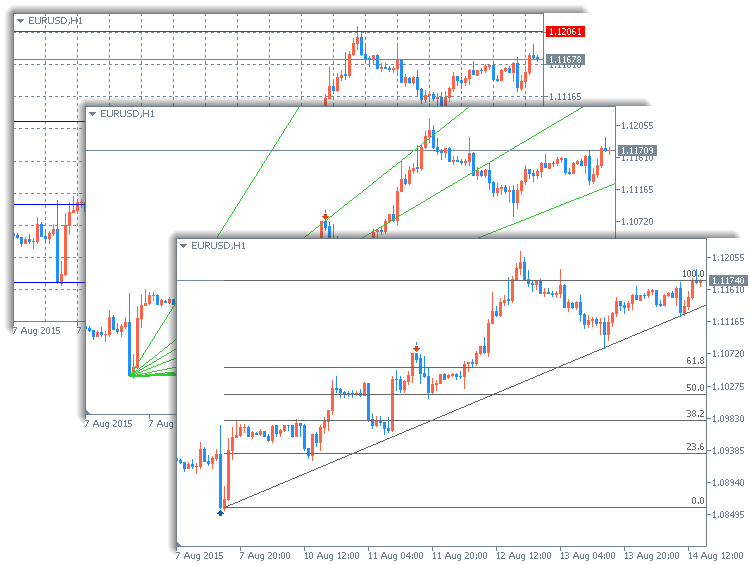
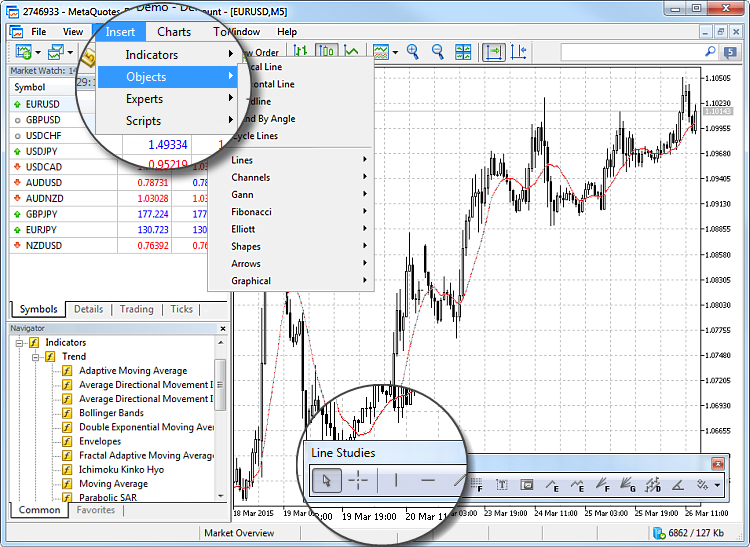
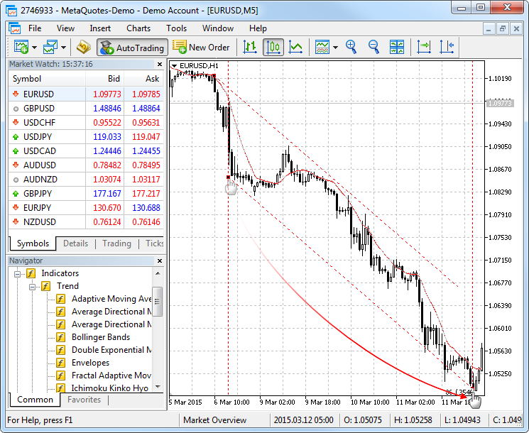
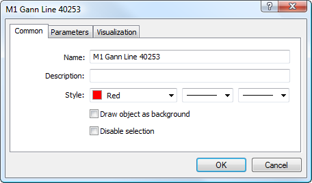
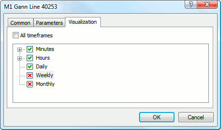
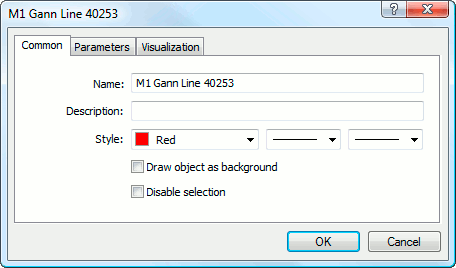

[🏠 Document Start](../README.md) / [Price Charts, Technical and Fundamental Analysis](README.md) / Analytical Objects

[Previous](Technical-Indicators/Bill-Williams'-Indicators/Market-Facilitation-Index.md) | [Next](Analytical-Objects/Lines.md)

# Analytical Objects (#analytical-objects)

Identifying trends, plotting channels, defining cycles and support/resistance levels — all these and many other tasks can be solved using analytical objects. The trading platform provides 46 analytical tools. They include geometric shapes, channels, Gann, Fibonacci and Elliott tools, and more. Unlike [technical indicators](Technical-Indicators.md), graphical objects are plotted manually. 

## Types of Analytical Objects (#type)

46 analytical objects are available in the trading platform. They are grouped into the following categories:

  * [Lines](Analytical-Objects/Lines.md) — various lines (trend lines, horizontal, cyclic lines, etc.) added to price charts and indicators;
  * [Channels](Analytical-Objects/Channels.md) — various channels (equidistant, regression channel, etc.) added to price charts and indicators;
  * [Gann Tools](Analytical-Objects/Gann-Tools.md) — a set of technical analysis tools developed by W. D. Gann;
  * [Fibonacci Tools](Analytical-Objects/Fibonacci-Tools.md) — a set of technical analysis tools created on the basis of the numerical sequence by L. Fibonacci;
  * [Elliott Tools](Analytical-Objects/Elliott-Tools.md) — a set of tools technical analysis based on the wave theory of R. N. Elliott;
  * [Shapes](Analytical-Objects/Shapes.md) — geometric shapes (square, triangle, and ellipse) that allow to mark various areas in the price chart;
  * [Arrows](Analytical-Objects/Arrows.md) — symbols (arrows, check and stop signs) allowing to mark the most significant points in the chart;
  * [Graphical objects](Analytical-Objects/Graphical-Objects.md) — various graphical objects (text, text labels, button, etc.)

For convenience, all objects are grouped by categories in the [Insert](../Getting-Started/User-Interface.md) menu and the [Line Studies](../Getting-Started/User-Interface.md) toolbar.

## How to Add an Object to a Chart (#draw)

To add an object, select it from the [Insert](../Getting-Started/User-Interface.md) menu or on the [Line Studies](../Getting-Started/User-Interface.md) toolbar.

Simple objects such as horizontal and vertical lines, arrows, labels, and others are plotted using one point. Select an object, click on the chart, and the object will be immediately added.

More complex objects that are built along the trend, such as channels, Gann and Fibonacci tools, etc. have multiple control points. They are added as follows: click on a chart to add the starting point, then hold down the mouse button and set the object direction and its second point. Below is an example of adding an equidistant channel.

> Some objects require setting more than one point. The object appears on the chart only after setting all the required points.

## Managing Object on the Chart (#manage)

A created object can be moved and modified. Click on an object to select it. Square markers or frames appear for a selected object. The markers are used for moving objects and changing their drawing parameters.

For example, to change the Fibonacci Fan location, grab its central marker with the left mouse button and move the cursor. Moving of any of its extreme markers changes the object drawing parameters.

The object moving points is its central point as a rule.

Any object can be removed from the chart using the context menu commands. Using the Backspace key, you can remove objects sequentially. Any removed object can be restored. To restore an object, click "Object — Undo Delete" in the [Charts](../Getting-Started/User-Interface.md) menu or press Ctrl+Z.

### Some features of working with objects: (#some-features-of-working-with-objects)

  * The platform allows you to quickly create copies of various objects. Select an object, hold down Ctrl and move the object using its central marker.
  * To move a group of objects, select them and drag the point of one of them while holding down Alt.
  * You can use a single click to select objects instead of the double click by enabling option "Select objects by single mouse click" in the [platform settings (#single-click)](../Getting-Started/Platform-Settings.md#single-click).
  * Magnet sensitivity of objects can be set in the [platform settings (#magnet)](../Getting-Started/Platform-Settings.md#magnet). When you move a point to the area within the distance specified in "Magnet sensitivity" from one of the bar prices ("Open", "High", "Low" or "Close"), the point is automatically moved to this price level. This feature enables convenient positioning of objects on the chart.

## How to Modify Object Properties (#modify)

Parameters of an added object can be modified. Select the required object in the [Object List (#objects)](Additional-Features/Lists-of-Objects-Applied.md#objects) window and click "Edit" or select " Properties" in the context menu of the object on the chart.

Use the context menu to manage objects:

  *  Properties — open the properties of a selected object.
  *  Object List — open the [Object List (#objects)](Additional-Features/Lists-of-Objects-Applied.md#objects) to manage objects on the chart.
  * Delete — delete the selected object.
  *  Delete All Arrows — delete all arrows belonging to the [Arrows](Analytical-Objects/Arrows.md) group.
  *  Delete All Selected — delete all selected objects.
  *  Unselect All — unselect all objects on the chart.
  * Unselect — unselect the selected object.
  *  Undo Delete — restore the last deleted object.

## How to Customize the Object Appearance (#appearance)

You can conveniently customize the appearance of analytical objects in the trading platform. You can set up the object parameters when adding it to a chart or modify them later. The object appearance is adjusted on the "Common" tab:

Line color, width and style are set up in the "Style" field. Other general object parameters can be set up here:

  * Name — the unique name of an object within one chart, it is set automatically. It can be changed by entering another name in this field. Such names make it easy to find an object among many other objects of the same type;
  * Description — a text description of an object which also helps to identify objects. The description can be shown on the chart if the "Show object descriptions" option is enabled in the chart settings;

## Object Display Settings (#visualization)

The object display on different timeframes (periods) can be changed in the "Visualization" tab.

The object only appears on the selected timeframes. This can be useful when an object has different settings on different timeframes. If the field "All timeframes" is selected, the object is visible on all timeframes.

The "Levels" tab is specifically used only for [Fibonacci tools](Analytical-Objects/Fibonacci-Tools.md) and [Andrews' Pitchfork](Analytical-Objects/Channels/Andrews'-Pitchfork.md). The list of the object levels is available in the form of a table here.

The values of the levels can be changed or deleted (the "Delete" button). A new level can be added by clicking the "Add" button. The "Defaults" button sets the initial values. The color, width and style of the object levels are set up in the "Style" field.

## Object Drawing Parameters (#draw-settings)

Object drawing parameters are available on the "Common" tab.

Parameters include:

  * Draw object as background — draw object in the background, behind the chart. This option also sets color filling of objects like shapes or channels (excluding Fibonacci Channel).
  * Disable selection — disable the possibility of object selection. This possibility is intended for control objects (["Button"](Analytical-Objects/Graphical-Objects/Button.md), ["Entry field"](Analytical-Objects/Graphical-Objects/Edit.md), ["Graphic label"](Analytical-Objects/Graphical-Objects/Bitmap-Label.md)). This option allows to change the state of buttons and graphic labels, as well enter values in the entry fields.

Coordinates of the object control points can be changed on the "Parameters" tab. Time coordinates are set in the "Date" fields. Values of coordinates along the vertical axis are entered in the "Value" fields. An object can have from one to three coordinates.

For some objects, additional options are available in the "Parameters" tab:

  * Angle in degrees — angle of the object slope counter-clockwise in degrees;
  * Scale — ratio between units of vertical (pips) and horizontal (bars) axes of the object. Normally, the number of pixels in a unit of the horizontal (time) axis differs from that of the vertical (prices) axis. Scale 1:1 sets them to the same value. Changing this setting for individual objects changes the ratio;
  * Arrow code — code of the object;
  * Ray right/left — displaying trend lines as rays in specified directions;
  * Anchor — one of the chart corners or sides where its anchor point is located;
  * X-distance: — horizontal distance between the anchor corner of the window and the text label in pixels;
  * Y-distance: — vertical distance between the anchor corner of the window and the text label in pixels;

> The complete list of object parameters is available in object description sections.

## What Platform Settings Affect Object Drawing (#general)

The trading platform has common object drawing settings, which are available in the [Chart (#charts)](../Getting-Started/Platform-Settings.md#charts) section.

  * Show object properties after creation — all objects have certain [properties (#parameters)](Analytical-Objects.md#parameters). For example, thickness and color of the trend line, period of the indicator's signal line, etc. Most traders use standard settings of all graphical objects, but in some cases you may need to set them up individually. Option "Show object properties after creation" allows to automatically open the window of properties of [graphical objects (#parameters)](Analytical-Objects.md#parameters) and [indicators (#run)](Technical-Indicators.md#run) after they are applied to a chart.
  * Select objects by single mouse click — graphical objects in the platform can be selected by a single or double click. This option allows to switch between the object selection methods. If it is enabled, all objects are selected by a single click. If this option is disabled, all objects are selected by a double click.
  * Precise time scale — if this option is disabled, objects are bound to bars along the horizontal scale of a chart. If you enable it, then it is possible to position an object at any point between bars.
  * Select objects after creation — objects are positioned on charts manually. After creating an object you may need to move it, for example to accurately position a trend line. To do that, it is necessary to select the object first. This option allows to do that automatically right after placing an object on a chart.
  * Magnet sensitivity — the platform allows to "dock" anchor points (except for the central moving points) of [graphical objects](Analytical-Objects.md) to different bar prices to locate them more precisely. In the "Magnet sensitivity" field, the sensitivity of this option in pixels can be defined. For example, if the value of 10 is specified, the object is automatically docked to a bar if the object's anchor point is located within a distance of 10 pips from the nearest bar price (OHLC). The point should also be within the bar width. To disable the option, set the parameter to 0.

> When you add an object to a chart with the [timeframe (#operations)](View-and-Configure-Charts.md#operations) other than M1, the following magnet features are active:
