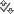
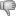
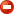
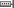
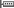
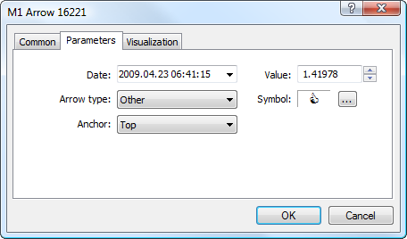

[🏠 Document Start](../../README.md) / [Price Charts, Technical and Fundamental Analysis](../README.md) / [Analytical Objects](../Analytical-Objects.md) / Arrows

[Previous](Shapes/Ellipse.md) | [Next](Graphical-Objects.md)

# Arrows

Various shapes can be applied to a price or indicator chart using the "Objects — Arrows" items of the [Insert](../../Getting-Started/User-Interface.md) menu or the button  in the [Line Studies](../../Getting-Started/User-Interface.md) toolbar. The following objects are described in this section:

| Type | Description  
 | Thumbs Up | The "Thumbs Up" sign anchored to a certain point in a chart.  
 | Thumbs Down | The "Thumbs Down" sign anchored to a certain point in a chart.  
 | Up Arrow | The "Arrow Up" sign anchored to a certain point in a chart.  
 | Down Arrow | The "Arrow Down" sign anchored to a certain point in a chart.  
 | Stop Sign | The "Stop Sign" anchored to a certain point in a chart.  
 | Check Sign | The "Check Sign" anchored to a certain point in a chart.  
 | Left Price Label | The "Left Price Label" shows the price value left to the point selected in the chart.  
 | Right Price Label | The "Right Price Label" shows the price value right to the point selected in the chart.  
 | Buy Sign | The "Buy sign" is intended for marking Buy deals, it is anchored to a certain point in a chart.  
 | Sell Sign | The "Sell sign" is intended for marking Sell deals, it is anchored to a certain point in a chart.  
 | Arrow | Placing of any available sign according to a user's choice.  
  
To draw these objects, one should select one of them and click on the necessary place of a chart.

## Parameters

All objects of this group have identical parameters, except for price labels that do not have the anchor angle.

  * Date/Value — coordinates of the anchor point of the object (date/value of the price scale);
  * Arrow Type — one of object types specified in the table above. When selecting "Other", an additional "Symbol" field appears to the right of this field;
  * Anchor — one of object sides (top or bottom) on which the point of anchoring the object to a chart or window is located. This parameter is not used for price labels..
  * Symbol — this field appears only when "Other" is selected as the arrow type. A click on  opens a window with available symbols. To select one a double-click on an icon is used.

Common parameters of object are described in a [separate section (#draw-settings)](../Analytical-Objects.md#draw-settings).
