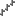

[🏠 Document Start](../../README.md) / [Price Charts, Technical and Fundamental Analysis](../README.md) / [Analytical Objects](../Analytical-Objects.md) / Channels

[Previous](Lines/Arrowed-Line.md) | [Next](Channels/Equidistant-Channel.md)

# Channels

Various channels can be applied to a price or indicator chart using the "Objects — Channels" items of the ["Insert"](../../Getting-Started/User-Interface.md) menu or the ["Line Studies"](../../Getting-Started/User-Interface.md) toolbar. The following channel types are available in the platform:

| Type | Description  
 | Equidistant Channel | Lines of the equidistant (trend) channel are always parallel. Two points must be set for this tool to be drawn. [Read more...](Channels/Equidistant-Channel.md)  
 | Standard Deviation Channel | Standard deviation is the way of volatility measuring based on statistical methods. Standard deviation influences the width of this channel. Two points must be set for this tool to be drawn. [Read more...](Channels/Standard-Deviation-Channel.md)  
 | Regression Channel | Regression channel is a statistical analysis tool used for forecasting of future values on basis of available data. If the trend is ascending, one can logically suppose that the next bar will be a bit higher than the preceding one. The linear regression method allows to have a statistical demonstration of such logical conclusions. Two points must be set for this tool to be drawn. [Read more...](Channels/Regression-Channel.md)  
 | Andrews' Pitchfork | This tool is drawn on three points and represents the parallel trendlines. The first trendline starts at the selected leftmost point (it is an important peak or trough) and is drawn precisely between two rightmost points. This line is the pitchfork «helve». Then, the second and the third trendlines outgoing from the above-mentioned rightmost points (significant peak and trough) are drawn in parallel to the first trendline. These lines are the pitchfork «teeth». Interpretation of Andrews’ Pitchfork is based on standard rules of interpretation of support and resistance. [Read more...](Channels/Andrews'-Pitchfork.md)
