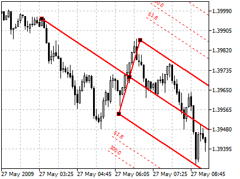
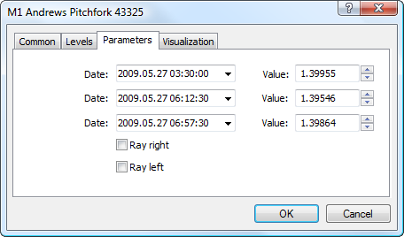

[🏠 Document Start](../../../README.md) / [Price Charts, Technical and Fundamental Analysis](../../README.md) / [Analytical Objects](../../Analytical-Objects.md) / [Channels](../Channels.md) / Andrews' Pitchfork

[Previous](Regression-Channel.md) | [Next](../Fibonacci-Tools.md)

# Andrews' Pitchfork

Andrews’ Pitchfork is an instrument consisting of three parallel [trendlines](../Lines/Trendline.md). This instrument was developed by Dr. Alan Andrews. Interpretation of Andrews’ Pitchfork is based on standard rules of interpretation of support and resistance. The first trend line starts in a selected extreme left point (it is an important peak or trough) and is drawn exactly between two extreme right points. This line is the pitchfork «helve». Then, the second and the third trendlines outgoing from the above-mentioned rightmost points (significant peak and trough) are drawn in parallel to the first trendline. These lines are the pitchfork «teeth». Signal lines are drawn parallel to "tines" of the pitchfork. They are drawn at distances proportional to Fibonacci numbers. The distance between the median line (continuation of a "handle") and "teeth" of the pitchfork.

## Drawing

To draw Andrews' Pitchfork, one should select this object and then click with the left mouse button in the chart plotting the first point (beginning of the "handle"). After that one should plot the second point of the "handle" in a chart and holding the mouse button move the cursor thus setting "teeth" of the pitchfork and signal lines at the necessary distance. Additional parameters will be shown near the cursor - three pairs of numbers. The first pair indicates the "handle" beginning, the first value is always equal to zero (because it is the initial point of the object); the second number indicates the distance between "teeth". The second and third pairs of numbers show distance along the time axis and price axis from the "teeth" to the "handle" beginning point.

## Controls

Moving of the "handle" beginning point will change the direction of "teeth" only. The second point of the "handle" allows moving Andrews' Pitchfork in the chart without changing its dimensions. Points of "teeth" beginning allow changing the position of teeth separately; when one point is moved, the second stays in its place.

## Parameters

For Andrews' Pitchfork [level settings (#levels)](../../Analytical-Objects.md#levels) (of signal lines). Besides there are the following parameters of the pitchfork:

  * Date/Value — coordinates of the beginning point of Andrews' Pitchfork "handle" (date/value of the price scale);
  * Date/Value — coordinates of the point of the lower "tooth" (lower pivot point) of Andrews' Pitchfork (date/value of the price scale);
  * Date/Value — coordinates of the point of the upper "tooth" (upper pivot point) of Andrews' Pitchfork (date/value of the price scale);
  * Ray Right — infinite duration of the pitchfork to the right;
  * Ray Left — infinite duration of the pitchfork to the left.

Common parameters of object are described in a [separate section (#draw-settings)](../../Analytical-Objects.md#draw-settings). 
