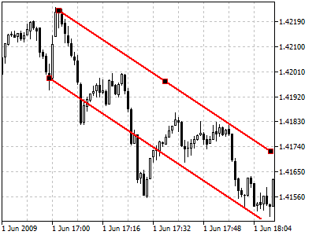
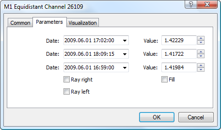

[🏠 Document Start](../../../README.md) / [Price Charts, Technical and Fundamental Analysis](../../README.md) / [Analytical Objects](../../Analytical-Objects.md) / [Channels](../Channels.md) / Equidistant Channel

[Previous](../Channels.md) | [Next](Standard-Deviation-Channel.md)

# Equidistant Channel

Equidistant Channel represents two parallel [trendlines](../Lines/Trendline.md) connecting extreme maximum and minimum close prices. Market price jumps, draws peaks and troughs forming the channel in the trend direction. Early identification of the channel can give valuable information including that about changes in the trend direction what allows to estimate possible profits and losses.

## Drawing

To draw the equidistant channel, one should select this object and then click with the left mouse button in the chart. After that holding the mouse button one should draw the channel in the necessary direction and set its width. Additional parameters will be shown near the end point of the lower border of the channel: distance from the initial point along the time axis, distance from the initial point along the price axis.

## Controls

On the main channel line there are three points that can be moved with the mouse. Moving of the first point changes the channel width and the length of the upper and lower borders (length of borders is changed proportionally but in different directions). Moving of the central point of the main line will move the channel without changing its dimensions. Manipulations with the third point allow changing the length and direction of the whole channel. Moving of the point of the second channel line allows moving this border independently from the main line.

## Parameters

There are the following parameters of the equidistant channel:

  * Date/Value — coordinates of the first point (anchor) on the main line (date/value of the price scale);
  * Date/Value — coordinates of the last point (moving point) on the main line (date/value of the price scale);
  * Date/Value — point coordinates of the second line (date/value of the price scale);
  * Ray Right — infinite duration of the channel to the right;
  * Ray Left — infinite duration of the channel to the left;
  * Fill — enable/disable color filling inside the channel.

Common parameters of object are described in a [separate section (#draw-settings)](../../Analytical-Objects.md#draw-settings).
