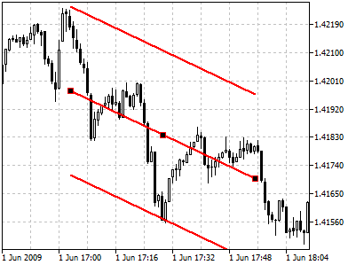
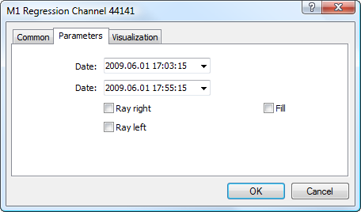

[🏠 Document Start](../../../README.md) / [Price Charts, Technical and Fundamental Analysis](../../README.md) / [Analytical Objects](../../Analytical-Objects.md) / [Channels](../Channels.md) / Regression Channel

[Previous](Standard-Deviation-Channel.md) | [Next](Andrews'-Pitchfork.md)

# Regression Channel

Regression Channel is built on base of Linear Regression Trend representing a usual [trendline](../Lines/Trendline.md) drawn between two points on a price chart using the method of least squares. As a result, this line proves to be the exact median line of the changing price. It can be considered as an equilibrium price line, and any deflection up or down indicates the superactivity of buyers or sellers respectively.

Linear Regression Channel consists of two parallel lines, equidistant up and down from the line of linear regression trend. The distance between frame of the channel and regression line equals to the value of maximum close price deviation from the regression line.

## Drawing

To draw the channel, one should select this object and then click with the left mouse button in the chart. After that holding the mouse button one should draw the channel in the necessary direction and set its length. Additional parameters will be shown near the end point of the trendline of the channel: distance from the initial point along the time axis, distance from the initial point along the price axis.

## Controls

On the trend line of the channel linear regression there are three points that can be moved with the mouse. The first and the last points are used to change the channel length in different directions. The central point (moving point) is used to move a channel in the chart without changing its dimensions.

## Parameters

There are the following parameters of the regression channel:

  * Date — coordinate on the time scale of the first point of the trend of the channel linear regression.
  * Date — coordinate on the time scale of the last point of the trend of the channel linear regression.
  * Ray Right — infinite duration of the channel to the right;
  * Ray Left — infinite duration of the channel to the left;
  * Fill — enable/disable color filling inside the channel.

Common parameters of object are described in a [separate section (#draw-settings)](../../Analytical-Objects.md#draw-settings).
