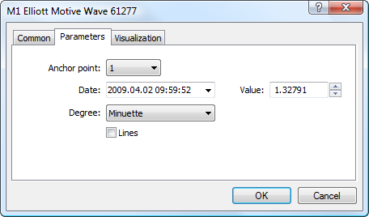

[🏠 Document Start](../../../README.md) / [Price Charts, Technical and Fundamental Analysis](../../README.md) / [Analytical Objects](../../Analytical-Objects.md) / [Elliott Tools](../Elliott-Tools.md) / Construction of Waves

[Previous](Elliott-Wave-Theory.md) | [Next](../Shapes.md)

# Construction of Waves

Two objects are available in the platform - Impulse and Corrective waves. To apply waves on a chart, five points should be defined for an impulse wave and three - for a corrective wave. Settings are identical for both objects, but they should be specified separately:

  * Anchor Point — select one of points for plotting an impulse or corrective waves;
  * Date/Value — coordinates of the selected anchor point (date/value of the price scale);
  * Degree — select the cycle level influencing also the displaying of point markings;
  * Lines — if this field is selected, all points of an impulse or corrective wave will be sequentially joined.

Common parameters of object are described in a [separate section (#draw-settings)](../../Analytical-Objects.md#draw-settings).
