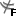

[🏠 Document Start](../../README.md) / [Price Charts, Technical and Fundamental Analysis](../README.md) / [Analytical Objects](../Analytical-Objects.md) / Fibonacci Tools

[Previous](Channels/Andrews'-Pitchfork.md) | [Next](Fibonacci-Tools/Fibonacci-Retracement.md)

# Fibonacci Tools

Fibonacci tools can be applied to a price or indicator chart using the "Objects — Fibonacci" items of the ["Insert"](../../Getting-Started/User-Interface.md) menu or the ["Line Studies"](../../Getting-Started/User-Interface.md) toolbar. The following types of Fibonacci tools are available in the platform:

| Type | Description  
 | Fibonacci Retracement | Leonardo Fibonacci is considered to have discovered a number sequence where each successive number represents a sum of two preceding ones: 1, 1, 2, 3, 5, 8, 13, 21, 34, 55, 89, 144, etc. Each number is approximately 1.618 times more than the preceding one, and each number makes approximately 0.618 of the successive one. The tool can be drawn on two points that determine the trendline. At that, horizontal lines that meet the trendline at Fibonacci levels (retracement) as 0.0%, 23.6%, 38.2%, 50%, 61.8%, 100%, 161.8%, 261.8%, and 423.6% are drawn automatically. [Read more...](Fibonacci-Tools/Fibonacci-Retracement.md)  
 | Fibonacci Time Zones | Fibonacci Time Zones is a sequence of vertical lines having Fibonacci intervals of 1, 2, 3, 5, 8, 13, 21, 34, etc. Significant price changes are considered to be expected near these lines. The tool is drawn on two points that define the unit interval. [Read more...](Fibonacci-Tools/Fibonacci-Time-Zones.md)  
 | Fibonacci Fan | Fibonacci Fan is drawn on two points that define the trendline. Then an «invisible» vertical line is drawn through the second point. Then three trendlines are drawn from the first point, these trendlines meeting the invisible vertical line at Fibonacci levels of 38.2%, 50%, and 61.8%. Significant price changes are considered to be expected near these lines. [Read more...](Fibonacci-Tools/Fibonacci-Fan.md)  
 | Fibonacci Arcs | The tool named Fibonacci Arcs is drawn on two points that define the trendline. Then three arcs having the centers in the second point are drawn, these arcs meeting the trendline at Fibonacci levels of 38.2%, 50%, and 61.8%. It is considered that significant price changes should be expected near these arcs. [Read more...](Fibonacci-Tools/Fibonacci-Arcs.md)  
 | Fibonacci Channel | To draw this tool, a channel is used the width of which is taken as one. Then, at the distances defined by the Fibonacci sequence, parallels are drawn starting with the distance of 0.618 of the channel width, then 1.000, 1.618, 2.618, 4.236, etc. Two points and the basic channel width must be set for this tool to be drawn. [Read more...](Fibonacci-Tools/Fibonacci-Channel.md)  
 | Fibonacci Expansion | Fibonacci Expansion is drawn on three points that circumscribe two waves. Then three lines meeting the third, "presumptive", wave at Fibonacci levels of 61.8%, 100%, and 161.8%, are drawn. Significant price changes are considered to be expected near these lines. [Read more...](Fibonacci-Tools/Fibonacci-Expansion.md)
