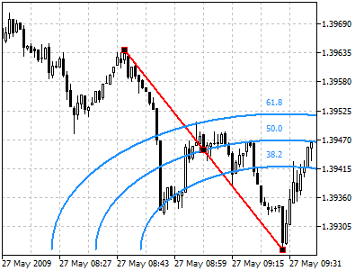
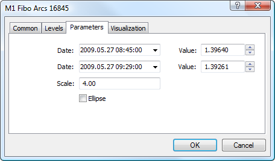

[🏠 Document Start](../../../README.md) / [Price Charts, Technical and Fundamental Analysis](../../README.md) / [Analytical Objects](../../Analytical-Objects.md) / [Fibonacci Tools](../Fibonacci-Tools.md) / Fibonacci Arcs

[Previous](Fibonacci-Fan.md) | [Next](Fibonacci-Channel.md)

# Fibonacci Arcs

Fibonacci Arcs are built as follows: first, the trend line is drawn between two extreme points, for example, from the trough to the opposing peak. Then three arcs are built having their centers in the second extreme point and intersecting the trend line at Fibonacci levels of 38.2, 50, and 61.8 percent.

Fibonacci arcs are considered to be potential support and resistance levels. Fibonacci Arcs and [Fibonacci Fan](Fibonacci-Fan.md) are usually plotted together on the chart, and support and resistance levels are determined by the points of intersection of these lines.

It should be noted that the points of intersection of Arcs and the price curve can change depending on the chart scale since an arc is a part of a circumference, and its form is always the same.

## Drawing

To draw Fibonacci Arcs, one should select this object and indicate an initial point in the chart and, holding the mouse button, one should draw a trendline till the second extreme point. Additional parameters will be shown near the end point of the trendline: distance from the initial point along the time axis and distance from the initial point along the price axis, as well as the slope angle relative to a horizontal line drawn through the initial point at the scale 1:1.

## Controls

On the trendline there are three points that can be moved by a mouse. The first and the last points are used for changing the length and direction of lines. The central point (moving point) is used for moving Fibonacci Arcs without changing their dimensions and direction.

## Parameters

For Fibonacci Arcs construction [settings (#levels)](../../Analytical-Objects.md#levels) can be changed. Besides, there are the following parameters for this object:

  * Date/Value — coordinates of the initial point of the trend line (date/value of the price scale);
  * Date/Value — coordinates of the end point of the trend line (date/value of the price scale);
  * Scale — ratio of the minor and larger radii of arcs. The minor radius is measured along the price scale, the larger one - along the time scale. This parameter sets the ratio of pips number to one bar;
  * Ellipse — if this field is checked, Fibonacci Arcs will be specularly closed by identical arcs thus building the shape of an ellipse.

Common parameters of object are described in a [separate section (#draw-settings)](../../Analytical-Objects.md#draw-settings).
