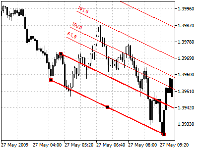
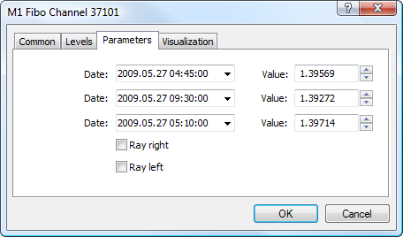

[🏠 Document Start](../../../README.md) / [Price Charts, Technical and Fundamental Analysis](../../README.md) / [Analytical Objects](../../Analytical-Objects.md) / [Fibonacci Tools](../Fibonacci-Tools.md) / Fibonacci Channel

[Previous](Fibonacci-Arcs.md) | [Next](Fibonacci-Expansion.md)

# Fibonacci Channel

Fibonacci Channels are built using several parallel [trendlines](../Lines/Trendline.md). To build this instrument, the channel having the width taken as a unit measure is used. Then, parallel lines are drawn at the values equal to the Fibonacci Numbers, beginning with 0.618-fold size of the channel, then 1.000-fold, 1.618-fold, 2.618-fold, 4.236-fold, etc. As soon as the fifth wave finishes, correction in the direction opposite to the trend can be expected.

It is necessary to remember for a correct Fibonacci Channel building: base line limits the upper part of the channel when trend is ascending, and the lower part of it when trend is descending.

## Drawing

To draw Fibonacci Channel, one should select this object and indicate an initial point of the main trendline in the chart. After that holding the mouse button one should draw a trendline in the necessary direction. Additional parameters will be shown near the end point of the trendline: distance from the initial point along the time axis and distance from the initial point along the price axis. Other lines will be automatically drawn parallel to the main one.

## Controls

On the main trendline there are three points that can be moved by a mouse. The first and the last points are used for changing the length and direction of lines. The central point (moving point) is used for moving Fibonacci Channel without changing its dimensions and direction. On the second border of the channel there is a point used for changing the width of the channel. The second border of the channel is moved independently from the first one.

## Parameters

For Fibonacci Channel trendline construction [settings (#levels)](../../Analytical-Objects.md#levels) can be changed. Besides, there are the following parameters for this object:

  * Date/Value — coordinates of the first point on the main line of Fibonacci Channel (date/value of the price scale);
  * Date/Value — coordinates of the last point on the main line of Fibonacci Channel (date/value of the price scale);
  * Date/Value — coordinates of the point on the second line of Fibonacci Channel (date/value of the price scale);
  * Ray Right — infinite duration of Fibonacci Channel to the right;
  * Ray Left — infinite duration of Fibonacci Channel to the left.

Common parameters of object are described in a [separate section (#draw-settings)](../../Analytical-Objects.md#draw-settings).
