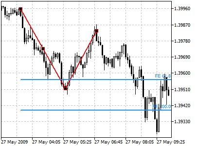
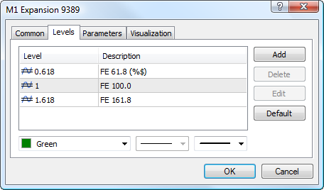
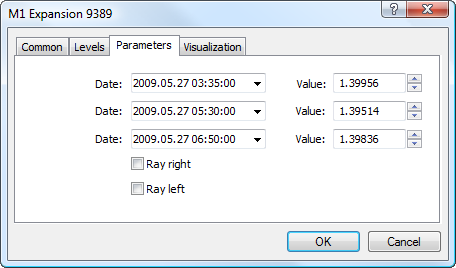

[🏠 Document Start](../../../README.md) / [Price Charts, Technical and Fundamental Analysis](../../README.md) / [Analytical Objects](../../Analytical-Objects.md) / [Fibonacci Tools](../Fibonacci-Tools.md) / Fibonacci Expansion

[Previous](Fibonacci-Channel.md) | [Next](../Gann-Tools.md)

# Fibonacci Expansion

Fibonacci Expansion is largely similar to [Fibonacci Retracement](Fibonacci-Retracement.md) and intended for determining of the end of the third wave. Unlike Fibonacci Retracement, this instrument is built not on the only one [trendline](../Lines/Trendline.md), but on two waves.

First, the line of the first wave is drawn, its height will be considered as a unit interval later on. The end of the second wave serves as a reference point for building an invisible vertical line. The corresponding lines are drawn from the reference point on the interval equal to 61.8, 100%, and 161.8 per cent of the unit interval. The third wave is considered to finish near these levels.

## Drawing

To draw Fibonacci extension, one should select this object and indicate the first point of the first wave in the chart. After that one should define the second point of the first wave. To plot the second wave one should click on the second point of the first wave and holding the mouse button draw it. When selecting each point additional parameters will be shown near it: distance from the initial point along the time axis and distance from the initial point along the price axis.

## Controls

On the first wave there are three points that can be moved by a mouse. Using the first point and the last point (which is the first point of the second wave) length and slope are defined. The last point of the second wave is used for changing its length and slope. The central point (moving point) is used for moving the whole object without changing its size and shape.

## Levels

This tab is intended for managing [levels (#levels)](../../Analytical-Objects.md#levels) of the tool. The Fibonacci Expansion has additional feature of displaying price value of each level. To do it, specify the (%$) symbols in the "Description" field.

## Parameters

There are the following parameters of the object:

  * Date/Value — coordinates of the first point of the first wave (date/value of the price scale);
  * Date/Value — coordinates of the last point of the first wave (date/value of the price scale);
  * Date/Value — coordinates of the last point of the second wave (date/value of the price scale);
  * Ray Right — infinite duration of levels to the right;
  * Ray Left — infinite duration of levels to the left.

Common parameters of object are described in a [separate section (#draw-settings)](../../Analytical-Objects.md#draw-settings).
