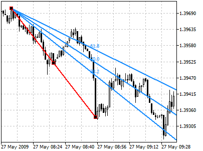
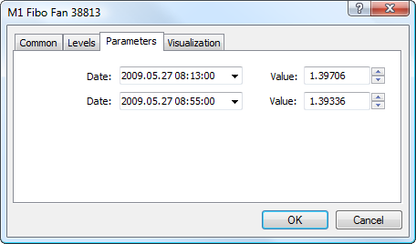

[🏠 Document Start](../../../README.md) / [Price Charts, Technical and Fundamental Analysis](../../README.md) / [Analytical Objects](../../Analytical-Objects.md) / [Fibonacci Tools](../Fibonacci-Tools.md) / Fibonacci Fan

[Previous](Fibonacci-Time-Zones.md) | [Next](Fibonacci-Arcs.md)

# Fibonacci Fan

Fibonacci Fan as a line instrument is built as follows: a [trendline](../Lines/Trendline.md) — for example from a trough to the opposing peak is drawn between two extreme points. Then, an "invisible" vertical line is automatically drawn through the second extreme point. After that, three trend lines intersecting this invisible vertical line at Fibonacci levels of 38.2, 50, and 61.8 percent are drawn from the first extreme point.

These lines are considered to represent support and resistance levels. For getting a more precise forecast, it is recommended to use [other Fibonacci tools](../Fibonacci-Tools.md) along with the Fan.

## Drawing

To draw Fibonacci Fan, one should select this object and indicate an initial point in the chart. After that holding the mouse button one should draw a trendline setting the necessary length and slope. Additional parameters will be shown near the end point of the trendline: distance from the initial point along the time axis and distance from the initial point along the price axis, as well as the slope angle relative to a horizontal line drawn through the initial point at the scale 1:1.

## Controls

On the main trendline there are three points that can be moved by a mouse. The first and the last points are used for changing the length and direction of lines. The central point (moving point) is used for moving Fibonacci Fan without changing its dimensions and direction.

## Parameters

For Fibonacci Fan trendline construction [settings (#levels)](../../Analytical-Objects.md#levels) can be changed. Besides, there are the following parameters for this object:

  * Date/Value — coordinates of the initial point of the trend line (date/value of the price scale);
  * Date/Value — coordinates of the end point of the trend line (date/value of the price scale);

Common parameters of object are described in a [separate section (#draw-settings)](../../Analytical-Objects.md#draw-settings).
