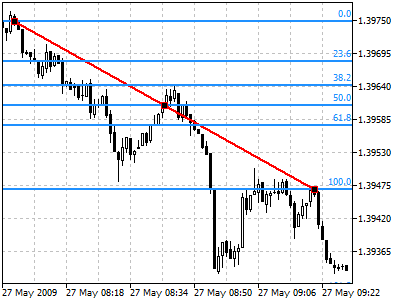
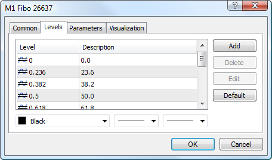
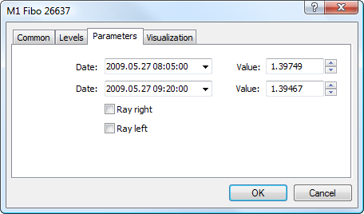

[🏠 Document Start](../../../README.md) / [Price Charts, Technical and Fundamental Analysis](../../README.md) / [Analytical Objects](../../Analytical-Objects.md) / [Fibonacci Tools](../Fibonacci-Tools.md) / Fibonacci Retracement

[Previous](../Fibonacci-Tools.md) | [Next](Fibonacci-Time-Zones.md)

# Fibonacci Retracement

Fibonacci Retracement is built as follows: first, a [trendline](../Lines/Trendline.md) is built between two extreme points, for example, from the trough to the opposing peak. Then, nine horizontal lines intersecting the trend line at Fibonacci levels of 0.0, 23.6, 38.2, 50, 61.8, 100, 161.8, 261.8, and 423.6 percent are drawn. After a significant rise or decline, prices often return to their previous levels correcting an essential part (and sometimes completely) of their initial movement. Prices often face support/resistance at the level of Fibonacci Retracements or near them in the course of such a reciprocal movement.

## Drawing

To draw Fibonacci Retracement, one should select this object and indicate an initial point in the chart. After that holding the mouse button one should draw a trendline setting the necessary length and slope. Additional parameters will be shown near the end point of the trendline: distance from the initial point along the time axis and distance from the initial point along the price axis, as well as the slope angle relative to a horizontal line drawn through the initial point at the scale 1:1.

## Controls

On the trendline there are three points that can be moved using a mouse. The first and the last points allow changing the trendline length and direction. The central point (moving point) is used for moving the object without changing its dimensions.

## Levels

This tab is intended for managing [levels (#levels)](../../Analytical-Objects.md#levels) of the tool. The Fibonacci Retracement has additional feature of displaying price value of each level. To do it, specify the (%$) symbols in the "Description" field.

## Parameters

For Fibonacci Retracement construction [settings (#levels)](../../Analytical-Objects.md#levels) can be changed. Besides, there are the following parameters for this object:

  * Date/Value — coordinates of the initial point of the trend line (date/value of the price scale);
  * Date/Value — coordinates of the end point of the trend line (date/value of the price scale);
  * Ray Right — infinite duration of Fibonacci Retracement to the right;
  * Ray Left — infinite duration of Fibonacci Retracement to the left.

Common parameters of object are described in a [separate section (#draw-settings)](../../Analytical-Objects.md#draw-settings).
