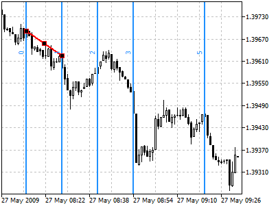
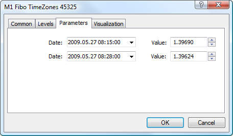

[🏠 Document Start](../../../README.md) / [Price Charts, Technical and Fundamental Analysis](../../README.md) / [Analytical Objects](../../Analytical-Objects.md) / [Fibonacci Tools](../Fibonacci-Tools.md) / Fibonacci Time Zones

[Previous](Fibonacci-Retracement.md) | [Next](Fibonacci-Fan.md)

# Fibonacci Time Zones

Fibonacci Time Zones is a sequence of vertical lines having Fibonacci intervals of 1, 2, 3, 5, 8, 13, 21, 34, etc. Significant price changes are considered to be expected near these lines.

## Drawing

To draw this tool, one should select this object and using the mouse define two points on the chart that will set the length of the unit interval. Additional parameters will be shown near the end point: distance from the initial point along the time axis and distance from the initial point along the price axis, as well as the slope angle relative to a horizontal line drawn through the initial point at the scale 1:1. All other lines are constructed on the basis of this unit interval in accordance with Fibonacci numbers.

## Controls

On the unit interval line there are three points that can be moved by a mouse. The first and the last points are used for changing the length and direction of lines. The central point (moving point) is used for moving the object without changing its dimensions.

## Parameters

For Fibonacci Time Zones construction [setting (#levels)](../../Analytical-Objects.md#levels) can be changed. Besides, there are the following parameters for this object:

  * Date/Value — coordinates of the initial point of the trend line (date/value of the price scale);
  * Date/Value — coordinates of the end point of the trend line (date/value of the price scale);

Common parameters of object are described in a [separate section (#draw-settings)](../../Analytical-Objects.md#draw-settings).
