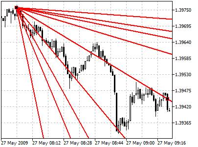
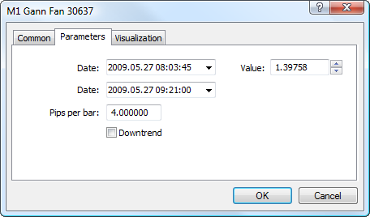

[🏠 Document Start](../../../README.md) / [Price Charts, Technical and Fundamental Analysis](../../README.md) / [Analytical Objects](../../Analytical-Objects.md) / [Gann Tools](../Gann-Tools.md) / Gann Fan

[Previous](Gann-Line.md) | [Next](Gann-Grid.md)

# Gann Fan

Lines of Gann Fan are built at different angles from an important base or peak at the price chart. The trendline of 1x1 was considered by Gann the most important. If the price curve is located above this line, it is the indication of the bull market, if it is below this line it is that of the bear market. Gann thought that the ray of 1x1 is a powerful support line when the trend is ascending, and he considered the breaking this line as an important turn signal. Gann emphasized the following nine basic angles, the angle of 1x1 being the most important of all:

  * 1x8 — 82,5 degrees
  * 1x4 — 75 degrees
  * 1x3 — 71,25 degrees
  * 1x2 — 63,75 degrees
  * 1x1 — 45 degrees
  * 2x1 — 26,25 degrees
  * 3x1 — 18,75 degrees
  * 4x1 — 15 degrees
  * 8x1 — 7,5 degrees

For the considered ratios of price and time increments to have corresponding angles of slope in degrees, X and Y axes must have the same scales. It means that a unit interval on X axis (i.e., hour, day, week, month) must correspond with the unit interval on Y axis. The simplest method of chart calibration consists in checking the slope of the ray of 1x1: it must make 45 degrees.

Gann noted that each of the above-listed rays can serve as support or resistance depending on the price trend direction. For example, ray of 1x1 is usually the most important support line when the trend is ascending. If prices fall below 1x1 line, it means the trend turns. According to Gann, prices should then sink down to the next trend line (in this case, it is the ray of 2x1). In other words, if one of rays is broken, the price consolidation should be expected to occur near the next ray.

## Drawing

To draw Gann Fan, one should select this object and indicate an initial point in the chart. After that holding the mouse button one should draw the tool at the necessary length. An additional parameter will be shown near the end point — distance along the time axis from the initial point.

## Controls

Gann Fan can be managed using two points located on the trendline 1x1; the points can be moved using a mouse. These points are used for positioning Gann Fan in a chart. The line slope angle can be changed in the "Pips Per Bar" parameter described below.

## Parameters

There are the following parameters of the Gann Fan:

  * Date/Value — coordinates of the initial point (date/value of the price scale);
  * Date — coordinates of the last point along the time axis;
  * Pips Per Bar — scale for plotting the Gann Fan in a chart. Ratio of pips number to one bar;
  * Downtrend — if this field is checked, the Gann Fan will be inclined downwards. This parameter is used for building the Gann Fan at downtrends.

Common parameters of object are described in a [separate section (#draw-settings)](../../Analytical-Objects.md#draw-settings).
