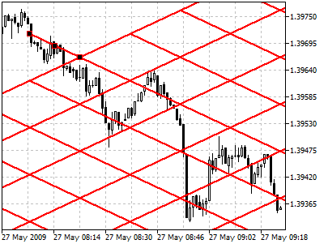
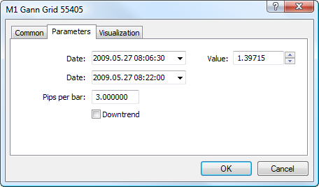

[🏠 Document Start](../../../README.md) / [Price Charts, Technical and Fundamental Analysis](../../README.md) / [Analytical Objects](../../Analytical-Objects.md) / [Gann Tools](../Gann-Tools.md) / Gann Grid

[Previous](Gann-Fan.md) | [Next](../Elliott-Tools.md)

# Gann Grid

Gann Grid represents [trends](../Lines/Trendline.md) built at the angle of 45 degrees ([Gann Lines](Gann-Line.md)). According to Gann’s concepts, a line having a slope of forty-five degrees represents a long-term trendline (ascending or descending). While prices are above the ascending line, the market holds bull directions. If prices hold below the descending line, the market is characterized as a bear one. Intersection of the Gann Line usually signals of breaking the basic trend. When prices go down to this line during an ascending trend, time and price become fully balanced. The further intersection of Gann Lines is an evidence of breaking of this balance and possible change of the trend.

## Drawing

To draw Gann Grid, one should select this object and indicate an initial point in the chart. After that holding the mouse button one should define the second point setting thus the size of cells. An additional parameter will be shown near this point — distance along the time axis from the initial point.

## Controls

On the main line of Gann Grid there are three points that can be moved by a mouse. The first and last points are used for setting the grid cell size. The central point (moving point) is used for moving Gann Grid in the chart without changing its dimensions. The slope of lines is defined by the "Pips Per Bar" parameter described below.

## Parameters

There are the following parameters of Gann Grid:

  * Date/Value — coordinates of the initial point (date/value of the price scale);
  * Date — coordinates of the last point along the time axis;
  * Pips Per Bar — scale for plotting the Gann Grid in a chart. Ratio of pips number to one bar;
  * Downtrend — if this field is checked, the Gann Grid will be directed downwards. This parameter is used for building the Gann Fan at downtrends.

Common parameters of object are described in a [separate section (#draw-settings)](../../Analytical-Objects.md#draw-settings).
