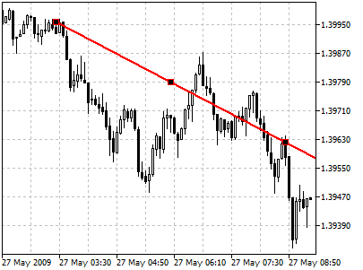
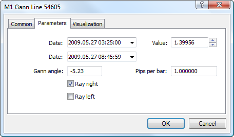

[🏠 Document Start](../../../README.md) / [Price Charts, Technical and Fundamental Analysis](../../README.md) / [Analytical Objects](../../Analytical-Objects.md) / [Gann Tools](../Gann-Tools.md) / Gann Line

[Previous](../Gann-Tools.md) | [Next](Gann-Fan.md)

# Gann Line

Gann Line represents a line drawn at the angle of 45 degrees. This line is also called "one to one" (1x1) what means one change of the price within one unit of time.

According to Gann’s concept, the line having the slope of forty-five degrees represents a long-term trendline (ascending or descending). While prices are above the ascending line, the market holds bull directions. If prices hold below the descending line, the market is characterized as a bear one. Intersection of the Gann Line usually signals of breaking the basic trend. When prices go down to this line during an ascending trend, time and price become fully balanced. The further intersection of Gann Line is the evidence of breaking of this balance and possible changing the trend.

## Drawing

To draw the Gann line, one should select this object and then select an initial point in the chart. After that holding the mouse button one should draw a line in the necessary direction. Additional parameters will be shown near the cursor: distance from the initial point along the time axis, distance from the initial point along the price axis. Besides, during line construction additional vertical lines are shown for the accurate positioning of the initial and end point of the line.

## Controls

On the line there are three points that can be moved by a mouse. By moving the first and the last points one can change the slope of a line, as well as its length (if "Ray Right" and "Ray Left" parameters are disabled in the object parameters). The central point (moving point) is used for moving the line in the chart without changing its length or slope.

## Parameters

There are the following parameters of the Gann Line:

  * Date/Value — coordinates of the initial point (date/value of the price scale);
  * Date — coordinates of the last point along the time axis;
  * Gann Angle — slope angle of the Gann line relative to a horizontal line drawn through the initial point at the scale 1:1 (one price change to one time unit);
  * Pips Per Bar — scale for plotting the Gann Line in a chart. Ratio of pips number to one bar;
  * Ray Right — infinite duration of a trendline to the right;
  * Ray Left — infinite duration of a trendline to the left.

Common parameters of object are described in a [separate section (#draw-settings)](../../Analytical-Objects.md#draw-settings).
