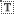
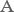
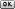
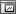
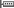
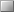

[🏠 Document Start](../../README.md) / [Price Charts, Technical and Fundamental Analysis](../README.md) / [Analytical Objects](../Analytical-Objects.md) / Graphical Objects

[Previous](Arrows.md) | [Next](Graphical-Objects/Text.md)

# Graphical Objects

Various graphical objects can be applied to a price or indicator chart using the "Objects — Graphical" items of the ["Insert"](../../Getting-Started/User-Interface.md) menu or the ["Line Studies"](../../Getting-Started/User-Interface.md) toolbar. The following graphical objects are available in the platform:

| Type | Description  
 | Text | Text intended for adding of comments to the chart. [Read more...](Graphical-Objects/Text.md)  
 | Text Label | Text intended for adding of comments and anchored to the chart window coordinates. Text label does not move when the chart is scrolled. [Read more...](Graphical-Objects/Text-Label.md)  
 | Button | Button intended for processing events from custom indicators, Expert Advisors and scripts. Button is bound to the window and does not move when the chart is scrolled. [Read more...](Graphical-Objects/Button.md)  
 | Graph | A chart window inside the current chart with the possibility to set up the displayed symbol and timeframe. [Read more...](Graphical-Objects/Graph.md)  
 | Bitmap | Placing of any "Bitmap" image in the chart window. This object is anchored to a chart and moves together with the chart. [Read more...](Graphical-Objects/Bitmap.md)  
 | Bitmap Label | Placing of any "Bitmap" image in the chart window. This object is bound to a chart window and does not move when the chart is scrolled. [Read more...](Graphical-Objects/Bitmap-Label.md)  
 | Edit | Placing of an editable field in a chart window. This object is bound to a chart window and does not move when the chart is scrolled. [Read more...](Graphical-Objects/Edit.md)  
 | Event | Placing the "Event" object on the horizontal chart scale. [Read more...](Graphical-Objects/Event.md)  
 | Rectangle Label | Placing a "Rectangle Label" used for creating custom graphical interfaces on a chart. [Read more...](Graphical-Objects/Rectangle-Label.md)
