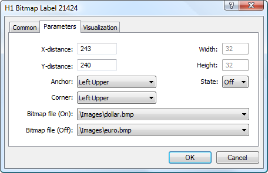

[🏠 Document Start](../../../README.md) / [Price Charts, Technical and Fundamental Analysis](../../README.md) / [Analytical Objects](../../Analytical-Objects.md) / [Graphical Objects](../Graphical-Objects.md) / Bitmap Label

[Previous](Bitmap.md) | [Next](Edit.md)

# Bitmap Label

This object, as well as ["Bitmap"](Bitmap.md) is used for adding various images to a chart in the "bitmap" (*.bmp) format. However the bitmap label is anchored to a chart window and does not move when the chart is scrolled. Bitmap label can also be used as a [button](Button.md) processed by [MQL5 (#mql5)](../../../Algorithmic-Trading-Trading-Robots/How-to-Create-an-Expert-Advisor-or-an-Indicator.md#mql5) programs.

## Controls

The object is moved using the anchor point located on its upper left corner.

## Parameters

There are the following parameters of the "Bitmap Label" object:

  * X-distance — distance in pixels from the anchor corner of the chart window till the control point of the object along the time axis;
  * Y-distance — distance in pixels from the anchor corner of the chart window till the control point of the object along the price axis;
  * Anchor — one of object sides or corners, where the anchor point is located;
  * Corner — one of the corners of the chart window, from which distances along X and Y axes will be set;
  * Bitmap File (On) — selecting a file to be displayed when the label is on. The bitmap files should be located in the [/MQL5/Images (#mql5)](../../../Getting-Started/For-Advanced-Users/Files-and-Folders.md#mql5) folder of the trading platform. If the object is created by an MQL5 program, the image file cannot be changed;
  * Bitmap File (Off) — selecting a file to be displayed when the label is off. The bitmap files should be located in the [/MQL5/Images (#mql5)](../../../Getting-Started/For-Advanced-Users/Files-and-Folders.md#mql5) folder of the trading platform. If the object is created by an MQL5 program, the image file cannot be changed;
  * Width — width of the object in pixels. This is an informational field, it cannot be modified;
  * Height — height of the object in pixels. This is an informational field, it cannot be modified.
  * State — selecting the label state: on or off. This parameter allows implementing the interaction with an MQL5 program. The program can read the change of the label state and a certain program code will be implemented.

> In order to have the possibility to change the label state in a chart, it is necessary to enable the option ["Disable selection" (#disable-selection)](../../Analytical-Objects.md#disable-selection) in object properties.

Common parameters of object are described in a [separate section (#draw-settings)](../../Analytical-Objects.md#draw-settings).
