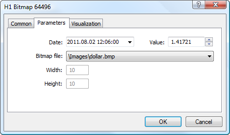

[🏠 Document Start](../../../README.md) / [Price Charts, Technical and Fundamental Analysis](../../README.md) / [Analytical Objects](../../Analytical-Objects.md) / [Graphical Objects](../Graphical-Objects.md) / Bitmap

[Previous](Graph.md) | [Next](Bitmap-Label.md)

# Bitmap

The object is used for attaching various images to a chart in the "bitmap" (*.bmp) format. The object is bound to a chart and moves together with it.

## Controls

The object is moved using the anchor point located on its upper left corner.

## Parameters

There are the following parameters of the "Bitmap" object:

  * Date/Value — coordinates of the anchor point of the upper left corner of the object (date/value of the price scale);
  * Bitmap File — the image file is indicated in this field. The bitmap files should be located in the [/MQL5/Images (#mql5)](../../../Getting-Started/For-Advanced-Users/Files-and-Folders.md#mql5) folder of the trading platform. If the object is created by an MQL5 program, the image file cannot be changed;
  * Width — width of the object in pixels. This is an informational field, it cannot be modified;
  * Height — height of the object in pixels. This is an informational field, it cannot be modified.

Common parameters of object are described in a [separate section (#draw-settings)](../../Analytical-Objects.md#draw-settings).
