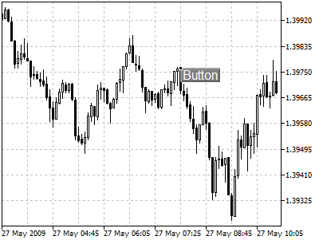
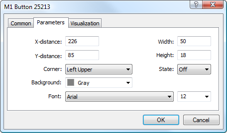

[🏠 Document Start](../../../README.md) / [Price Charts, Technical and Fundamental Analysis](../../README.md) / [Analytical Objects](../../Analytical-Objects.md) / [Graphical Objects](../Graphical-Objects.md) / Button

[Previous](Text-Label.md) | [Next](Graph.md)

# Button

This object is used for placing of functional buttons in a chart; processing of buttons is performed via programs written in [MQL5 (#mql5)](../../../Algorithmic-Trading-Trading-Robots/How-to-Create-an-Expert-Advisor-or-an-Indicator.md#mql5). The object is anchored to a chart window and does not move when the chart is scrolled. To place the object in a chart, one should select it and define the necessary point in a chart.

## Controls

The object is moved using the anchor point located on one of object sides or corners. The text content is changed via the object settings in the "Description" field of the ["Common" (#common)](../../Analytical-Objects.md#common) tab.

## Parameters

There are the following parameters of the object:

  * X-distance — distance in pixels from the anchor corner of the chart window till the control point of the object along the time axis;
  * Y-distance — distance in pixels from the anchor corner of the chart window till the control point of the object along the price axis;
  * Width — width of the button in pixels;
  * Height — height of the button in pixels;
  * Corner — one of the corners of the chart window, from which distances along X and Y axes will be set;
  * State — selecting the button state: on or off. This parameter allows implementing the connection with an [MQL5 (#mql5)](../../../Algorithmic-Trading-Trading-Robots/How-to-Create-an-Expert-Advisor-or-an-Indicator.md#mql5) program. The program can read the change of the button state and a certain program code will be implemented;
  * Background — background color of the button;
  * Font — font type and size for the object text.

> In order to have the possibility to change the button state in a chart, it is necessary to enable the option ["Disable selection" (#disable-selection)](../../Analytical-Objects.md#disable-selection) in object properties.

Common parameters of object are described in a [separate section (#draw-settings)](../../Analytical-Objects.md#draw-settings).
