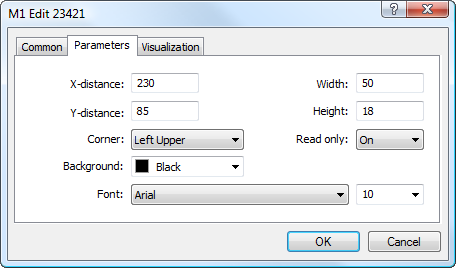

[🏠 Document Start](../../../README.md) / [Price Charts, Technical and Fundamental Analysis](../../README.md) / [Analytical Objects](../../Analytical-Objects.md) / [Graphical Objects](../Graphical-Objects.md) / Edit

[Previous](Bitmap-Label.md) | [Next](Event.md)

# Edit

This object is used for adding an editable text field in a chart. Values of the field can be changed directly in the chart. Entered valued can be read by a program written in [MQL5 (#mql5)](../../../Algorithmic-Trading-Trading-Robots/How-to-Create-an-Expert-Advisor-or-an-Indicator.md#mql5) language. The object is anchored to a chart window and does not move when the chart is scrolled.

## Controls

The object is moved using the anchor point located on its upper left corner.

## Parameters

There are the following parameters of the "Edit" object:

  * X-distance — distance in pixels from the anchor corner of the chart window till the control point of the object along the time axis;
  * Y-distance — distance in pixels from the anchor corner of the chart window till the control point of the object along the price axis;
  * Width — width of the editable field in pixels;
  * Height — height of the editable field in pixels;
  * Corner — one of the corners of the chart window, from which distances along X and Y axes will be set;
  * Read Only — enable/disable the "read only" mode. If this mode is enabled, then entering and editing of a text in this field is prohibited;
  * Background — background color for the editable field;
  * Font — font type and size for the object text.

> In order to have the possibility to enter values in a field on a chart, it is necessary to enable the option ["Disable selection" (#disable-selection)](../../Analytical-Objects.md#disable-selection) in object properties.

Common parameters of object are described in a [separate section (#draw-settings)](../../Analytical-Objects.md#draw-settings).
