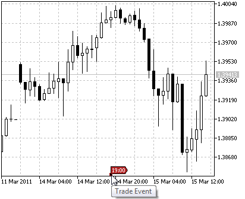

[🏠 Document Start](../../../README.md) / [Price Charts, Technical and Fundamental Analysis](../../README.md) / [Analytical Objects](../../Analytical-Objects.md) / [Graphical Objects](../Graphical-Objects.md) / Event

[Previous](Edit.md) | [Next](Rectangle-Label.md)

# Event

This object is designed for displaying various events on a chart, like the events of the [economic calendar](../../Fundamental-Analysis.md). An object is anchored to the time scale and is moved together with the chart scroll. The object is shown on the time scale and is does not move vertically.

## Controls

An object can be moved using an anchor point located on the time scale.

## Parameters

The object only has [common parameters (#draw-settings)](../../Analytical-Objects.md#draw-settings).
